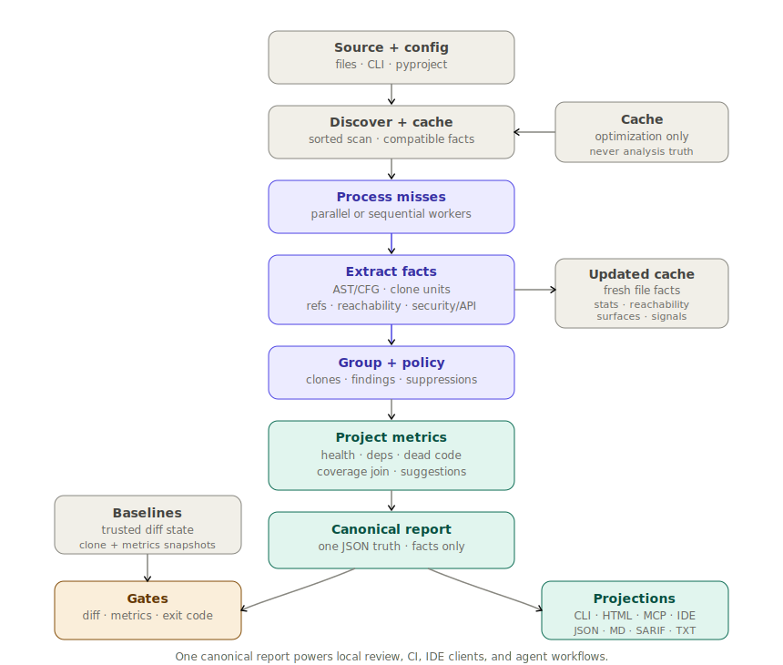

<div align="center">

  <picture>
    <source
      media="(prefers-color-scheme: dark)"
      srcset="https://raw.githubusercontent.com/orenlab/codeclone/main/docs/assets/codeclone-wordmark-dark.svg"
    >
    <source
      media="(prefers-color-scheme: light)"
      srcset="https://raw.githubusercontent.com/orenlab/codeclone/main/docs/assets/codeclone-wordmark.svg"
    >
    
  </picture>

  <p><strong>Structural Change Controller for AI-assisted Python development</strong></p>
  <p><em>Deterministic structural review, baseline-aware CI gates,<br>and explicit change boundaries for coding agents — one canonical report, every surface.</em></p>

[![][pypi-shield]][pypi-link] [![][status-shield]][pypi-link] [![][downloads-shield]][pypi-link] [![][python-shield]][pypi-link] [![][license-shield]][license-link]

[![][tests-shield]][tests-link] [![][benchmark-shield]][benchmark-link]

</div>

---

**CodeClone** is a deterministic structural review layer and change controller for Python. It gives human reviewers and
AI coding agents one canonical view of structural code quality — clone findings, complexity and coupling metrics,
baseline-aware CI gates, coverage join, public API diffs — and adds a **Structural Change Controller** that starts
working *before* a diff exists.

The Controller lets coding agents declare intent, inspect structural blast radius, stay inside explicit edit boundaries,
verify the patch after editing, validate review claims against the canonical report, and leave an auditable review
receipt. Every decision is grounded in deterministic structural facts — never in LLM judgment about what is "safe to
change".

One analysis, many surfaces: **CLI, HTML, JSON, SARIF, Markdown, MCP, VS Code, Claude Desktop, Codex, GitHub Action, and
CI**. Humans and agents operate on the same facts.

Docs: [orenlab.github.io/codeclone](https://orenlab.github.io/codeclone/) &middot;
Live sample report: [orenlab.github.io/codeclone/examples/report/](https://orenlab.github.io/codeclone/examples/report/)

> [!NOTE]
> This README tracks the in-development **v2.1** line.
> For the latest stable release see the [`v2.0.2` README](https://github.com/orenlab/codeclone/blob/v2.0.2/README.md).

## Why CodeClone

AI coding agents do not just write code faster. They expand scope faster.

A prompt asks for one change. The agent edits the target file, touches another module because it looks "related",
updates a helper, rewrites a few tests — and the final diff still looks plausible. The problem is not speed. The problem
is **silent scope expansion**.

CodeClone provides a Structural Change Controller for that workflow:

```text
declare intent
  → inspect structural blast radius
  → constrain edit scope
  → edit
  → verify patch contract
  → validate review claims
  → leave auditable receipt
```

CodeClone does not replace the agent and does not use LLM judgment to decide what is safe. It gives the agent
**deterministic structural boundaries before the diff exists**, then verifies whether the resulting patch stayed inside
them. Same control surface protects human reviewers, CI pipelines, and pre-merge gates.

## Install

```bash
uv tool install codeclone          # recommended
pip install codeclone              # or pip

# with MCP server for AI agents and IDE clients
uv tool install "codeclone[mcp]"
pip install "codeclone[mcp]"

# with token-accurate MCP payload sizing (adds tiktoken)
uv tool install "codeclone[mcp,token-bench]"
```

<details>
<summary>Run without installing</summary>

```bash
uvx codeclone@latest .
```

</details>

## Quick Start

```bash
codeclone .                                    # analyze current directory
codeclone . --html --open-html-report          # interactive HTML report
codeclone . --json --md --sarif --text         # all report formats
codeclone . --ci                               # CI mode: baseline-aware gating
```

<details>
<summary>More commands</summary>

```bash
# Changed-scope review against a branch
codeclone . --changed-only --diff-against main
codeclone . --paths-from-git-diff HEAD~1

# Timestamped report snapshots
codeclone . --html --json --timestamped-report-paths

# Structural Change Controller — CLI surface
codeclone . --blast-radius codeclone/analysis/parser.py
codeclone . --patch-verify --diff-against HEAD~1
```

</details>

## How It Works

<details open>
<summary>Pipeline overview</summary>
<br>

</details>

CodeClone produces **one canonical JSON report** and renders it through every surface — CLI, HTML, Markdown, SARIF, MCP,
IDE extensions, GitHub Action, CI. The same deterministic facts drive human review, baseline-aware gates, and agent
workflows. The canonical report is the source of truth; surfaces render, filter, and explain it without creating a
second analysis engine.

Architecture: [Architecture narrative](https://orenlab.github.io/codeclone/architecture/) &middot;
CFG semantics: [CFG semantics](https://orenlab.github.io/codeclone/cfg/)

## Structural Change Controller

The Controller governs AI-assisted edits before they become invisible diffs. Every stage is deterministic — structural
facts come from the canonical report, not from LLM inference.

| Stage                       | Surface                                          | Purpose                                                                                       |
|-----------------------------|--------------------------------------------------|-----------------------------------------------------------------------------------------------|
| **Start controlled change** | `start_controlled_change`                        | Pre-edit: workspace check, declare scope, blast radius, patch budget                          |
| **Finish controlled change**| `finish_controlled_change`                       | Post-edit: scope check, verify, optional claims/receipt, clear intent                         |
| **Map blast radius**        | `get_blast_radius` · `--blast-radius`            | Reverse imports, clone cohorts, review context, do-not-touch boundaries                       |
| **Check patch contract**    | `check_patch_contract` · `--patch-verify`        | Pre-edit budget check and post-edit structural verification                                   |
| **Validate claims**         | `validate_review_claims`                         | Cross-check review text; optional `patch_health_delta` from verify for regression-free claims |
| **Generate receipt**        | `create_review_receipt`                          | Auditable artifact: intent, scope, blast radius, patch outcome                                |
| **Intent lifecycle (atomic)** | `manage_change_intent`                         | Queue/promote/recover and atomic declare/check/clear when workflow tools are unavailable      |
| **Coordinate workspace**    | workspace intent registry                        | Make active declared scopes visible across MCP processes                                      |
| **Audit controller events** | optional audit trail                             | Record passive workflow events and MCP payload footprint when enabled                         |

Intent execution is **session-local**. Cross-agent visibility is optional, advisory, TTL/lease-bound, and stored as
ephemeral workspace coordination state under `.cache/codeclone/intents/`.

The optional audit trail records controller events and estimated MCP payload footprint when enabled. It is **not
canonical analysis truth** and does not affect gates, baselines, report digests, cache compatibility, or finding
identity.

CodeClone never mutates source files, baselines, generated reports, or analysis cache through MCP — read-only by
contract.

[Structural Change Controller docs](https://orenlab.github.io/codeclone/book/24-structural-change-controller/)

## What CodeClone Reviews

| Category                | What it covers                                                                                                                                                 |
|-------------------------|----------------------------------------------------------------------------------------------------------------------------------------------------------------|
| **Clone detection**     | Function clones via CFG fingerprints, block clones via statement windows, segment clones as report-only review context                                         |
| **Structural findings** | Duplicated branch families, clone guard/exit divergence, clone-cohort drift                                                                                    |
| **Quality metrics**     | Cyclomatic complexity, coupling (CBO), cohesion (LCOM4), dependency cycles, adaptive depth profile, dead code, overall health score, overloaded-module profile |
| **Baseline governance** | Separates accepted legacy debt from new regressions — CI fails only on what got worse                                                                          |
| **Coverage Join**       | Fuses external Cobertura XML into the current run to surface untested hotspots and coverage scope gaps                                                         |
| **Adoption & API**      | Type and docstring annotation coverage, public API surface inventory, baseline-aware API break detection                                                       |
| **Security Surfaces**   | Report-only inventory of security-relevant capability boundaries — no vulnerability claims                                                                     |
| **Design signals**      | Overloaded modules and other report-only structural review context                                                                                             |

## Baseline-Aware CI

```bash
# 1. Generate baseline once (commit it to your repo)
codeclone . --update-baseline

# 2. Enforce it on every push
codeclone . --ci
```

`--ci` is equivalent to `--fail-on-new --no-color --quiet`. When a trusted metrics baseline is present, it also enables
`--fail-on-new-metrics`.

> [!TIP]
> Run `codeclone . --update-baseline` once after install. Commit the baseline file — it becomes the contract CI enforces
> on every push, separating accepted legacy debt from real regressions.

### GitHub Action

CodeClone ships a composite Action for PR and CI workflows:

```yaml
- uses: orenlab/codeclone/.github/actions/codeclone@v2
  with:
    fail-on-new: "true"
    sarif: "true"
    pr-comment: "true"
```

The Action runs baseline-aware gating, generates JSON and SARIF reports, uploads SARIF to GitHub Code Scanning, and
posts or updates a PR summary comment.

[Action docs](https://github.com/orenlab/codeclone/blob/main/.github/actions/codeclone/README.md)

### Quality Gates

```bash
# Structural metric thresholds
codeclone . --fail-complexity 20 --fail-coupling 10 --fail-cohesion 4 --fail-health 60
codeclone . --fail-cycles --fail-dead-code

# Baseline-aware regression detection
codeclone . --fail-on-new-metrics
codeclone . --fail-on-typing-regression --fail-on-docstring-regression

# Adoption and API governance
codeclone . --min-typing-coverage 80 --min-docstring-coverage 60
codeclone . --api-surface --fail-on-api-break

# Coverage Join — fuse external Cobertura XML into the review
codeclone . --coverage coverage.xml --fail-on-untested-hotspots --coverage-min 50
```

[Gate reference](https://orenlab.github.io/codeclone/book/15-metrics-and-quality-gates/)

### Pre-commit

```yaml
repos:
  - repo: local
    hooks:
      - id: codeclone
        name: CodeClone
        entry: codeclone
        language: system
        pass_filenames: false
        args: [ ".", "--ci" ]
        types: [ python ]
```

## MCP Control Surface

CodeClone ships an MCP control surface for AI agents and IDE clients, built on the same canonical pipeline as the CLI.
Canonical analysis is **read-only by contract**: MCP tools never mutate source, baselines, generated reports, or
analysis cache. Controller state is session-local or ephemeral workspace coordination state.

- **28 tools across 6 workflow phases** — *analyze → triage → drill down → focused checks → change control → session*.
  Triage-first design avoids dumping the full report into agent context.
- **Stable read-only resources** — `codeclone://latest/*` and `codeclone://runs/{run_id}/*` URIs return deterministic
  projections (summary, report, health, gates, changed, triage, schema) without re-triggering analysis.
- **Bounded in-memory run history** — `--history-limit` (default `4`, max `10`); session-local, does not survive
  restart.
- **Run identity from canonical report integrity digest** — same digest, same run, same projection across every tool and
  resource.

```bash
codeclone-mcp --transport stdio             # local clients (IDE, agents)
codeclone-mcp --transport streamable-http   # HTTP transport
```

> [!WARNING]
> Analysis tools require an absolute repository root. Relative roots such as `.` are rejected.
> Keep `stdio` as the default transport for local IDE and agent clients; HTTP exposure beyond loopback requires explicit
`--allow-remote`.

[MCP usage guide](https://orenlab.github.io/codeclone/mcp/) &middot;
[MCP interface contract](https://orenlab.github.io/codeclone/book/20-mcp-interface/)

### Native Agent and IDE Clients

| Surface                   | Install                                                                                                                      | Docs                                                                        |
|---------------------------|------------------------------------------------------------------------------------------------------------------------------|-----------------------------------------------------------------------------|
| **VS Code extension**     | [VS Code Marketplace](https://marketplace.visualstudio.com/items?itemName=orenlab.codeclone)                                 | [Guide](https://orenlab.github.io/codeclone/book/21-vscode-extension/)      |
| **Claude Desktop bundle** | [`extensions/claude-desktop-codeclone/`](https://github.com/orenlab/codeclone/tree/main/extensions/claude-desktop-codeclone) | [Guide](https://orenlab.github.io/codeclone/book/22-claude-desktop-bundle/) |
| **Codex plugin**          | [`orenlab/codeclone-codex`](https://github.com/orenlab/codeclone-codex)                                                      | [Guide](https://orenlab.github.io/codeclone/book/23-codex-plugin/)          |
| **Cursor plugin**         | [`plugins/cursor-codeclone/`](https://github.com/orenlab/codeclone/tree/main/plugins/cursor-codeclone)                       | [Guide](https://orenlab.github.io/codeclone/book/25-cursor-plugin/)         |

All clients connect to the same `codeclone-mcp` contract — no second analysis engine.

## Reports

All formats render from one canonical JSON payload — same facts, different audiences.

| Format   | Flag      | Default path                    |
|----------|-----------|---------------------------------|
| HTML     | `--html`  | `.cache/codeclone/report.html`  |
| JSON     | `--json`  | `.cache/codeclone/report.json`  |
| Markdown | `--md`    | `.cache/codeclone/report.md`    |
| SARIF    | `--sarif` | `.cache/codeclone/report.sarif` |
| Text     | `--text`  | `.cache/codeclone/report.txt`   |

```bash
codeclone . --html --json --md --sarif --text
```

`--open-html-report` opens the HTML in the default browser. `--timestamped-report-paths` appends a UTC timestamp to
default filenames.

[Report contract](https://orenlab.github.io/codeclone/book/08-report/) &middot;
[HTML render](https://orenlab.github.io/codeclone/book/10-html-render/)

<details>
<summary>Canonical JSON report shape (v2.11)</summary>

Top-level keys: `report_schema_version`, `meta`, `inventory`, `findings`, `metrics`, `derived`, `integrity`.

```json
{
  "report_schema_version": "2.11",
  "meta": {
    "codeclone_version": "...",
    "project_name": "...",
    "scan_root": ".",
    "...": "..."
  },
  "inventory": {
    "files": {},
    "code": {},
    "file_registry": {
      "encoding": "relative_path",
      "items": []
    }
  },
  "findings": {
    "summary": {},
    "groups": {
      "clones": {
        "functions": [],
        "blocks": [],
        "segments": []
      },
      "structural": {
        "groups": []
      },
      "dead_code": {
        "groups": []
      },
      "design": {
        "groups": []
      }
    }
  },
  "metrics": {
    "summary": {
      "coverage_adoption": {},
      "coverage_join": {},
      "api_surface": {}
    },
    "families": {
      "coverage_adoption": {},
      "coverage_join": {},
      "api_surface": {}
    }
  },
  "derived": {
    "suggestions": [],
    "overview": {
      "families": {},
      "top_risks": [],
      "health_snapshot": {},
      "directory_hotspots": {}
    },
    "hotlists": {
      "most_actionable_ids": [],
      "highest_spread_ids": [],
      "production_hotspot_ids": []
    }
  },
  "integrity": {
    "canonicalization": {
      "version": "1",
      "scope": "canonical_only"
    },
    "digest": {
      "algorithm": "sha256",
      "verified": true,
      "value": "..."
    }
  }
}
```

Full schema contract: [Report contract](https://orenlab.github.io/codeclone/book/08-report/)

</details>

## Configuration

CodeClone loads project-level configuration from `pyproject.toml`:

```toml
[tool.codeclone]
baseline = "codeclone.baseline.json"

min_loc = 10
min_stmt = 6

block_min_loc = 20
block_min_stmt = 8

segment_min_loc = 20
segment_min_stmt = 10

golden_fixture_paths = ["tests/fixtures/golden_*"]
```

Precedence: **CLI flags > `pyproject.toml` > built-in defaults**.

[Config reference](https://orenlab.github.io/codeclone/book/04-config-and-defaults/)

## Baseline Workflow

Baselines capture the current duplication and metrics state. Once committed, they become the CI reference point.

- Clones are classified as **NEW** (not in baseline) or **KNOWN** (accepted debt)
- `--update-baseline` writes both clone and metrics snapshots
- Trust is verified via `generator`, `fingerprint_version`, and `payload_sha256`
- In `--ci` mode, an untrusted baseline is a contract error (exit `2`)

[Baseline contract](https://orenlab.github.io/codeclone/book/06-baseline/)

## Exit Codes

| Code | Meaning                                                                       |
|------|-------------------------------------------------------------------------------|
| `0`  | Success                                                                       |
| `2`  | Contract error — untrusted baseline, invalid config, unreadable sources in CI |
| `3`  | Gating failure — new clones or quality threshold exceeded                     |
| `5`  | Internal error                                                                |

Contract errors (`2`) take precedence over gating failures (`3`).

[Exit code policy](https://orenlab.github.io/codeclone/book/03-contracts-exit-codes/)

## Inline Suppressions

When a symbol is invoked through runtime dynamics — framework callbacks, plugin loading, reflection — suppress the known
false positive at the declaration site:

```python
# codeclone: ignore[dead-code]
def handle_exception(exc: Exception) -> None:
    ...


class Middleware:  # codeclone: ignore[dead-code]
    ...
```

[Inline suppressions](https://orenlab.github.io/codeclone/book/19-inline-suppressions/) &middot;
[Dead-code contract](https://orenlab.github.io/codeclone/book/16-dead-code-contract/)

## Controller Audit and MCP Payload Footprint

When enabled, the optional controller audit trail records passive workflow events: declared intents, blast radius
summaries, patch budget checks, patch verification, claim validation, review receipts, and workspace coordination
events.

It can also record **estimated CodeClone MCP payload tokens** for each request. With the `codeclone[token-bench]` extra
installed, estimation uses `tiktoken` (`o200k_base`); without it, the estimator falls back to a character-based
approximation (`ceil(chars / 4)`). This measures the deterministic payload footprint emitted by CodeClone — not actual
model billing tokens for a full client session.

Audit is **disabled by default** and never affects controller decisions, gates, baselines, report digests, cache
compatibility, or finding identity.

## Benchmarking

<details>
<summary>Reproducible Docker benchmark</summary>

```bash
./benchmarks/run_docker_benchmark.sh
```

The wrapper builds `benchmarks/Dockerfile`, runs isolated container benchmarks, and writes results to
`.cache/benchmarks/codeclone-benchmark.json`.

Pin the benchmark envelope via environment overrides:

```bash
CPUSET=0 CPUS=1.0 MEMORY=2g RUNS=16 WARMUPS=4 \
  ./benchmarks/run_docker_benchmark.sh
```

The MCP token footprint benchmark estimates deterministic CodeClone-emitted payload size. It does not claim actual model
billing tokens.

Performance claims are backed by the reproducible benchmark workflow documented in
the [Benchmarking contract](https://orenlab.github.io/codeclone/book/18-benchmarking/).

</details>

## Documentation

Full docs and contract book: [orenlab.github.io/codeclone](https://orenlab.github.io/codeclone/)

Quick links:
[Baseline](https://orenlab.github.io/codeclone/book/06-baseline/) &middot;
[Report](https://orenlab.github.io/codeclone/book/08-report/) &middot;
[Metrics & gates](https://orenlab.github.io/codeclone/book/15-metrics-and-quality-gates/) &middot;
[MCP](https://orenlab.github.io/codeclone/book/20-mcp-interface/) &middot;
[Structural Change Controller](https://orenlab.github.io/codeclone/book/24-structural-change-controller/) &middot;
[CLI](https://orenlab.github.io/codeclone/book/09-cli/)

## License

- **Code:** MPL-2.0 (`LICENSE`)
- **Documentation and docs-site content:** MIT (`LICENSE-MIT`)

## Links

- **Docs:** <https://orenlab.github.io/codeclone/>
- **PyPI:** <https://pypi.org/project/codeclone/>
- **Issues:** <https://github.com/orenlab/codeclone/issues>
- **Discussions:** <https://github.com/orenlab/codeclone/discussions>
- **Licenses:** [MPL-2.0](https://github.com/orenlab/codeclone/blob/main/LICENSE)
  &middot; [MIT docs](https://github.com/orenlab/codeclone/blob/main/LICENSE-MIT)
  &middot; [Scope map](https://github.com/orenlab/codeclone/blob/main/LICENSES.md)

<!-- Shields -->

[pypi-shield]: https://img.shields.io/pypi/v/codeclone?style=flat-square&color=6366f1

[status-shield]: https://img.shields.io/pypi/status/codeclone?style=flat-square&color=6366f1

[downloads-shield]: https://img.shields.io/pypi/dm/codeclone?style=flat-square&color=6366f1

[python-shield]: https://img.shields.io/pypi/pyversions/codeclone?style=flat-square&color=6366f1

[license-shield]: https://img.shields.io/badge/license-MPL--2.0-6366f1?style=flat-square

[tests-shield]: https://img.shields.io/github/actions/workflow/status/orenlab/codeclone/tests.yml?branch=main&style=flat-square&label=tests

[benchmark-shield]: https://img.shields.io/github/actions/workflow/status/orenlab/codeclone/benchmark.yml?style=flat-square&label=benchmark
<!-- Links -->

[pypi-link]: https://pypi.org/project/codeclone/

[license-link]: #license

[tests-link]: https://github.com/orenlab/codeclone/actions/workflows/tests.yml

[benchmark-link]: https://github.com/orenlab/codeclone/actions/workflows/benchmark.yml
