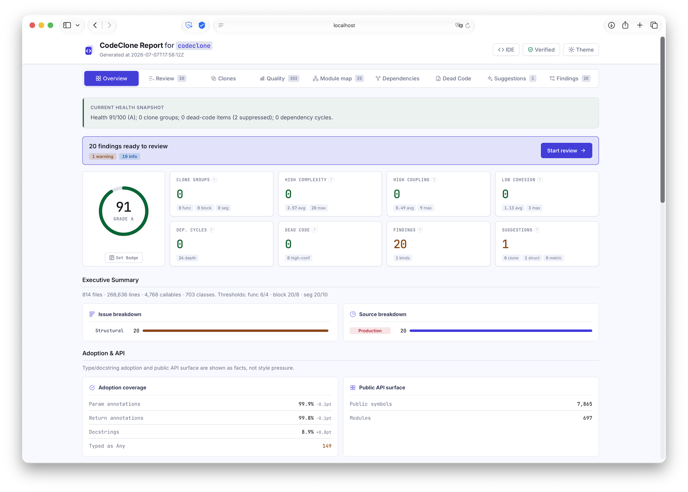

<div align="center">

  <picture>
    <source
      media="(prefers-color-scheme: dark)"
      srcset="https://raw.githubusercontent.com/orenlab/codeclone/main/docs/assets/codeclone-wordmark-dark.svg"
    >
    <source
      media="(prefers-color-scheme: light)"
      srcset="https://raw.githubusercontent.com/orenlab/codeclone/main/docs/assets/codeclone-wordmark.svg"
    >
    
  </picture>

  <p><strong>Deterministic Structural Change Controller for AI-assisted Python development</strong></p>

  <p>
    <em>
      Let agents move fast.<br>
      Keep structural change explicit, bounded, and verifiable.
    </em>
  </p>

[![][pypi-shield]][pypi-link] [![][downloads-shield]][pypi-link] [![][python-shield]][pypi-link] [![][license-shield]][license-link] [![][discord-shield]][discord-link]

[![][tests-shield]][tests-link] [![][benchmark-shield]][benchmark-link]

</div>

---

> [!IMPORTANT]
> Sections marked **`2.1 alpha`** require the
> [CodeClone 2.1 prerelease](https://pypi.org/project/codeclone/#history).
> Everything else works with the current stable release,
> [CodeClone 2.0.2](https://github.com/orenlab/codeclone/tree/v2.0.2).

## What is CodeClone?

CodeClone helps developers use AI coding agents without losing control of structural change.

Before an agent edits code, CodeClone records the intended change, maps the structural blast radius, and establishes
explicit edit boundaries. After the edit, it compares the real patch with the declared scope, verifies structural
regressions, and leaves an auditable review receipt.

CodeClone does not generate or rewrite source files, and it does not ask an LLM to decide whether a structural change
is safe. Every finding and every gate comes from deterministic repository facts shared across agents, human reviewers,
IDEs, reports, and CI.

| Capability                                      | What it provides                                                                                                       |
|-------------------------------------------------|--------------------------------------------------------------------------------------------------------------------------|
| **Canonical structural analysis**               | One deterministic report: clones, complexity, coupling, cohesion, dead code, module map, API inventory, coverage joins |
| **Baseline-aware governance**                   | Records accepted legacy debt and separates it from regressions introduced by the current change                        |
| **One report, many surfaces**                   | CLI, HTML, JSON, Markdown, SARIF, MCP, IDE integrations, and GitHub Actions from one canonical payload                 |
| **Structural Change Controller** — `2.1 alpha`  | Intent-first change control, blast radius, explicit edit boundaries, patch verification, and review receipts           |
| **Live Implementation Context** — `2.1 alpha`   | Real-time structural and call-graph context served from the current analysis run — no stale index to maintain          |
| **Engineering Memory** — `2.1 alpha`            | Local, typed, evidence-linked project knowledge and reusable histories of prior controlled changes                     |
| **Agent coordination** — `2.1 alpha`            | Conflict-safe multi-agent intents, queues, recovery, and workspace hygiene                                             |

CodeClone requires no hosted service or cloud account. Analysis state, controller state, Engineering Memory, and
trajectories are stored locally.

## Why intent comes before the diff

Most review tools begin after the patch already exists. CodeClone begins earlier:

```text
task request
  → declared intent
  → structural blast radius
  → explicit boundary
  → actual patch
  → deterministic verification
```

Agent scope expansion can look reasonable in the final diff. A narrow task may quietly spread into shared helpers,
tests, configuration, public APIs, or unrelated modules.

By the time that expansion reaches the final diff, it already looks intentional. CodeClone catches it at the declared
boundary instead — by comparing what the agent said it would change with what it actually changed.

## Quick start

Requires Python 3.10 or newer.

### 1. Analyze a repository

Run the stable release without installing anything:

```bash
uvx codeclone@latest .
```

Prefer a browsable report? Generate the HTML view and open it:

```bash
uvx codeclone@latest . --html --open-html-report
```

<div align="center">
  <picture>
    <source
      media="(prefers-color-scheme: dark)"
      srcset="docs/assets/codeclone-html-sample-dark.png"
    >
    <source
      media="(prefers-color-scheme: light)"
      srcset="docs/assets/codeclone-html-sample.png"
    >
    
  </picture>
</div>

Once you use it regularly, install it as a local tool:

```bash
uv tool install codeclone
codeclone .
```

### 2. Record the current structural baseline

Before asking an agent to change the repository, capture the accepted state once:

```bash
codeclone . --update-baseline
git add codeclone.baseline.json
git commit -m "chore: add CodeClone structural baseline"
```

The baseline records the structural debt that already exists. Future analysis can then separate **new regressions**
from findings that were already present, so agents and reviewers can focus on what the current change introduced.

Updating the baseline is an explicit governance action. Do not regenerate it merely to make a failing check pass.

### 3. Connect your AI agent — `2.1 alpha`

Continue to [Agent change control](#agent-change-control--21-alpha) below to install the MCP control surface and wire
CodeClone into Claude Code, Cursor, VS Code, Codex, or Claude Desktop.

## One canonical structural report

CodeClone runs one deterministic analysis and renders the same canonical report through every supported surface.

The report covers:

- function, block, and segment clones;
- clone drift and duplicated branch families;
- complexity, coupling, cohesion, dependency cycles, and dead code;
- **Module Map** — a package/module dependency graph with cycle, hub, overloaded-module, and unwind-candidate views;
- **Guided Finding Review** — a prioritized review queue with shared finding cards, filters, and progress tracking;
- public API inventory and baseline-aware API break detection;
- external coverage joined with structural hotspots;
- deterministic structural health and review priorities.

```bash
codeclone . --json --html --md --sarif --text
```

[How CodeClone works](https://orenlab.github.io/codeclone/concepts/structural-analysis/) ·
[Canonical report contract](https://orenlab.github.io/codeclone/reference/reports/)

## Baseline-aware governance and CI

The baseline is a versioned, integrity-checked contract that records the accepted structural state of the repository.

It lets CodeClone and connected agents distinguish:

- findings that already existed;
- regressions introduced by the current change;
- deliberate baseline updates approved by the user.

Check future changes against the committed baseline:

```bash
codeclone . --ci
```

Use CodeClone in GitHub Actions:

```yaml
- uses: orenlab/codeclone/.github/actions/codeclone@v2
  with:
    fail-on-new: "true"
    sarif: "true"
    pr-comment: "true"
```

CI can reject newly introduced clones, metric regressions, API breaks, and coverage regressions without requiring the
existing repository to be clean first.

[Baseline contract](https://orenlab.github.io/codeclone/concepts/reports/) ·
[CI integration and quality gates](https://orenlab.github.io/codeclone/guides/ci-integration/)

## How CodeClone differs

Linters check style and correctness file by file. Clone detectors report duplication and stop there. Hosted review
bots ask a model for an opinion about a finished diff.

CodeClone combines CFG-based clone detection, multi-metric baseline governance, and a read-only MCP control surface in
one local-first, open-source package — and applies them **before** the edit happens, not only after. Structural facts
are computed deterministically, so the same input always produces the same verdict, in the terminal, in CI, and inside
your agent's loop.

## Agent change control — `2.1 alpha`

### Install the MCP control surface

```bash
uv tool install --prerelease allow "codeclone[mcp]"
codeclone-mcp --transport stdio
```

The server exposes **38 MCP tools** covering analysis, change control, blast radius, memory, and diagnostics. Responses
are built for agent loops: deterministic `next_tool` guidance, token-budget-aware payloads, and replies that keep
mandatory control facts inline while linking full evidence for drill-down.

Before gating agents or CI, confirm `[tool.codeclone]` and local gitignore hygiene:

```bash
codeclone setup status
codeclone setup plan
codeclone setup apply   # or: codeclone setup wizard
```

See [Repository setup and readiness](https://orenlab.github.io/codeclone/guides/setup-project/).

### Wire it into your client

| Client         | Setup                                                                         |
|----------------|-------------------------------------------------------------------------------|
| VS Code        | [Extension setup](https://orenlab.github.io/codeclone/integrations/vscode/)   |
| Cursor         | [Plugin and skills](https://orenlab.github.io/codeclone/integrations/cursor/) |
| Claude Code    | [Plugin setup](https://orenlab.github.io/codeclone/integrations/claude/)      |
| Codex          | [Plugin setup](https://orenlab.github.io/codeclone/integrations/codex/)       |
| Claude Desktop | [Bundle setup](https://orenlab.github.io/codeclone/integrations/claude/)      |

Every client uses the same MCP interface and the same canonical structural facts.

### The controlled-change workflow

For an agent, the normal workflow is:

```text
analyze → start → edit → finish
```

**Analyze.** CodeClone builds one canonical structural report for the repository and compares it with the accepted
baseline.

**Start.** `start_controlled_change`:

- records the agent's intent;
- maps structural blast radius;
- separates editable paths from review context and do-not-touch boundaries;
- exposes the regression budget relative to the accepted baseline;
- returns the authoritative `edit_allowed` result.

**Edit.** The agent writes the code. CodeClone does not generate or rewrite source files. Where the host supports
hooks, integrations can stop edits unless `edit_allowed=true`. While editing, the agent stays oriented through
[Live Implementation Context](#live-implementation-context) instead of rediscovering the repository with broad
searches.

**Finish.** `finish_controlled_change`:

- resolves the actual changed files;
- checks declared scope against the real patch;
- verifies structural changes;
- validates optional review claims;
- records Patch Trail evidence;
- produces an auditable review receipt.

<!-- TODO: short example of a review receipt (trimmed JSON, ~10 lines) -->

If the patch crosses the declared boundary or introduces regressions beyond the budget, verification fails — and the
receipt records exactly where and why. The result is not an AI opinion about the patch. It is a deterministic
comparison between declared intent, repository structure, the accepted baseline, and the actual change.

[Read the Structural Change Controller guide](https://orenlab.github.io/codeclone/concepts/controlled-change/)

### Live Implementation Context

`get_implementation_context` serves the agent bounded, task-scoped context directly from the current analysis run:

- structural context and call relationships for the declared edit scope;
- contract-oriented truth maps and test anchors;
- freshness signals and active intent boundaries.

There is no separate vector database drifting behind the code, and no watcher daemon re-indexing the tree. Context
comes from the same analysis that produces findings and gates — so what the agent reads is what the verifier will
check. Context is read-only: it informs edits but never authorizes them.

### Also in the 2.1 line

- **Platform Observability** — development-time tracing of CLI, MCP, analysis phases, database activity, and payload
  pressure, so you can see what CodeClone itself is doing and what it costs.
- **Corpus Analytics** — offline intent clustering and interpretability over recorded controlled changes, with
  versioned profiles and inspectable JSON/HTML outputs.

## Engineering Memory — `2.1 alpha`

Engineering Memory gives agents durable, repository-specific context without treating model output as project truth.

The local SQLite store can contain:

- architecture and contract notes;
- risks, test anchors, and public surfaces;
- git and change-control provenance;
- prior trajectories and Patch Trail evidence;
- recurring advisory patterns called **Experiences**.

Agent-created records remain drafts until a human approves them.

```bash
codeclone memory init --root .
codeclone memory search "baseline schema" --match all
```

Retrieval is hybrid — FTS5/BM25 lexical search, optional LanceDB vector search, and Reciprocal Rank Fusion combining
the two — with fully reproducible ranking.

Memory can guide an agent. It cannot authorize edits, override blast radius, change a gate, or replace canonical
report facts.

[Engineering Memory documentation](https://orenlab.github.io/codeclone/concepts/engineering-memory/) ·
[Trajectories and Experiences](https://orenlab.github.io/codeclone/guides/engineering-memory-workflow/)

## Trust boundaries

- Structural findings and gates come from deterministic analysis, not LLM judgment.
- `edit_allowed` is an explicit controller result; status or advisory ownership does not grant permission.
- Read-only analysis commands do not modify source code or project governance state.
- Baseline updates are explicit user-approved governance actions.
- Controller and memory operations write only to their explicit local state stores.
- Memory, trajectory, and implementation-context evidence remain advisory.
- `stdio` is the recommended transport for local clients.
- Remote HTTP exposure requires explicit `--allow-remote`.

## Contributing

Bug reports, feature discussions, and pull requests are welcome — start with
[Issues](https://github.com/orenlab/codeclone/issues) or
[Discussions](https://github.com/orenlab/codeclone/discussions), or join the
[Discord](https://discord.com/invite/U72KmRvpUx).

Run the repository version from source:

```bash
git clone https://github.com/orenlab/codeclone.git
cd codeclone
uv sync --all-extras
uv run codeclone .
```

## Documentation

**[orenlab.github.io/codeclone](https://orenlab.github.io/codeclone/)**

- [Getting started](https://orenlab.github.io/codeclone/getting-started/)
- [Structural Change Controller](https://orenlab.github.io/codeclone/concepts/controlled-change/)
- [Engineering Memory](https://orenlab.github.io/codeclone/concepts/engineering-memory/)
- [MCP usage](https://orenlab.github.io/codeclone/concepts/mcp/)
- [Configuration reference](https://orenlab.github.io/codeclone/reference/configuration/)

## License

- **Code:** MPL-2.0
- **Documentation:** MIT

See [LICENSES.md](https://github.com/orenlab/codeclone/blob/main/LICENSES.md) for the license scope map.

## Links

- **PyPI:** <https://pypi.org/project/codeclone/>
- **Discord:** <https://discord.com/invite/U72KmRvpUx>
- **Issues:** <https://github.com/orenlab/codeclone/issues>
- **Discussions:** <https://github.com/orenlab/codeclone/discussions>

<!-- Shields -->
[pypi-shield]: https://img.shields.io/pypi/v/codeclone?style=flat-square&color=6366f1
[downloads-shield]: https://img.shields.io/pypi/dm/codeclone?style=flat-square&color=6366f1
[python-shield]: https://img.shields.io/pypi/pyversions/codeclone?style=flat-square&color=6366f1
[license-shield]: https://img.shields.io/badge/license-MPL--2.0-6366f1?style=flat-square
[tests-shield]: https://img.shields.io/github/actions/workflow/status/orenlab/codeclone/tests.yml?branch=main&style=flat-square&label=tests
[benchmark-shield]: https://img.shields.io/github/actions/workflow/status/orenlab/codeclone/benchmark.yml?branch=main&style=flat-square&label=benchmark
[discord-shield]: https://img.shields.io/badge/Discord-Join%20community-5865F2?style=flat-square&logo=discord&logoColor=white
<!-- Links -->
[pypi-link]: https://pypi.org/project/codeclone/
[license-link]: https://github.com/orenlab/codeclone/blob/main/LICENSES.md
[tests-link]: https://github.com/orenlab/codeclone/actions/workflows/tests.yml
[benchmark-link]: https://github.com/orenlab/codeclone/actions/workflows/benchmark.yml
[discord-link]: https://discord.com/invite/U72KmRvpUx
