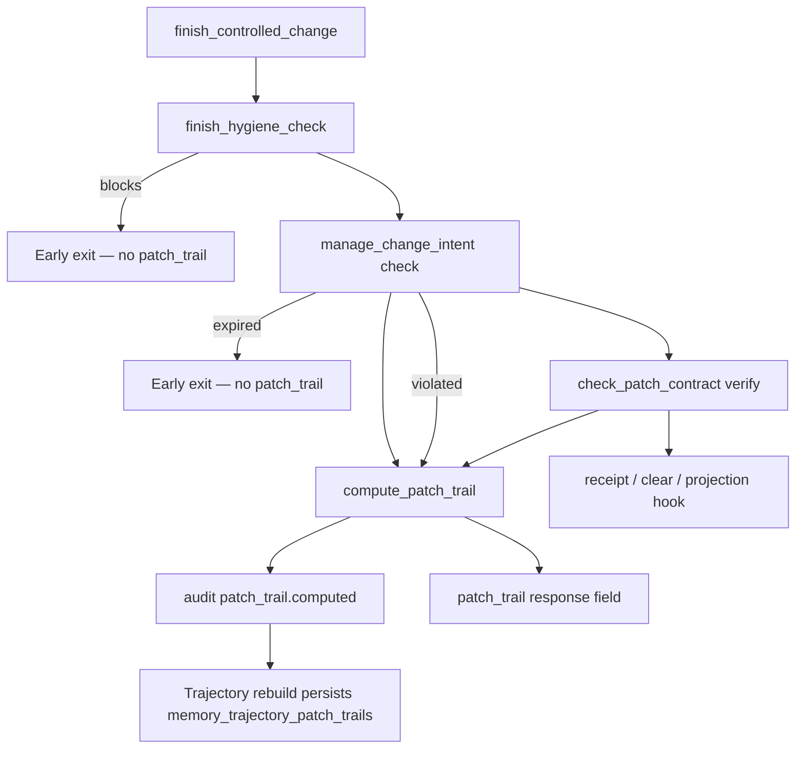

<!-- doc-scope: STRUCTURAL CHANGE CONTROLLER — flagship governance chapter.
     owns: intent lifecycle, blast radius, patch contract, receipt, intent registry,
       audit trail, workspace hygiene, payload semantics (health_delta,
       multi-agent hygiene, start/finish transitions).
     does-not-own: engineering memory (→ 13), claim guard (→ 14),
       MCP tool schemas (→ 25).
     rule: payload semantics block was moved here from docs/mcp.md.
       Do not move it back. -->

# 12. Structural Change Controller

CodeClone v2.1 adds structural change control for AI-assisted edits. The MCP
surface owns session-aware agent workflows; the CLI exposes the two
human-facing query modes that are useful at a terminal. Neither path is a
second analyzer: both compose over the canonical report contract.

## Status

The v2.1 alpha currently includes intent, blast-radius, patch-contract checks,
review receipts, workspace intent visibility, claim guard, and CLI controller
queries:

| Phase                     | Status            | Surface                                                                            |
|---------------------------|-------------------|------------------------------------------------------------------------------------|
| Declarative workflow      | Live in `2.1.0a1` | MCP `start_controlled_change`, `finish_controlled_change`                          |
| Intent declaration        | Live in `2.1.0a1` | MCP `manage_change_intent`                                                         |
| Blast radius              | Live in `2.1.0a1` | MCP `get_blast_radius`, CLI `--blast-radius`                                       |
| Patch contract            | Live in `2.1.0a1` | MCP `check_patch_contract`, CLI `--patch-verify`                                   |
| Review receipt            | Live in `2.1.0a1` | MCP `create_review_receipt`                                                        |
| Workspace intent registry | Live in `2.1.0a1` | MCP `manage_change_intent`                                                         |
| Lease and recovery        | Live in `2.1.0a1` | MCP `manage_change_intent`                                                         |
| Claim guard               | Live in `2.1.0a1` | MCP `validate_review_claims`                                                       |
| Scope-aware verification  | Live in `2.1.0a1` | MCP `check_patch_contract`                                                         |
| Workspace relations       | Live in `2.1.0a1` | MCP `manage_change_intent`                                                         |
| Verification profiles     | Live in `2.1.0a1` | MCP `check_patch_contract`                                                         |
| Intent queue              | Live in `2.1.0a1` | MCP `manage_change_intent`                                                         |
| Verify ergonomics         | Live in `2.1.0a1` | MCP `check_patch_contract`                                                         |
| MCP payload token budget  | Live in `2.1.0a1` | Audit trail, CLI `--audit`, `--session-stats`                                      |
| Patch Trail               | Live in `2.1.0a1` | MCP `finish_controlled_change(patch_trail_detail=…)`; audit `patch_trail.computed` |

## Contract

- The canonical report remains the source of truth.
- Intent truth is **session-local** for the active MCP process; the optional
  workspace registry (file backend under `.codeclone/intents/` or SQLite
  per `[tool.codeclone]`) provides advisory, TTL/lease-bound cross-process
  visibility only.
- MCP may write ephemeral workspace coordination records through the configured
  intent registry backend and optional audit records under
  `.codeclone/db/` when enabled.
- MCP must not mutate source files, baselines, reports, or analysis cache data.
- Tools derive responses from existing run/report facts rather than LLM
  inference.
- Report-only context is review context, not an edit prohibition.

## CLI Controller Queries

The CLI exposes read-only terminal projections for humans:

```bash
codeclone . --blast-radius codeclone/analysis/parser.py
codeclone . --patch-verify --diff-against HEAD~1
codeclone . --patch-verify --strictness relaxed
codeclone . --session-stats
```

`--blast-radius` runs normal analysis, builds the canonical report in memory,
and renders the same dependent/context split as `get_blast_radius`.

`--patch-verify` is a baseline-relative terminal check: it uses the trusted
clone baseline as the accepted comparison snapshot and checks baseline-relative
new clone regressions plus the selected gate profile. It is not the same as MCP
patch-local verification, which compares a clean before-run to an after-run.
`ci` is the default; `strict` applies tighter controller budgets; `relaxed`
reports violations but exits `0`.

`--session-stats` shows workspace session status: active agents, intents, and
lease health. Read-only, does not run analysis. Collection is implemented in
`codeclone/controller_insights/session_stats.py` (CLI and IDE-only MCP tools
consume the same payload).

CLI controller queries are terminal-only and read-only with respect to source
files, baselines, reports, and analysis cache data. They are incompatible with
report output flags and baseline update flags.

## Pre-Change Workflow

1. Call `manage_change_intent(action="list_workspace", root="/abs/repo")` to
   see active intents from other agents before analysis.
   If it returns `ownership="recoverable"` for a matching run, use
   `manage_change_intent(action="recover")` instead of killing another MCP
   process or redeclaring blindly.
2. Run `analyze_repository` or `analyze_changed_paths`.
3. Declare scope with `manage_change_intent(action="declare")`.
4. If `concurrent_intents` is non-empty, narrow scope or coordinate before
   editing.
5. Inspect the returned `blast_radius_summary`.
6. Optionally call `get_blast_radius` for full dependent/context detail.
7. Call `check_patch_contract(mode="budget")` to inspect the active regression
   budget and metric headroom before editing.
8. Run analysis again after editing (produces the after-run).
9. Call `manage_change_intent(action="check", intent_id=..., changed_files=...)`
   with the original `intent_id`. Use `diff_ref=...` instead of
   `changed_files=...` when the changed set should come from git. The intent
   stays bound to the before-run; `verify` compares its `report_digest` against
   the before-run, so redeclaring on the after-run would cause an `expired`
   mismatch.
10. Call `check_patch_contract(mode="verify", before_run_id=...,
    after_run_id=..., intent_id=...)`.
11. Call `validate_review_claims` before publishing claim text in the atomic
    workflow, or pass `claims_text` to `finish_controlled_change`.
12. Call `create_review_receipt` to collect provenance, scope, blast radius,
    reviewed findings, patch status, human decision points, and claims-not-made.
13. Call `manage_change_intent(action="clear")` when the edit is complete.

`manage_change_intent` can return `clean`, `expanded`, `violated`, or
`expired`. Expiry means the report digest changed since declaration.

`check_patch_contract` never runs analysis itself. Budget mode reads one stored
run and optional intent. Verify mode compares explicit before/after stored runs,
previews gates, validates scope when intent is available, and reports baseline
abuse signals. Missing before or after runs return `status="unverified"` with
`reason="no_before_run"` or `reason="no_after_run"`.

Patch verify is run-relative, not baseline-novelty-relative: if a finding is
absent from the clean before-run and present in the after-run, it is a patch
regression even when that finding's fingerprint is `novelty="known"` against the
trusted baseline.

Budget payloads use `null` for disabled numeric thresholds rather than sentinel
values. Boolean policy gates are named `forbid_*`, for example
`forbid_dead_code_regression`.

## Blast Radius Payload

Core blast-radius graph traversal lives in `codeclone/analysis/blast_radius.py`
(consuming canonical report `Mapping` facts). MCP (`get_blast_radius`,
`start`/`finish` summaries) and CLI (`--blast-radius`) are presentation
adapters over that core — non-MCP surfaces must not import
`codeclone/surfaces/mcp/_blast_radius.py`.

`get_blast_radius` separates hard edit guardrails from review context:

- `do_not_touch`: actionable negative context such as baseline/cache state,
  generated CodeClone state, or explicit forbidden paths.
- `review_context`: report-only facts such as security boundary inventory,
  overloaded-module candidates, known baseline debt, and golden fixture
  surfaces.

Long context sections are bounded and include summaries with `total`, `shown`,
and `truncated`.

## Workspace Intent Registry

`manage_change_intent` also supports workspace actions for multi-agent
coordination:

- `list_workspace`: list active workspace intent records from all agents for a
  repository root. Includes `recovery_available` (with `run_available` and
  per-candidate `hint`) and `recovery_next_step` when recoverable intents exist.
- `renew`: refresh the active lease before long edits or test runs.
- `gc_workspace`: remove expired, orphaned, or corrupted registry records.
- `recover`: explicitly reclaim a recoverable intent when the caller has the
  matching run and report digest in the current MCP session.
- `reset_workspace`: reset an own intent or remove expired/recoverable
  registry records. Foreign active and foreign stale intents are rejected
  and require coordination.

Registry records live under `.codeclone/intents/` by default (one JSON
file per intent) and are protected with a SHA-256 integrity digest over
canonical JSON. Repositories may opt into a SQLite backend instead:

```toml
[tool.codeclone]
intent_registry_backend = "sqlite"
intent_registry_path = ".codeclone/db/intents.sqlite3"
```

Environment overrides: `CODECLONE_INTENT_REGISTRY_BACKEND`,
`CODECLONE_INTENT_REGISTRY_PATH`, `CODECLONE_INTENT_REGISTRY_RETENTION_DAYS`.
The SQLite backend stores the same signed JSON payloads in WAL mode; integrity
and validation rules are unchanged. Unlike the file backend, SQLite keeps
closed intents (`clean`, `expired`, `orphaned`) for audit and purges them only
after `intent_registry_retention_days` (default `7`, maximum `14` in the
open-source edition). Values above `14` are rejected with a contract error; see
[Plans and Retention](../plans-and-retention.md) for Team (up to 30 days),
Enterprise (up to 90 days with PostgreSQL backend), premium support, and contact
details at [sudo@secuapp.ru](mailto:sudo@secuapp.ru).

This detects accidental corruption, not malicious tampering by a user with write
access. Conflicts are advisory: hard overlap means two agents claimed the same
primary file; soft overlap means primary files overlap related context.

Each registry record has a TTL and a shorter renewable lease. TTL is the hard
maximum lifetime of the record (default 3600s). The lease is the ownership
freshness signal (default 300s, max 600s): active MCP interactions auto-renew
it, while detached processes stop renewing and transition through ownership
states.

??? info "Ownership classification"

    | State            | PID alive | Lease valid | Meaning                                              |
    |------------------|-----------|-------------|------------------------------------------------------|
    | `own_active`     | own       | yes         | This session's active intent                         |
    | `own_stale`      | own       | no          | This session's intent with expired lease             |
    | `foreign_active` | foreign   | yes         | Another live process, active lease — coordinate      |
    | `foreign_stale`  | foreign   | no          | Another live process, expired lease — coordinate     |
    | `recoverable`    | dead      | —           | Owning process is dead; safe to reclaim              |
    | `expired`        | —         | —           | TTL exceeded; eligible for garbage collection        |

    A foreign active or foreign stale record should be coordinated with the
    user; CodeClone does not ask agents to kill the owning process. Only
    `recoverable` intents (dead PID) can be reclaimed without user
    coordination.

### Cursor local enforcement (optional)

The Cursor plugin can install project hooks (`.cursor/hooks.json`) that run a
fail-closed `preToolUse` gate before `Write`, `StrReplace`, `ApplyPatch`, and
`Shell`. The gate calls the read-only API
`codeclone.workspace_intent.evaluate_workspace_edit_gate`, which loads the same
registry backend as MCP (`file` or `sqlite` per `[tool.codeclone]`). It does not
lazy-close records, create registry files, or read plugin-local marker files.

| Registry signal                                                       | Hook behavior                                                       |
|-----------------------------------------------------------------------|---------------------------------------------------------------------|
| Live `active` intent (any agent; lease/TTL rules match MCP ownership) | Authorize repository writes and non–read-only shell                 |
| `queued` only                                                         | Deny — queued intents are visible but not editable locally          |
| No active intent / registry error                                     | Deny file tools; allow only read-only Git inspection shell commands |

Hooks require `codeclone` in the Python interpreter referenced by
`.cursor/hooks.json` (typically the project venv). Install:
`plugins/cursor-codeclone/scripts/install-project-hooks.py`. See
[Cursor plugin guide](../cursor-plugin.md) and
[Cursor plugin contract](../cursor-plugin.md).

## Review Receipt Payload

`create_review_receipt` returns `format="markdown"` by default and can return a
structured JSON receipt with `format="json"`. The receipt is a composition of
stored MCP state; it does not run analysis and does not mutate source files,
baselines, cache, reports, or repository state.

The receipt includes:

- report provenance: digest, schema version, baseline trust state, run id, root
- verification profile: profile classification, reason, applicable/not-applicable
  checks, limitations
- scope: optional change intent, declared files, changed files, unexpected files
- blast radius summary: level, direct dependent count, clone cohort count,
  do-not-touch count
- reviewed evidence: session-local reviewed finding markers and notes
- patch contract: accepted, violated, or not checked from stored gate,
  structural delta, intent, and baseline-abuse signals
- human decision points: bounded list of clone divergence, scope expansion, and
  known-baseline-debt prompts
- claims not made: explicit reminders that Security Surfaces are boundary
  inventory, report-only signals are not gates, and known baseline debt is not
  new relative to the baseline

Receipt verdicts are `clean`, `incomplete`, or `needs_attention`. They summarize
receipt completeness only; they are not CI gates.

## Claim Guard

`validate_review_claims` validates claim text against stored run semantics. It
uses citation matching around known finding ids and metric family names. It does
not read source files, run analysis, call an LLM, or persist state.

The guard checks for deterministic overclaims:

- Security Surfaces described as vulnerabilities or exploitability.
- Report-only metric families described as CI failures or blocking gates.
- known baseline findings described as new relative to the baseline. Patch-local
  introduction/reintroduction claims require before-run to after-run evidence.
- dead-code certainty where runtime reachability evidence exists.
- fixed/resolved claims before a post-patch run is available.

Warnings, such as missing or unknown citations, do not make the response
invalid. Violations make `valid=false`.

When `patch_health_delta` is negative, regression-free or fully-clean structural
claims produce a `health_regression_overclaim` violation even if patch verify
returned `accepted`. `finish_controlled_change` passes delta automatically when
`claims_text` is supplied; atomic callers must pass it from verify output.

## Verification Profiles

`check_patch_contract(mode="verify")` derives a **verification profile** from
actual changed files. The profile determines which structural checks are
applicable and whether `after_run_id` is required for verification.

### Profile classification

The classifier is a pure function with a deterministic priority chain:

| Priority | Profile                 | When                                    | `after_run` required | Structural checks |
|----------|-------------------------|-----------------------------------------|----------------------|-------------------|
| 1        | `state_artifact_change` | Baseline or cache files touched         | no (violated)        | not applicable    |
| 2        | `python_structural`     | Any `.py` / `.pyi` touched              | yes                  | all               |
| 3        | `governance_config`     | Config files only (pyproject.toml, CI…) | yes                  | not applicable    |
| 4        | `documentation_only`    | Only docs files (`.md`, `.rst`, …)      | no                   | not applicable    |
| 5        | `non_python_patch`      | Other files, no Python or docs          | no                   | not applicable    |

A single file from a higher-priority category overrides the entire patch.

### Fast path

Documentation-only and non-Python patches can verify without `after_run_id`
when `changed_files` or `diff_ref` evidence is provided. Without any diff
evidence, verify returns `unverified` to preserve backward compatibility.

### Invariants

- The profile is derived from `actual_changed_files`, never declared by the
  agent.
- Scope and forbidden checks always run before any profile-based fast return.
- Receipts use "not applicable" for skipped structural checks, never "passed".
- Claim guard warns when review text references structural verification but
  the profile says structural checks were not applicable.
- Claim guard warns and violates regression-free claims when
  `patch_health_delta < 0`.

### Public surface

| Artifact          | Path                                                   |
|-------------------|--------------------------------------------------------|
| Classifier module | `codeclone/surfaces/mcp/_verification_profile.py`      |
| Enum              | `VerificationProfile`                                  |
| Classifier        | `classify_patch(changed_files) → ClassificationResult` |
| Check matrix      | `check_matrix(profile) → CheckMatrix`                  |

### Locked by tests

- `tests/test_verification_profile.py`
- `tests/test_mcp_service.py`

## Scope-Aware Patch Contract Verification

When a change intent is active, `check_patch_contract(mode="verify")` attributes
regressions and gate changes to the declared scope rather than treating the
entire workspace as one undifferentiated surface.

### Regression attribution

Regressions from `compare_runs` are partitioned into two sets:

- `intent_regressions` — findings whose file paths fall inside the declared
  `allowed_files` or `allowed_related`.
- `external_regressions` — findings whose file paths are entirely outside
  the declared scope.

Only `intent_regressions` produce `structural_regressions` contract violations.
External regressions are reported as informational context without failing the
contract.

Findings with no extractable file paths are conservatively classified as
intent-scope to avoid false-negative accepts.

Without an active intent, all regressions are treated as intent-scope and
behavior is unchanged from the base contract.

### Gate-delta logic

Gate evaluation uses a two-layer attribution model:

1. **Gate delta** — only gate *changes* between before-run and after-run are
   contract-relevant. A gate that was already failing before the edit is
   pre-existing, not a new violation. `gate_worsened` is true only when
   `before_gate.would_fail` is false and `after_gate.would_fail` is true.

2. **Gate attribution** — when `gate_worsened` is true and an intent is active,
   the contract checks whether the gate-triggering signals come from intent
   scope: intent-scope regressions or intent-scope worsened metric symbols. If
   neither exists, the gate failure is external and does not produce a contract
   violation.

### Status values

| Status                           | Meaning                                                                  |
|----------------------------------|--------------------------------------------------------------------------|
| `accepted`                       | No intent-scope regressions, no gate worsening                           |
| `accepted_with_external_changes` | Intent scope is clean but external signals exist                         |
| `violated`                       | Intent-scope regressions, intent-caused gate failure, or scope violation |
| `unverified`                     | Missing before or after run                                              |
| `expired`                        | Report digest mismatch since declaration                                 |

The `accepted_with_external_changes` status signals that another agent or
concurrent edit introduced regressions outside the current intent scope. The
verify response includes `intent_regressions`, `external_regressions`,
`intent_worsened`, `external_worsened`, `gate_worsened`, and `before_gate`
fields for full attribution visibility.

??? info "Decision table"

    | Intent | Intent regressions | External regressions | Gate worsened | Intent caused gate | Scope check | Status                           |
    |--------|--------------------|-----------------------|---------------|--------------------|-------------|----------------------------------|
    | no     | any                | —                     | any           | any                | —           | current logic unchanged          |
    | yes    | > 0                | any                   | any           | any                | any         | `violated`                       |
    | yes    | 0                  | any                   | yes           | yes                | clean       | `violated`                       |
    | yes    | 0                  | any                   | yes           | no                 | clean       | `accepted_with_external_changes` |
    | yes    | 0                  | > 0                   | no            | —                  | clean       | `accepted_with_external_changes` |
    | yes    | 0                  | 0                     | no            | —                  | clean       | `accepted`                       |
    | yes    | 0                  | any                   | any           | any                | violated    | `violated` (scope violation)     |

### Baseline abuse

`detect_baseline_abuse` stays workspace-global. Baseline hygiene is a
repository-level signal: if the baseline was updated while any regressions exist
(even external), that is suspicious regardless of whose regressions they are.

## Workspace Relations

`detect_conflicts` classifies the relationship between a new intent and existing
workspace intents. Beyond edit-overlap detection (hard and soft conflicts),
the classifier distinguishes forbidden-scope relationships:

| Relation                  | Meaning                                             |
|---------------------------|-----------------------------------------------------|
| `edit_overlap`            | Both agents claim the same files (hard or soft)     |
| `foreign_excludes_target` | Foreign `forbidden` matches current `allowed_files` |
| `target_excludes_foreign` | Current `forbidden` matches foreign `allowed_files` |

Absence of a relation entry means disjoint scope.

The `declare` response includes a `workspace_relations` field alongside the
existing `concurrent_intents`. `concurrent_intents` continues to contain only
edit overlaps for backward compatibility; `workspace_relations` provides the
full classification including forbidden-scope signals.

This allows agents to distinguish three cases that were previously
indistinguishable:

1. No overlap at all (disjoint).
2. No edit overlap, but the foreign agent explicitly excludes the current
   agent's target files (`foreign_excludes_target`) — a positive coordination
   signal.
3. No edit overlap, but the current agent explicitly excludes the foreign
   agent's target files (`target_excludes_foreign`).

## Intent Queue

When multiple agents target overlapping scope, `manage_change_intent` supports
an advisory queue so a blocked agent can register its intent without failing.

### Declare with queue

`manage_change_intent(action="declare", on_conflict="queue")` first attempts a
normal declare. If `detect_conflicts` finds overlapping foreign active intents,
it downgrades the already-registered intent to `queued` instead of returning an
error.

A queued intent:

- Is visible in `list_workspace` as a workspace record with `status="queued"`.
- Does **not** own scope — conflict detection skips queued records.
- Does **not** pin the before-run — long waits may cause eviction from bounded
  run history.
- Cannot pass `check_patch_contract(mode="verify")` or
  `check_patch_contract(mode="budget")` with `edit_allowed=true`.
- Can be cleared via `manage_change_intent(action="clear")`.

The declare response includes `blocked_by` (list of blocking intents with
`intent_id`, `agent_pid`, `ownership`, `overlapping_files`) and
`queue_position` (deterministic ordering by `declared_at_utc`, then
`intent_id`).

### Promote

`manage_change_intent(action="promote", intent_id=...)` transitions a queued
intent to active:

1. Validates the intent has `status="queued"`.
2. Resolves the before-run — if evicted, returns `status="unverified"` with
   `reason="before_run_evicted"` and a `next_step` hint.
3. Re-checks workspace conflicts. If conflicts persist, returns `status="queued"`
   with `blocking_count` and `blocked_by` without changing state.
4. On success: sets status to `active`, pins the run, renews the lease, and
   updates the workspace record.

### Queue semantic invariants

- `queued` is a lifecycle status, not an ownership classification. Ownership
  (`own_active`, `foreign_active`, etc.) and status (`active`, `queued`) are
  orthogonal.
- Queued intents do not block other agents. `_detect_scope_state` skips records
  with `status == "queued"`.
- Queue position is deterministic: sorted by `declared_at_utc`, then
  `intent_id` as tiebreaker.

### Audit events

| Event                  | When                         |
|------------------------|------------------------------|
| `intent.queued`        | Declare downgrades to queued |
| `intent.promoted`      | Promote succeeds             |
| `intent.queue_blocked` | Promote blocked by conflicts |

## Verify Ergonomics

`check_patch_contract(mode="verify")` includes three ergonomic features that
reduce agent error and wasted context tokens.

### Auto-resolve before_run_id

When `intent_id` is provided but `before_run_id` is omitted, verify resolves
the before-run from the intent record's `run_id`. This eliminates the most
common agent error: forgetting to pass `before_run_id`.

### Next-step hints

Non-accepted verify responses include a `next_step` field with an actionable
hint matched to the failure reason:

| Reason                              | Hint                                                       |
|-------------------------------------|------------------------------------------------------------|
| `no_before_run`                     | Run analysis or pass intent_id to auto-resolve             |
| `no_after_run`                      | Run analysis after editing and pass after_run_id           |
| `after_run_not_new`                 | After-run matches before-run; run fresh post-edit analysis |
| `after_run_required_for_governance` | Governance changes require post-edit analysis              |
| `incomparable_runs`                 | Re-run analysis with the same settings                     |
| `intent_not_active`                 | Queued intent must be promoted first                       |
| `report_digest_mismatch`            | Use the original intent_id with the original before-run    |
| `state_artifact_mutation`           | Remove baseline/cache files from the patch                 |
| `scope_violation`                   | Redeclare intent with expanded scope                       |

### Claim validation recommended

The `claim_validation_recommended` boolean in verify responses advises whether
calling `validate_review_claims` is meaningful for the verification profile.
It is `true` for `python_structural` and `governance_config` profiles, `false`
for `documentation_only`, `non_python_patch`, `state_artifact_change`, and
non-accepted outcomes.

## MCP Payload Token Budget

The optional controller audit trail can estimate the token footprint of MCP
payloads returned to the agent. This is a deterministic estimate of how much
context window each tool response consumes, not actual model billing tokens.

### Setup

Token estimation requires two conditions:

1. Audit trail enabled (`audit_enabled = true` in `pyproject.toml`).
2. The `codeclone[token-bench]` optional extra installed (provides `tiktoken`).

Without `tiktoken`, the estimator falls back to a character-based approximation
(`ceil(characters / 4)`). Without audit enabled, no estimation runs.

### How it works

The estimation runs inside the audit writer's `event_to_row`, not in the MCP
tool call path. The MCP session has zero overhead when audit is disabled or
when `tiktoken` is not installed.

Each audit event row includes three optional fields:

- `estimated_tokens` — BPE token count (or character-based approximation).
- `token_encoding` — encoding name (`o200k_base` or `chars_approx`).
- `payload_characters` — character count of the canonical JSON payload.

The estimation input is the full original payload (what the MCP client
receives), not the compact audit storage form.

With `audit_payloads=compact`, stored JSON drops large structured fields, but
`intent.declared` keeps bounded `intent_description`. The SQLite `summary` column
always stores a short essence via `event_summary()`, independent of payload mode.

### CLI visibility

The `--audit` Rich TUI renderer shows token columns when data is available:

```
Tokens  Encoding      Event
  412   o200k_base    intent.declared
  890   o200k_base    blast_radius.computed
 1204   o200k_base    patch_contract.verified
```

The `--session-stats` command appends a summary line when audit token data
exists:

```
MCP payload footprint: ~3,816 tokens (o200k_base, 7 tool calls)
```

### Invariants

- Token estimation never affects controller decisions, gate results, report
  digests, or baseline trust.
- Any exception in the estimation path results in `NULL` values, not a failed
  audit event write.
- The `codeclone/budget/` module never imports from `codeclone/surfaces/` or
  `codeclone/audit/`. Dependency direction: `audit -> budget`, never reverse.
- Base `codeclone` never depends on `tiktoken`. The import is lazy and guarded.

## Workflow consolidation

The atomic change control workflow requires 7–11 MCP tool calls per edit
cycle. Two **workflow-level tools** aggregate these steps while preserving
the same evidence, state updates, and boundary checks:

| Tool                       | Replaces                                          | Calls            |
|----------------------------|---------------------------------------------------|------------------|
| `start_controlled_change`  | workspace check + declare + blast radius + budget | 1 instead of 4   |
| `finish_controlled_change` | scope check + verify + claims + receipt + clear   | 1 instead of 4–6 |

Workflow tools are orchestration shortcuts. They call the same internal
methods as the atomic tools and emit the same semantic audit events.
`analyze_repository` remains a separate explicit call — workflow tools
never run analysis implicitly.

`finish_controlled_change` keeps human notes and validated claims separate:
`review_text` is a note, while `claims_text` is the only finish parameter passed
to Claim Guard. The response includes a compact `summary` for humans while
retaining full `scope_check`, `verification`, `claims`, `receipt`, and
`workspace_hygiene_after` payloads for agents.

**Tool tiers:**

- **Normal workflow:** `analyze_repository`, `start_controlled_change`,
  `finish_controlled_change` — every edit cycle.
- **Queue/recovery:** `manage_change_intent` (promote, recover, reset,
  renew) — multi-agent coordination, crash recovery.
- **Advanced/diagnostic:** `get_blast_radius`, `check_patch_contract`,
  `validate_review_claims`, `create_review_receipt` — deep inspection,
  step-by-step debugging.

The same semantic audit events are preserved regardless of which
approach the agent uses. Atomic tools remain available for backward
compatibility and advanced use cases.

## `finish_controlled_change`

Post-edit workflow tool. It runs a **fixed pipeline** over the same atomic
primitives as the manual path; agents must not skip hygiene, check, or verify
and call `clear` alone.

### Preconditions

- Intent is **active** in the current MCP session (not `queued`).
- **Evidence:** exactly one of `changed_files` or `diff_ref` (non-empty). Both
  or neither is a contract error.
- **`after_run_id`** when the derived `verification_profile` requires it
  (Python structural and governance config patches).

`review_text` is a human note only. **`claims_text`** is the only finish input
passed to Claim Guard (when `claim_validation_recommended` is true).

### Execution order (do not reorder manually)

```text
resolve intent
  → resolve changed_files | diff_ref (git-expanded)
  → finish_hygiene_check (git + start dirty snapshot)
  → manage_change_intent(check)  # uses files_for_scope_check = evidence only
  → check_patch_contract(verify) # before_run_id from intent when omitted
  → compute Patch Trail + audit emit patch_trail.computed (when check/verify reached)
  → validate_review_claims (optional, if claims_text + recommended)
  → create_review_receipt (default true)
  → manage_change_intent(clear)  # auto_clear when accepted and receipt ok
  → elevate status if out-of-scope dirty remains (external_changes)
```

Early exits (intent stays active unless noted):

| Step                | Top-level `status`                             | `reason` (typical)      | `intent_cleared`                          |
|---------------------|------------------------------------------------|-------------------------|-------------------------------------------|
| Queued intent       | `unverified`                                   | `intent_not_active`     | `false`                                   |
| Hygiene gate        | `unverified`                                   | `workspace_hygiene`     | `false`                                   |
| Scope check         | `expired` / `violated`                         | digest / scope          | `false`                                   |
| Verify not accepted | `unverified` / `violated`                      | verify-specific         | `false`                                   |
| Receipt failure     | `accepted` or `accepted_with_external_changes` | —                       | `false` (verify passed but clear skipped) |
| Success             | `accepted` or `accepted_with_external_changes` | verify reason or `null` | `true` when `auto_clear` and receipt ok   |

### Top-level `status` semantics

| `status`                         | Meaning for agents                                                                                                                            |
|----------------------------------|-----------------------------------------------------------------------------------------------------------------------------------------------|
| `accepted`                       | Patch contract passed for declared scope; no out-of-scope dirty paths in the hygiene view                                                     |
| `accepted_with_external_changes` | Patch contract passed; **other** git-dirty paths exist outside declared scope — report `external_changes` to the user; intent may still clear |
| `unverified`                     | Hygiene block, verify failure, missing after-run, `after_run_not_new`, etc. — follow `next_step`                                              |
| `violated`                       | Scope expansion or structural/gate violations attributable to the patch                                                                       |
| `expired`                        | Before-run digest no longer matches intent — re-analyze and `start` again                                                                     |

`accepted` / `accepted_with_external_changes` mean the **patch contract** passed
for the declared scope. They do **not** mean “no structural regressions” or
unchanged repository health — read `verification.structural_delta` and
`health_regression_advisory` when present.

### Hygiene payload `detail_level`

On `start_controlled_change` / `finish_controlled_change`, hygiene uses
`detail_level` as binary size control: `summary` and `normal` are equivalent
(`counts`, `foreign_dirty_overlaps`, blocking flags). `detail_level="full"` adds
`dirty_attribution`, path classification arrays, and expanded `dirty_snapshot`.
Findings/hotspots tools still honor all three levels.

### Finish hygiene: what blocks vs what informs

Finish hygiene reconciles **agent evidence with git** and the **start-time dirty
snapshot**. It is not honor-system.

**Blocking** (`blocks_finish: true`, top-level `reason: workspace_hygiene`,
`user_action_required: true`) happens only for:

| `finish_block_reason`   | Meaning                                                                                      | Agent action                                                                               |
|-------------------------|----------------------------------------------------------------------------------------------|--------------------------------------------------------------------------------------------|
| `missing_evidence`      | Git is dirty inside declared scope but the path is missing from `changed_files` / `diff_ref` | Add every in-scope dirty path to evidence or revert                                        |
| `foreign_dirty_overlap` | A **live** foreign active/stale intent previously declared the same **in-scope** path        | Coordinate (queue/promote/clear foreign intent), stash/commit foreign WIP, or narrow scope |

**Non-blocking (advisory)** — surfaced on `workspace_hygiene_after` (path lists in
`dirty_attribution` when `detail_level="full"`), but **do not** set
`finish_block_reason` and **do not** feed `files_for_scope_check`:

| Field                                  | Meaning                                                                                 |
|----------------------------------------|-----------------------------------------------------------------------------------------|
| `preexisting_unscoped_dirty`           | Out-of-scope dirty at `start`, unchanged since — informational                          |
| `new_unattributed_unscoped_dirty`      | Out-of-scope dirty appeared after `start`, not foreign-attributed — peer/context signal |
| `modified_unattributed_unscoped_dirty` | Out-of-scope dirty existed at `start` but content changed — peer/context signal         |
| `unknown_unattributed_unscoped_dirty`  | No usable start snapshot for comparison — conservative classification only              |
| `foreign_attributed_outside_scope`     | Out-of-scope dirty owned by foreign active/stale intent — ignored for your finish       |
| `dirty_paths_outside_scope`            | All out-of-scope dirty paths — drives `external_changes` when verify is `accepted`      |

`own_unscoped_dirty` and `unattributed_unscoped_dirty` are **legacy aliases** for
the union of unattributed out-of-scope paths. They are **not** proof that the
current agent owns those edits and **do not** block finish.

**Recoverable** foreign intents (dead PID) do **not** populate
`foreign_attributed_outside_scope`. **Queued** foreign intents do **not**
populate `foreign_dirty_overlaps`.

When verify returns plain `accepted` but `dirty_paths_outside_scope` is
non-empty, finish elevates the top-level status to
`accepted_with_external_changes` and attaches:

```json
"external_changes": {"count": N, "sample": ["path", "..."], "truncated": false}
```

### Response payloads agents should read

| Field                           | Use                                                                                                   |
|---------------------------------|-------------------------------------------------------------------------------------------------------|
| `summary`                       | Compact dashboard (`scope_status`, `verification_profile`, `receipt`, `intent_cleared`, dirty counts) |
| `scope_check`                   | Declared vs actual files from check                                                                   |
| `verification`                  | Full verify payload including `structural_delta`, `next_step`                                         |
| `workspace_hygiene_after`       | Post-finish hygiene; `counts` always; `dirty_attribution` only when `detail_level="full"`             |
| `health_regression_advisory`    | On accepted verify when `health_delta < 0` — user-facing, not auto-fail                               |
| `claims`                        | Claim Guard result when `claims_text` was validated                                                   |
| `receipt` / `receipt_error`     | Receipt body; `receipt_error` prevents `auto_clear`                                                   |
| `propose_memory` / memory hooks | When `propose_memory=true` on accept                                                                  |
| `patch_trail`                   | Deterministic scope/verify forensics for this finish (see below); not authorization                   |

### Patch Trail {#patch-trail}

Patch Trail is a **bounded, deterministic snapshot** of declared scope, evidence
files, hygiene counts, and verify outcome for one finish cycle. It complements
patch verify — it does **not** authorize edits, expand scope, or override
structural findings.



**When emitted:** after scope `check` succeeds or returns `violated`, and after
`verify` when reached. Hygiene blocks and expired intents do **not** emit Patch
Trail.

**Parameters:**

| Parameter            | Default   | Meaning                                                                |
|----------------------|-----------|------------------------------------------------------------------------|
| `patch_trail_detail` | `summary` | `summary`: counts, statuses, digest, evidence refs; `full`: path lists |

**Response `patch_trail` (summary):** `schema_version` (`PATCH_TRAIL_SCHEMA_VERSION`,
currently **`1`**), `intent_id`, compact `intent_description`, `scope_check_status`,
`verification_status`, `counts`, `patch_trail_digest`, `evidence` (audit sequence
refs), `retrieval_policy` (`patch_trail_does_not_authorize_edits`,
`patch_trail_does_not_override_findings`).

**Audit:** `patch_trail.computed` stores a compact event core (`patch_trail_digest`,
counts, verification status) for trajectory projection. Requires `audit_enabled=true`.

**Persistence:** manual or job-driven trajectory rebuild projects Patch Trail into
`memory_trajectory_patch_trails` and bumps trajectory projection to
`trajectory-v2` (digest includes `patch_trail_digest`). Scoped retrieval surfaces
`patch_trail_summary` / full `patch_trail` — see
[Engineering Memory — Trajectory memory](13-engineering-memory.md#trajectory-memory-phases-2226).

Refs: `codeclone/memory/trajectory/patch_trail.py`, `codeclone/audit/events.py`,
`codeclone/surfaces/mcp/_session_workflow_mixin.py:_finish_patch_trail`.

## Workspace hygiene and registry consistency

Three independent contours (do not collapse):

```text
status     = persisted registry lifecycle
ownership  = runtime view (PID / TTL / lease)
hygiene    = git working tree ∩ declared scope
permission = edit_allowed (with status gate)
```

**Lazy intent closure:** agent-facing registry reads (`list_workspace`,
declare/start workspace refresh) close eligible non-terminal intents using a
**lazy-close predicate** (`for_lazy_close=True`). Lease-only staleness with valid
TTL is not closed on read. **Orphaned** (dead PID) intents stay recoverable until
TTL expiry or explicit `gc_workspace` — lazy close does not purge them.

**Explicit GC:** `gc_workspace` performs cleanup/purge in one atomic transaction
using a broader removal predicate. Lazy close and GC share intent lifecycle
concepts, but **not** an identical close predicate.

Registry I/O is serialized with cross-process locks; SQLite `gc()` is one
atomic scan→close→purge transaction.

**Continuing known WIP:** when uncommitted changes already overlap your declared
scope, default `dirty_scope_policy="block"` returns workflow `status: "blocked"`.
Pass `dirty_scope_policy="continue_own_wip"` only to resume known dirty scope
when **no** live foreign dirty overlap exists (`foreign_dirty_overlaps` empty).
Finish must still prove all declared-scope dirty paths via `changed_files` or
`diff_ref`.

**Start blocking:** when foreign active/stale scope overlap is unresolved
(without `on_conflict="queue"`) or scoped hygiene detects dirty paths in
`allowed_files`, `start_controlled_change` returns workflow `status: "blocked"`,
`edit_allowed: false`, and populated `workspace` / `workspace_hygiene` payloads.
`blocked` is workflow-only — never persisted registry lifecycle status.

**Finish hygiene gate:** see [`finish_controlled_change`](#finish_controlled_change)
for the full pipeline. Only `missing_evidence` and `foreign_dirty_overlap` set
`blocks_finish`. Out-of-scope unattributed dirt is advisory and may elevate the
top-level status to `accepted_with_external_changes` without failing verify.
**Queued** foreign intents do not populate `foreign_dirty_overlaps`.

Declare **new files** in `allowed_files` at `start`, not only in
`allowed_related`. Finish always attaches `workspace_hygiene_after` (scoped
hygiene + repo-level `workspace_dirty_summary`) on verify paths that reach
hygiene evaluation.

**List workspace:** `manage_change_intent(action="list_workspace")` attaches
repo-level `workspace_dirty_summary` only (bounded dirty path sample). Scoped
`workspace_hygiene.blocks_edit` applies only to start/finish. When recoverable
intents exist, the response includes `recovery_available` (each entry may show
`run_available: false` after MCP restart) and top-level `recovery_next_step`.

## Change-control payload semantics

This section supplements the workflow descriptions above. It does not repeat tool
lists or atomic step sequences.

### `structural_delta.health_delta` vs receipt `health.delta`

Verify compares the intent's **before-run** to the explicit **after-run** via
`compare_runs`. `structural_delta` mirrors that comparison:

```json
"before": {"run_id": "14d82d39", "health": 90},
"after": {"run_id": "74cb3c0e", "health": 88},
"structural_delta": {
"verdict": "regressed",
"health_delta": -2,
"regressions": ["...new finding ids..."]
}
```

| Field                            | Source                                             | Meaning                                              |
|----------------------------------|----------------------------------------------------|------------------------------------------------------|
| `verification.before` / `.after` | Intent before-run vs `after_run_id`                | Run refs used for patch contract                     |
| `structural_delta.health_delta`  | `health_after - health_before` from `compare_runs` | **Patch delta** between those two stored runs        |
| `receipt.health.delta`           | After-run summary vs trusted baseline              | **Repository drift** signal in the receipt narrative |

Patch deltas are run-relative, not baseline-novelty-relative. A finding absent
from the clean before-run and present in the after-run is a patch regression
even when its fingerprint is `novelty="known"` against the trusted baseline.

If `before.run_id == after.run_id` for `python_structural` or
`governance_config` profiles, verify returns `status: "unverified"` with
`reason: "after_run_not_new"` — run a fresh post-edit analysis and pass the new
`after_run_id`. For documentation-only patches the identical-run case is not
structurally gated the same way.

Negative `health_delta` sets `structural_delta.verdict` to `"regressed"` (or
`"mixed"` when improvements coexist). It does **not** by itself set
`verification.status` to `"violated"` — blocking comes from intent-scoped
finding regressions, gate worsening attributable to the patch, scope
violations, or baseline-abuse signals. Agents should still surface
`health_delta < 0` in review text. Accepted verify may include
`health_regression_advisory`. Claim Guard warns and violates regression-free
claims when `patch_health_delta < 0` (passed automatically by
`finish_controlled_change`; explicit on atomic `validate_review_claims`).

### Multi-agent hygiene (who blocks whom)

Hygiene reads the **shared git working tree**, not per-agent sandboxes.

| Actor                                                                              | Trigger                                | Start                                                                                                    | Finish                                                           |
|------------------------------------------------------------------------------------|----------------------------------------|----------------------------------------------------------------------------------------------------------|------------------------------------------------------------------|
| **Foreign active/stale** intent on overlapping scope                               | `concurrent_intents`                   | `status: "blocked"` (coordination)                                                                       | —                                                                |
| **Any** uncommitted dirty file in your `allowed_files`                             | `workspace_hygiene.blocks_edit`        | `edit_allowed: false` (unless `dirty_scope_policy="continue_own_wip"` and no live foreign dirty overlap) | —                                                                |
| Dirty in scope **not** listed in `changed_files` / `diff_ref` (git reconciliation) | `unacknowledged_dirty_in_scope`        | —                                                                                                        | **`finish_block_reason: missing_evidence`** (blocks finish)      |
| Dirty **outside** declared scope, already dirty at `start` and unchanged           | `preexisting_unscoped_dirty`           | —                                                                                                        | Advisory only                                                    |
| Dirty **outside** declared scope, appeared after `start`, not foreign-attributed   | `new_unattributed_unscoped_dirty`      | —                                                                                                        | Advisory — may appear in `external_changes`                      |
| Dirty **outside** declared scope, changed after `start`, not foreign-attributed    | `modified_unattributed_unscoped_dirty` | —                                                                                                        | Advisory — may appear in `external_changes`                      |
| Dirty **outside** declared scope, no usable start snapshot                         | `unknown_unattributed_unscoped_dirty`  | —                                                                                                        | Advisory classification only                                     |
| Foreign dirty **outside** your scope (other agent's paths)                         | `foreign_attributed_outside_scope`     | —                                                                                                        | **ignored** — does not block finish                              |
| **Live** foreign intent previously declared overlapping dirty paths in your scope  | `foreign_dirty_overlaps`               | Contributes to `blocks_edit` at start                                                                    | **`finish_block_reason: foreign_dirty_overlap`** (blocks finish) |

Recoverable, expired, terminal, or **queued** foreign records **do not**
populate `foreign_dirty_overlaps`. A queued peer does not block finish for an
active agent.

**Foreign attribution at finish:** only **`foreign_active`** and
**`foreign_stale`** intents (live owning PID, foreign to this session) may
populate `foreign_attributed_outside_scope`. **`Recoverable`** intents (dead
owning PID) do **not** grant foreign attribution — treat their dirty paths like
ordinary workspace dirt unless scope is widened or changes reverted.

**Finish hygiene payload fields** (on `workspace_hygiene` / `workspace_hygiene_after`
when finish is hygiene-gated):

For hygiene, `detail_level` is effectively binary: `summary` and `normal` return
`counts`, overlap lists, and blocking fields only; pass `detail_level="full"` for
`dirty_attribution`, path classification arrays, and expanded `dirty_snapshot`.

| Field                                      | Meaning                                                                                                                                 |
|--------------------------------------------|-----------------------------------------------------------------------------------------------------------------------------------------|
| `unacknowledged_dirty_in_scope`            | In-scope git dirty missing from finish evidence                                                                                         |
| `preexisting_unscoped_dirty`               | Out-of-scope git dirty that existed at `start` and did not change — informational, non-blocking                                         |
| `unattributed_unscoped_dirty`              | Union of unattributed out-of-scope paths — **advisory**, not blocking                                                                   |
| `own_unscoped_dirty`                       | Legacy alias for `unattributed_unscoped_dirty`; not proof of ownership                                                                  |
| `new_unattributed_unscoped_dirty`          | Out-of-scope dirty path appeared after `start`                                                                                          |
| `modified_unattributed_unscoped_dirty`     | Out-of-scope dirty path existed at `start` but changed afterward                                                                        |
| `unknown_unattributed_unscoped_dirty`      | Out-of-scope dirty path cannot be compared with a start snapshot                                                                        |
| `foreign_attributed_outside_scope`         | Out-of-scope git dirty owned by foreign active/stale intent — informational, non-blocking                                               |
| `dirty_attribution`                        | Per-path attribution (`detail_level="full"` only)                                                                                       |
| `dirty_snapshot` / `dirty_snapshot_status` | Snapshot summary; expanded detail with `detail_level="full"`                                                                            |
| `files_for_scope_check`                    | Agent evidence only — paths passed to scope `check` (out-of-scope dirt does not expand scope)                                           |
| `finish_block_reason`                      | `missing_evidence` or `foreign_dirty_overlap` when `blocks_finish` is true                                                              |
| `external_changes`                         | On finish response when verify is `accepted` but out-of-scope dirty remains — top-level status becomes `accepted_with_external_changes` |

**Typical two-agent overlap on `pkg/a.py`:**

1. Agent A (active intent) edits → working tree dirty on `pkg/a.py`.
2. Agent B calls `start` on the same path → blocked by **coordination**
   (`foreign_active`) **and** **hygiene** (`blocks_edit` because the tree is
   dirty in scope). B should not edit.
3. Agent A calls `finish` with `changed_files` including `pkg/a.py` → passes
   declared-scope dirty acknowledgment. Finish fails on **live** foreign dirty overlap only
   (`foreign_active` / `foreign_stale`). **Queued** foreign peers do not
   appear in `foreign_dirty_overlaps`.
4. Resolution: coordinate (queue/promote/clear **active** foreign intent),
   stash/commit foreign WIP, or narrow scope — not kill foreign PIDs.

### Start / finish workflow transitions

Workflow `status` values are **not** persisted registry lifecycle states.

| Tool response                                 | `edit_allowed` | Agent action                                                                                                      |
|-----------------------------------------------|----------------|-------------------------------------------------------------------------------------------------------------------|
| `start` → `needs_analysis`                    | `false`        | `analyze_repository` → `start` again                                                                              |
| `start` → `queued`                            | `false`        | Wait → `promote`; re-analyze if `before_run_evicted`                                                              |
| `start` → `blocked`                           | `false`        | Follow `next_step` (`message` matches); do not edit unless `continue_own_wip` was requested and returned `active` |
| `start` → `active`                            | `true`         | Edit inside declared scope only; read `budget.gate_preview` as advisory                                           |
| `finish` → `accepted`                         | —              | Intent cleared (if receipt ok); no out-of-scope dirty in hygiene view                                             |
| `finish` → `accepted_with_external_changes`   | —              | Patch accepted; report `external_changes` — other paths dirty outside declared scope                              |
| `finish` → `unverified` / `workspace_hygiene` | —              | Fix `missing_evidence` or coordinate `foreign_dirty_overlap` — out-of-scope dirt alone does not cause this        |
| `finish` → `violated`                         | —              | Fix regressions or widen scope via new `start`                                                                    |
| `finish` → `expired`                          | —              | Re-analyze → new `start` (digest mismatch)                                                                        |
