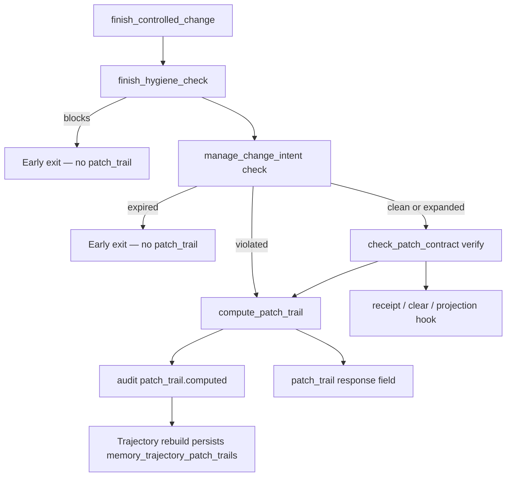

### Patch Trail {#patch-trail}

Patch Trail is a **bounded, deterministic snapshot** of declared scope, evidence
files, hygiene counts, and verify outcome for one finish cycle. It complements
patch verify — it does **not** authorize edits, expand scope, or override
structural findings.

**When emitted:** after scope `check` returns `violated` (**before** verify), or
after `verify` when check is `clean` / `expanded`. Failed verify still returns
`patch_trail` when check/verify stages were reached. Hygiene blocks and expired
intents do **not** emit Patch Trail.

**Parameters:**

| Parameter            | Default   | Meaning                                                                |
|----------------------|-----------|------------------------------------------------------------------------|
| `patch_trail_detail` | `summary` | `summary`: counts, statuses, digest, evidence refs; `full`: path lists |

**Response `patch_trail` (summary):** `schema_version` (`PATCH_TRAIL_SCHEMA_VERSION`,
currently **`1`**), `intent_id`, compact `intent_description`, `scope_check_status`,
`verification_status`, `counts`, `patch_trail_digest`, `evidence` (audit sequence
refs), `retrieval_policy` (`patch_trail_does_not_authorize_edits`,
`patch_trail_does_not_override_findings`).

**Audit:** `patch_trail.computed` stores a compact event core (`patch_trail_digest`,
counts, verification status) for trajectory projection. Requires `audit_enabled=true`.

**Persistence:** manual or job-driven trajectory rebuild projects Patch Trail into
`memory_trajectory_patch_trails` under the active `trajectory-v3` projection
(digest includes `patch_trail_digest`). The same projection carries
deterministic quality scoring and agent subjects. Scoped retrieval surfaces
`patch_trail_summary` / full `patch_trail` — see
[Engineering Memory — Trajectory memory](../13-engineering-memory/trajectory-and-patch-trail.md).

Refs: `codeclone/memory/trajectory/patch_trail.py`, `codeclone/audit/events.py`,
`codeclone/surfaces/mcp/_session_workflow_mixin.py:_finish_patch_trail`.
