<!-- doc-scope: ENGINEERING MEMORY — evidence-linked repository memory.
     owns: record types, governance lifecycle, retrieval contract, MCP sync,
       semantic search, approval model.
     does-not-own: change controller (→ 12), claim guard (→ 14),
       VS Code Memory UI (→ ../vscode-extension.md). -->

# 13. Engineering Memory

## Purpose

Engineering Memory is a **local, evidence-linked knowledge store** for a Python
repository. It captures structural facts, document links, git provenance, and
governed human/agent notes — then surfaces them to AI agents **before and during**
controlled edits.

!!! note "Not a second analyzer"
    Memory reads from the same canonical report, contracts, docs, tests, and git
    facts as CodeClone analysis. It does **not** run a separate LLM inference
    path, mutate source files, or override structural findings.

!!! note "Not analysis cache"
    The SQLite database under `.codeclone/memory/` is a **governed memory
    contract**, separate from analysis cache (`cache.json`) and baselines
    (`codeclone.baseline.json`).

---

## Status

| Phase | Capability                                                    | Surface                                                                                  |
|-------|---------------------------------------------------------------|------------------------------------------------------------------------------------------|
| 18.1  | Store, init ingest, CLI `init\|status\|for-path\|search`      | CLI                                                                                      |
| 18.2  | Scoped retrieval, ranking                                     | MCP `get_relevant_memory`, `query_engineering_memory`                                    |
| 18.3  | Refresh staleness, scope staleness, retention                 | CLI `stale`, `vacuum`; finish hook marks scope stale                                     |
| 18.4  | Draft governance, claim validation                            | MCP `manage_engineering_memory`; CLI `review-candidates\|approve\|reject\|archive`       |
| 18.5  | Scope coverage, finish proposals                              | `finish_controlled_change(propose_memory=true)`                                          |
| 18.6  | FTS search (`match_mode`), git hotspots, schema 1.1, Rich CLI | CLI `--match`; MCP `filters.match_mode`                                                  |
| 18.7  | MCP sync from analysis runs                                   | `mcp_sync_policy`; auto bootstrap on `get_relevant_memory`; `refresh_from_run`           |
| 20    | Optional semantic retrieval (LanceDB sidecar)                 | `[tool.codeclone.memory.semantic]`; CLI `memory semantic *`; MCP/CLI search `--semantic` |
| 22    | Audit event core for trajectory replay                        | `AUDIT_EVENT_CORE_VERSION`; audit `event_core_json` / `workflow_id`                      |
| 23    | Trajectory projection + SQLite storage                        | CLI `memory trajectory status\|rebuild\|list\|show\|search`                              |
| 24    | Scoped trajectory retrieval + memory evidence                 | MCP `get_relevant_memory.trajectories[]`; `query_engineering_memory(mode=trajectory_*)`  |
| 25    | Disabled-by-default local JSONL export profiles               | CLI `memory trajectory export --profile ... --out ...`                                   |
| 26    | Patch Trail persistence + scoped retrieval                    | `memory_trajectory_patch_trails`; `patch_trail_summary` on scoped retrieval              |

Schema version constant: `ENGINEERING_MEMORY_SCHEMA_VERSION` in
`codeclone/contracts/__init__.py` (currently **`1.4`**).

Semantic index format (separate contract): `SEMANTIC_INDEX_FORMAT_VERSION`
(currently **`1`**) in the same module. The vector sidecar is independent of
the SQLite memory schema version.

---

## Architecture

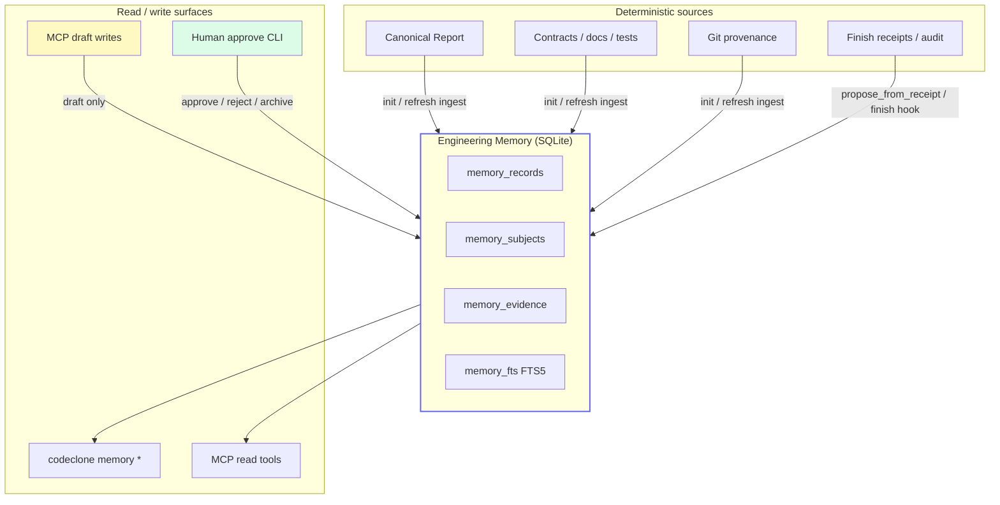

Module ownership:

| Module                                            | Role                                                 |
|---------------------------------------------------|------------------------------------------------------|
| `codeclone/memory/sqlite_store.py`                | SQLite persistence, FTS sync, subject dedup          |
| `codeclone/memory/ingest/*`                       | Init/refresh batch builders from report + git + docs |
| `codeclone/memory/retrieval/*`                    | Scoped ranking and query router                      |
| `codeclone/memory/semantic/*`                     | Projections, LanceDB sidecar, rebuild, search hits   |
| `codeclone/memory/embedding/*`                    | Embedding providers (`diagnostic` default)           |
| `codeclone/memory/governance.py`                  | Draft candidates, approve/reject, claim validation   |
| `codeclone/memory/staleness.py`                   | Refresh-time and scope-time staleness                |
| `codeclone/memory/jobs/store.py`                  | Coalesced projection rebuild jobs (schema 1.3+)      |
| `codeclone/memory/trajectory/*`                   | Audit → trajectory projection, Patch Trail, export   |
| `codeclone/config/memory*.py`                     | `[tool.codeclone.memory]` resolution                 |
| `codeclone/surfaces/cli/memory*.py`               | Human CLI + Rich rendering                           |
| `codeclone/surfaces/mcp/_session_memory_mixin.py` | MCP memory tools + finish hook                       |

Refs:

- `codeclone/memory/ingest/runner.py:run_memory_init`
- `codeclone/memory/retrieval/service.py:query_engineering_memory`
- `codeclone/surfaces/mcp/_session_memory_mixin.py`

---

## Trust boundaries

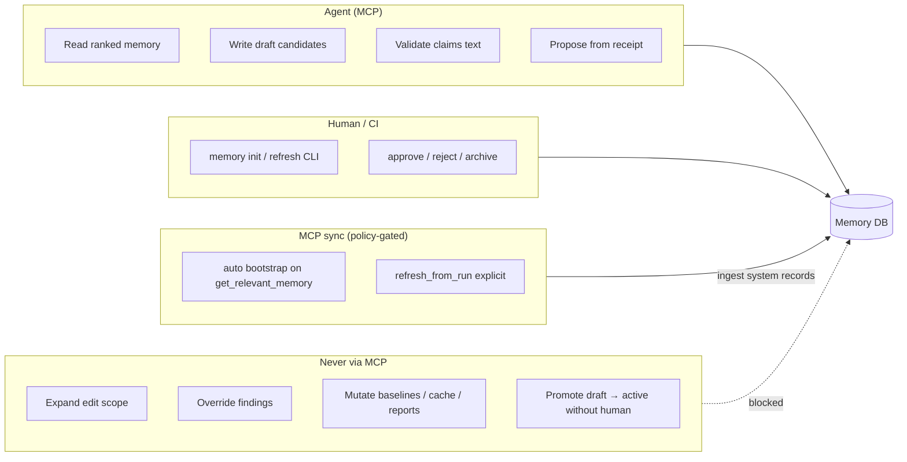

| Action                                  | Who                                   | Resulting status                           |
|-----------------------------------------|---------------------------------------|--------------------------------------------|
| Init / refresh ingest                   | Human or CI (`codeclone memory init`) | `active` system records                    |
| Auto bootstrap / refresh from MCP run   | MCP when `mcp_sync_policy` allows     | `active` system records (same ingest path) |
| `refresh_from_run`                      | Agent MCP (explicit)                  | Force ingest from selected MCP run         |
| `record_candidate`                      | Agent MCP                             | `draft`                                    |
| `finish(propose_memory=true)` on accept | Agent MCP                             | `draft` proposals + staleness side effects |
| `approve`                               | Human CLI                             | `active` + `verified`/`supported`          |
| `reject`                                | Human CLI                             | `rejected`                                 |
| `archive`                               | Human CLI                             | `archived`                                 |
| Refresh detects drift                   | System on `init --refresh`            | `stale`                                    |
| Patch touches linked path               | System on accepted finish             | `stale`                                    |

---

## Record lifecycle

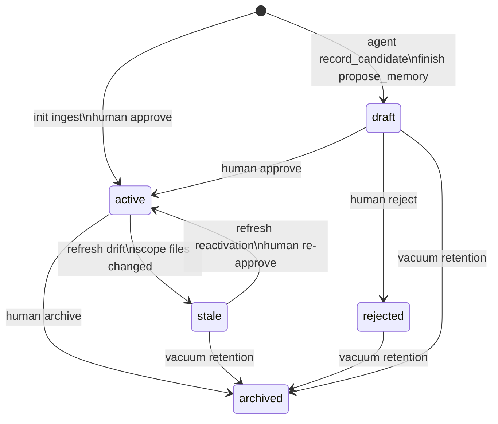

**Confidence** (`inferred` → `supported` → `verified`) and **origin**
(`system`, `agent`, `human`) are separate axes. Agents must treat `draft` and
`inferred` as non-authoritative.

Default retrieval excludes `stale`. Keyword `search` excludes `draft` unless
`include_drafts=true`; scoped `get_relevant_memory` and `for_path` /
`for_symbol` include draft agent notes automatically so handoffs are visible.
Draft records remain non-authoritative.

---

## Bootstrap: init, MCP sync, and refresh

The memory store can be created or refreshed through **CLI init**, **MCP auto-sync**
(default), or **explicit MCP refresh**. All paths call the same deterministic
ingest pipeline (`run_memory_init`).

### CLI init (human / CI)

```bash
codeclone memory init --root /abs/repo
codeclone memory init --root /abs/repo --refresh   # re-ingest + staleness pass
```

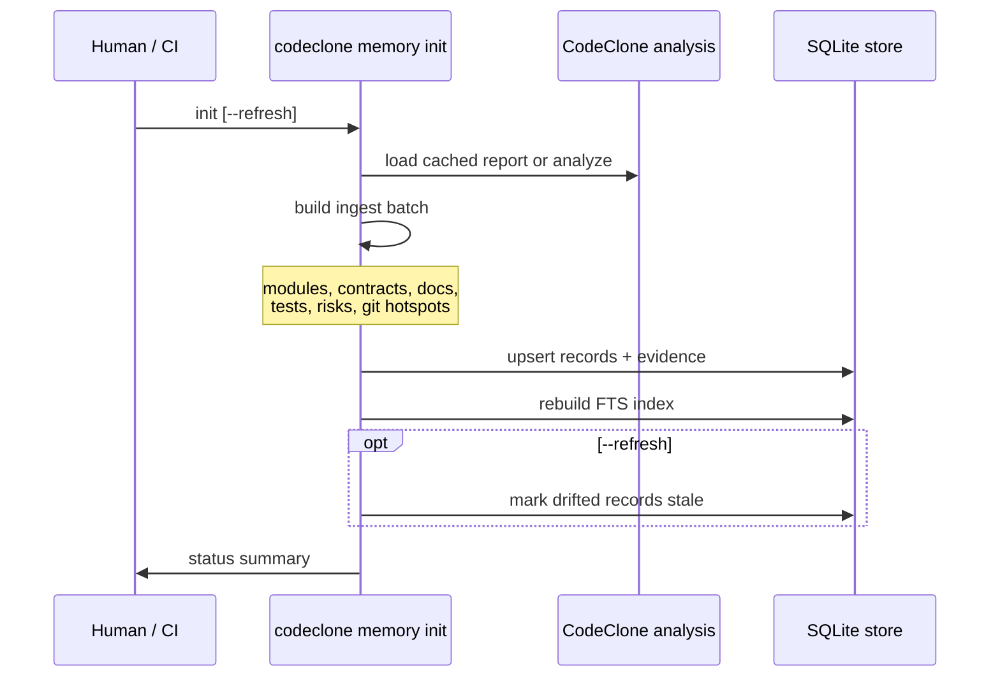

### MCP sync (default agent path)

Policy key: `mcp_sync_policy` in `[tool.codeclone.memory]` (default
`bootstrap_if_missing`).

| Policy                 | Auto behavior on `get_relevant_memory`            | Explicit `refresh_from_run` |
|------------------------|---------------------------------------------------|-----------------------------|
| `off`                  | No auto sync; DB must exist                       | Always runs ingest          |
| `bootstrap_if_missing` | Create store from latest MCP run when DB missing  | Always runs ingest          |
| `refresh_when_stale`   | Re-ingest when stored digest ≠ current run digest | Always runs ingest          |

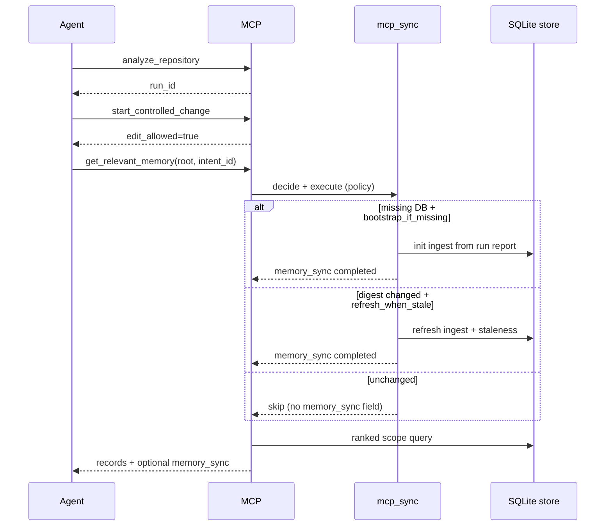

**Explicit refresh:** `manage_engineering_memory(action="refresh_from_run", run_id?)`
always ingests from the selected MCP run (defaults to latest). Use after
`analyze_repository` when you need fresh system facts without waiting for policy
triggers.

**Agent rule:** MCP sync ingests **system records only** — same as CLI init.
Human `approve` is still required for agent drafts. MCP never runs
approve/reject/archive.

When auto-sync does not run and the DB is missing, memory tools return a contract
error pointing to `refresh_from_run` or CLI init.

Ingest sources (non-exhaustive):

| Record type          | Typical ingest source                       |
|----------------------|---------------------------------------------|
| `module_role`        | Report file inventory                       |
| `contract_note`      | `codeclone/contracts/__init__.py`           |
| `document_link`      | Docs headings → repo paths                  |
| `test_anchor`        | Test file inventory                         |
| `risk_note`          | Complexity / security surfaces from metrics |
| `public_surface`     | MCP / CLI public API inventory              |
| `contradiction_note` | Cross-source conflicts during ingest        |

Git provenance (Phase 18.6): init attaches `git_commit` evidence when git is
available; optional git hotspot records use
`git_hotspot_period_days` / `git_hotspot_min_changes` from config.

Refs: `codeclone/memory/ingest/mcp_sync.py`, `codeclone/surfaces/mcp/_session_memory_mixin.py`.

---

## Configuration

Nested table in `pyproject.toml`:

```toml
[tool.codeclone.memory]
backend = "sqlite"
db_path = ".codeclone/memory/engineering_memory.sqlite3"
max_records = 10000
max_candidates = 1000
git_hotspot_period_days = 90
git_hotspot_min_changes = 5
stale_retention_days = 180
draft_retention_days = 14
mcp_sync_policy = "bootstrap_if_missing"   # off | bootstrap_if_missing | refresh_when_stale

[tool.codeclone.memory.semantic]
enabled = false                          # default: off, zero extra deps
backend = "lancedb"
index_path = ".codeclone/memory/semantic_index.lance"
embedding_provider = "diagnostic"        # diagnostic | fastembed | local_model | api
# When embedding_provider = "fastembed", defaults apply:
# embedding_model = "BAAI/bge-small-en-v1.5", dimension = 384
embedding_cache_dir = ".codeclone/memory/fastembed"  # used by fastembed
allow_model_download = false             # fastembed: require pre-populated model cache
max_results = 20
index_audit = true                       # project audit summaries when audit DB exists
```

Environment overrides:

| Variable                                         | Effect                                     |
|--------------------------------------------------|--------------------------------------------|
| `CODECLONE_MEMORY_DB_PATH`                       | SQLite store path                          |
| `CODECLONE_MEMORY_SEMANTIC_ENABLED`              | `true` / `false` for `semantic.enabled`    |
| `CODECLONE_MEMORY_SEMANTIC_EMBEDDING_PROVIDER`   | Provider literal                           |
| `CODECLONE_MEMORY_SEMANTIC_EMBEDDING_MODEL`      | Provider model name                        |
| `CODECLONE_MEMORY_SEMANTIC_EMBEDDING_CACHE_DIR`  | Local embedding cache directory            |
| `CODECLONE_MEMORY_SEMANTIC_ALLOW_MODEL_DOWNLOAD` | `true` / `false`; opt in to model download |
| `CODECLONE_MEMORY_SEMANTIC_INDEX_PATH`           | LanceDB directory path                     |
| `CODECLONE_PROJECTION_REBUILD_POLICY`            | `off` or `enqueue_when_stale`              |

Unknown keys under `[tool.codeclone.memory.semantic]` are contract errors
(Pydantic `extra="forbid"` on `SemanticConfig`).

Refs:

- `codeclone/config/memory_specs.py`
- `codeclone/config/memory_defaults.py`

---

## CLI surface

All commands live under `codeclone memory` and accept `--root` (default `.`).

| Command                                                                    | Purpose                                       |
|----------------------------------------------------------------------------|-----------------------------------------------|
| `init [--refresh] [--dry-run]`                                             | Create or refresh the memory store            |
| `status`                                                                   | Schema version, counts, last ingest metadata  |
| `for-path PATH [--limit N]`                                                | Records linked to a repo-relative path        |
| `search QUERY [--match any\|all] [--semantic] [--active-only] [--limit N]` | FTS search; optional semantic blend           |
| `semantic status`                                                          | Index availability, provider, row counts      |
| `semantic rebuild`                                                         | Rebuild LanceDB sidecar from memory + audit   |
| `semantic search QUERY [--limit N]`                                        | Search with semantic ranking (index required) |
| `stale [--limit N]`                                                        | List stale records and reasons                |
| `vacuum [--dry-run]`                                                       | Retention purge per config                    |
| `coverage --scope PATH [PATH...]`                                          | Scope coverage metrics                        |
| `review-candidates [--limit N]`                                            | List draft records awaiting human review      |
| `approve RECORD_ID [--verified-by NAME]`                                   | Promote draft → active                        |
| `reject RECORD_ID [--reason TEXT]`                                         | Reject draft                                  |
| `archive RECORD_ID [--reason TEXT]`                                        | Archive record                                |

Human governance (`approve`, `reject`, `archive`) is available through the
**CodeClone VS Code Memory** view (IDE governance channel) and the `codeclone memory`
CLI. MCP agents cannot call `approve`/`reject`/`archive` on `manage_engineering_memory`.

Refs:

- `codeclone/surfaces/cli/memory.py`
- `codeclone/surfaces/cli/memory_render.py`

---

## MCP surface

### Read tools

#### `get_relevant_memory`

Ranked, scope-aware context for the **declared edit scope**.

| Parameter                         | Purpose                                                                                                         |
|-----------------------------------|-----------------------------------------------------------------------------------------------------------------|
| `root`                            | **Required.** Absolute repository root (same as `analyze_repository`)                                           |
| `scope`                           | Explicit repo-relative paths                                                                                    |
| `intent_id`                       | Active intent from `start_controlled_change` (resolves scope)                                                   |
| `symbols`                         | Optional qualname keys for boost                                                                                |
| `max_records`                     | Cap (default 20)                                                                                                |
| `include_stale`, `include_drafts` | `include_stale` defaults false; drafts are automatic for scoped retrieval / path / symbol and opt-in for search |
| `detail_level`                    | `compact` (default) or `full` — compact returns statement previews without payload                              |

Unscoped `get_relevant_memory` is **rejected**. Pass `scope`, `intent_id`, or
`symbols`. For project-wide orientation use
`query_engineering_memory(mode=status|search)` — not root scope (`"."`, `""`).

Project root is never a valid memory scope for `scope`, `path`, or `coverage`.

`intent_id` or `scope` without `root` fails MCP argument validation (Pydantic).
Always pass the same absolute `root` used for `analyze_repository` and
`start_controlled_change`.

When auto-sync runs, the response includes a `memory_sync` object (`status`,
`trigger`, `run_id`, `report_digest`, ingest stats). Omitted when sync was skipped
(`status: unchanged`).

#### `query_engineering_memory`

Mode router for inspection and search.

| `mode`       | Required inputs                       | Purpose                                   |
|--------------|---------------------------------------|-------------------------------------------|
| `search`     | `query`; optional `semantic=true`     | FTS keyword search; optional vector blend |
| `get`        | `record_id`                           | Single record + subjects + evidence       |
| `for_path`   | `path`                                | Path-linked records                       |
| `for_symbol` | `symbol`                              | Symbol-linked records                     |
| `stale`      | —                                     | Stale inventory                           |
| `coverage`   | `scope` (non-empty, not project root) | Coverage metrics for paths                |
| `status`     | —                                     | Store status (like CLI `status`)          |

List modes (`search`, `stale`, `drafts`, scoped `get_relevant_memory`) default
to **compact** payloads: statement preview, `statement_length`, no `payload`.
Use `mode=get` or `detail_level=full` for complete statements and payload.

**Filters** (`filters` object):

| Key           | Values                   | Notes                                 |
|---------------|--------------------------|---------------------------------------|
| `types`       | list of record types     | e.g. `["contract_note", "risk_note"]` |
| `statuses`    | list of statuses         | e.g. `["active"]`                     |
| `confidences` | list of confidences      | e.g. `["verified"]`                   |
| `match_mode`  | `any` (default) or `all` | **search mode only** — token matching |

CLI equivalent: `codeclone memory search QUERY --match any|all`.

### Write tools (draft layer)

#### `manage_engineering_memory`

| `action`                 | Required params                                     | Effect                                                     |
|--------------------------|-----------------------------------------------------|------------------------------------------------------------|
| `refresh_from_run`       | optional `run_id` (defaults to latest MCP run)      | Force ingest from MCP run report                           |
| `rebuild_semantic_index` | (none)                                              | Rebuild LanceDB sidecar when `memory.semantic.enabled`     |
| `record_candidate`       | `record_type`, `statement`; optional `subject_path` | Creates **draft** record                                   |
| `validate_claims`        | `text`                                              | Memory-layer claim guard (warnings/errors)                 |
| `propose_from_receipt`   | optional `text`, `intent_id`                        | Draft proposals from finish-like payload (atomic fallback) |

IDE channel only (VS Code launches MCP with `--ide-governance-channel`):

| `action`                  | Purpose                                                 |
|---------------------------|---------------------------------------------------------|
| `register_ide_governance` | Bind session HMAC key + client attestation              |
| `prepare_governance`      | Issue ticket + nonce + `statement_digest` (protocol v2) |
| `commit_governance`       | Human confirm with HMAC proof → approve/reject/archive  |

Agent calls to `approve`, `reject`, or `archive` return `governance_mode_unavailable`
with `next_step` pointing to the VS Code Memory view (never CLI instructions).

#### `finish_controlled_change(propose_memory=true)`

On **accepted** or **accepted_with_external_changes** finish:

- proposes draft memory candidates from changed scope, claims, review text
- marks scope-linked **active** records stale
- returns `memory_candidates`, `memory_staleness`, `memory_coverage_delta`

This is the preferred post-edit memory update path when using the workflow
tools.

### Help topic

`help(topic="engineering_memory")` — compact agent playbook summary.

Refs:

- `codeclone/surfaces/mcp/server.py`
- `codeclone/surfaces/mcp/messages/help_topics.py`
- `codeclone/surfaces/mcp/_session_workflow_mixin.py` (finish hook)

---

## Agent playbook

### When to read memory

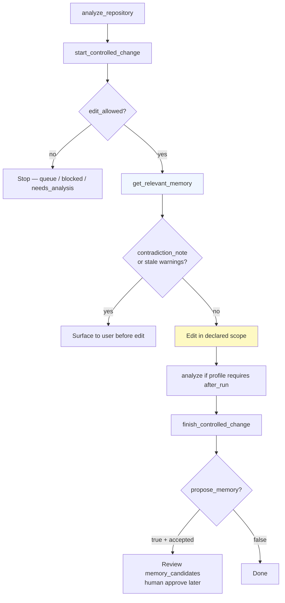

| Moment                           | Tool                                                                     | Why                                           |
|----------------------------------|--------------------------------------------------------------------------|-----------------------------------------------|
| After `start`, before first edit | `get_relevant_memory(root=abs, scope=… \| intent_id=…)`                  | Ranked context for declared scope             |
| Need one path deep-dive          | `query_engineering_memory(mode=for_path, path=…)`                        | Targeted lookup                               |
| Need keyword across store        | `query_engineering_memory(mode=search, query=…, filters={match_mode:…})` | FTS discovery                                 |
| Before writing claims in finish  | `manage_engineering_memory(action=validate_claims, text=…)`              | Catch overclaims vs memory                    |
| After accepted patch (optional)  | `finish(..., propose_memory=true)`                                       | Draft candidates + staleness + coverage delta |

### When to write memory

| Situation                        | Action                                                            | Notes                                 |
|----------------------------------|-------------------------------------------------------------------|---------------------------------------|
| Stable observation during edit   | `record_candidate`                                                | Draft only; cite scope in statement   |
| Patch accepted, workflow finish  | `propose_memory=true`                                             | Preferred batch proposal              |
| Atomic fallback (no finish hook) | `propose_from_receipt`                                            | Same receipt shape as finish          |
| System facts changed in repo     | `refresh_from_run` or ask human for `memory init --refresh`       | Explicit MCP refresh always available |
| Promote draft to trusted fact    | **Not agent** — VS Code Memory view or `codeclone memory approve` | Required for active/verified          |

### When **not** to use memory

- To justify touching `do_not_touch` paths
- To expand scope beyond declared intent
- To override CodeClone structural findings
- As a substitute for `analyze_repository` or `get_blast_radius`
- To treat `draft` / `inferred` / `stale` records as established facts

---

## Staleness and anchor durability

Records with a git anchor (`created_at_commit` + `code_fingerprint`) are judged
by **drift from that anchor**, not by whether the subject appears in the current
analysis inventory. Non-Python subjects (`.md`, `.toml`, `.js`, …) therefore
stay `active` across refresh when their on-disk bytes are unchanged.

| Anchor vs `HEAD`           | Status transition                                           |
|----------------------------|-------------------------------------------------------------|
| Fingerprint matches anchor | `active` (or reactivated from `historical` / drift `stale`) |
| Fingerprint differs        | `stale` (`subject_fingerprint_drift`)                       |
| Subject file absent        | `historical` (preserved, queryable)                         |

A record is **anchored** only when both `created_at_commit` and `code_fingerprint`
are present at write time. `record_candidate` sets git fields only when the
subject fingerprint resolves (commit without fingerprint is treated as
unanchored). Unanchored records skip anchor drift; system-ingest signals below
still apply.

Only `draft` records skip refresh drift evaluation. `human`-origin and
human-approved records follow the same anchor table — approval does not exempt
a record from honest content drift.

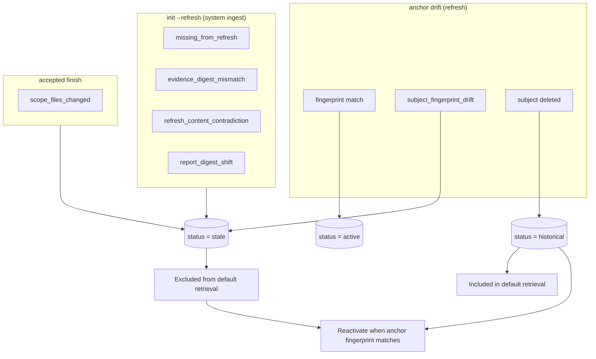

`historical` is a durable resting state — vacuum never auto-deletes it.
Stale records remain for audit but are **excluded** from `get_relevant_memory`
and default search unless explicitly included.

---

## Search semantics (schema 1.1)

### FTS (always available)

FTS5 index (`memory_fts`) indexes record statements and metadata.

| `match_mode`    | Behavior                                      |
|-----------------|-----------------------------------------------|
| `any` (default) | Match records containing **any** query token  |
| `all`           | Match records containing **all** query tokens |

Document links display as normalized headings, e.g.
`AGENTS.md · §16 · Change routing → AGENTS.md`.

Refs:

- `codeclone/memory/search_index.py`
- `codeclone/memory/display.py`

### Optional semantic retrieval (Phase 20)

Semantic search is **opt-in** and **off by default** (`enabled = false` in
`codeclone/config/memory_defaults.py`). It does not replace FTS: keyword search
still runs first; when the index is available, vector proximity **merges extra
candidates** and adjusts ranking (`semantic_proximity * 0.3` in
`codeclone/memory/retrieval/ranking.py`).

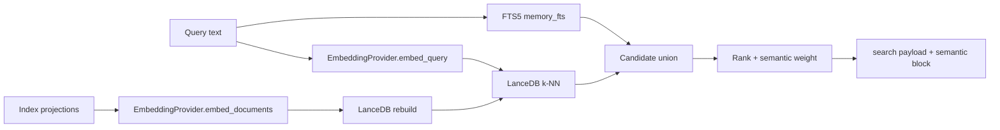

**Prerequisites (all required for `semantic.used: true`):**

1. `memory.semantic.enabled = true` in effective config.
2. Optional vector backend installed: `pip install 'codeclone[semantic-lancedb]'`.
   For semantic-quality local embeddings, install `codeclone[semantic-local]`
   instead (or combine `semantic-lancedb` + `semantic-fastembed`).
3. Index built at `index_path` (default
   `.codeclone/memory/semantic_index.lance`) via
   `manage_engineering_memory(action="rebuild_semantic_index")` (MCP agents) or
   `codeclone memory semantic rebuild` (CLI/CI).

Minimal local semantic-quality setup:

```bash
pip install 'codeclone[semantic-local]'
```

```toml
[tool.codeclone.memory.semantic]
enabled = true
embedding_provider = "fastembed"
allow_model_download = true  # or pre-populate embedding_cache_dir and keep false
```

```bash
codeclone memory init --root .
# Agents (MCP): manage_engineering_memory(action=rebuild_semantic_index)
codeclone memory semantic rebuild --root .
codeclone memory semantic search "recover after MCP restart" --root .
codeclone memory search "recover after MCP restart" --semantic --root .
```

Use `codeclone[semantic-lancedb]` only when you intentionally want the derived
sidecar with the deterministic diagnostic provider; it is stable, but not
semantic-quality recall.

**Degraded states (never crash read paths):**

| Condition                      | Index behavior                                                 | Search `semantic` block                           |
|--------------------------------|----------------------------------------------------------------|---------------------------------------------------|
| `enabled=false`                | `NullSemanticIndex`                                            | `used: false`, `reason: disabled`                 |
| Enabled, index missing         | `UnavailableSemanticIndex` (`not_built`)                       | FTS only; `used: false`                           |
| Enabled, LanceDB extra missing | `UnavailableSemanticIndex` (`lancedb_not_installed`)           | FTS only; explicit `semantic rebuild` fails clear |
| Provider unavailable           | `semantic_reason` set (e.g. FastEmbed extra/model unavailable) | FTS only                                          |

The index is a **derived, rebuildable sidecar** — not updated on the memory
write hot path. Rebuild is idempotent on projection `text_hash`
(`codeclone/memory/semantic/rebuild.py`).

#### Embedding providers

| Provider               | Status                                    | Meaning                                                                                                                                                                                                                                                                                                 |
|------------------------|-------------------------------------------|---------------------------------------------------------------------------------------------------------------------------------------------------------------------------------------------------------------------------------------------------------------------------------------------------------|
| `diagnostic` (default) | Always available                          | `DeterministicHashEmbeddingProvider`: sha256-derived unit vectors. **Stable across runs, not semantic-quality recall.** CLI prints an advisory when `provider=diagnostic`.                                                                                                                              |
| `fastembed`            | Optional: `codeclone[semantic-fastembed]` | Local ONNX embeddings through FastEmbed. Default model is `BAAI/bge-small-en-v1.5` (`384` dimensions). Query text uses a `query:` prefix; indexed records use `passage:`. Model download is disabled unless `allow_model_download=true`, so air-gapped installs can pre-populate `embedding_cache_dir`. |
| `local_model`          | Raises `MemorySemanticUnavailableError`   | Reserved compatibility literal; use `fastembed` for community local semantic search.                                                                                                                                                                                                                    |
| `api`                  | Raises `MemorySemanticUnavailableError`   | Reserved for remote/API providers.                                                                                                                                                                                                                                                                      |

Model id for diagnostic: `diagnostic-hash-v1`
(`codeclone/memory/embedding/__init__.py`).
Model id for FastEmbed: `fastembed:<embedding_model>`.

#### What gets indexed

**Memory record types** (`INDEXED_MEMORY_TYPES` in
`codeclone/memory/semantic/projection.py`):

`contract_note`, `change_rationale`, `risk_note`, `architecture_decision`,
`contradiction_note`, `protocol_rule`, `human_note`.

**Not** semantically indexed (served by exact subject / path match instead):
`module_role`, `test_anchor`, `document_link`, `public_surface`, `stale_marker`.

**Audit incidents** when `index_audit=true` (default) and `audit_enabled=true`
with a readable audit DB — projected from **`controller_events.summary` only**
(never `payload_json`). Event types:

`intent.declared`, `patch_contract.violated`, `workspace.conflict_detected`,
`baseline_abuse.detected`, `claim_validation.violated`, `review_receipt.created`.

Empty audit summaries are skipped.

#### Surfaces

| Surface                                                        | Semantic flag                                                |
|----------------------------------------------------------------|--------------------------------------------------------------|
| `query_engineering_memory(mode=search, semantic=true)`         | MCP                                                          |
| `manage_engineering_memory(action=rebuild_semantic_index)`     | MCP (build sidecar)                                          |
| `codeclone memory search --semantic`                           | CLI                                                          |
| `codeclone memory semantic search`                             | CLI (requires built index)                                   |
| `codeclone memory semantic rebuild`                            | CLI (build sidecar)                                          |
| VS Code `codeclone.memory.searchSemantic` (default **`true`**) | Passes MCP `semantic` on IDE search; server opt-in unchanged |
| `get_relevant_memory`                                          | **No** semantic parameter (scoped ranking only)              |

Search responses include a top-level **`semantic`** object:

| Field           | When set                                              |
|-----------------|-------------------------------------------------------|
| `used`          | `true` only when index + provider + rebuild succeeded |
| `backend`       | e.g. `lancedb` from index status                      |
| `provider`      | Config label (`diagnostic`, …)                        |
| `model`         | Provider `model_id` when used                         |
| `index_version` | `SEMANTIC_INDEX_FORMAT_VERSION` when used             |
| `reason`        | Degrade reason when `used` is false                   |

When semantic hits audit rows, `payload.audit_events` lists hydrated incidents
(event type, bounded summary preview, score) alongside memory records.

Refs:

- `codeclone/memory/retrieval/service.py:_handle_semantic_search_mode`
- `codeclone/memory/semantic/__init__.py:resolve_semantic_index`
- `tests/test_semantic_projection.py`, `tests/test_semantic_rebuild.py`,
  `tests/test_mcp_memory_semantic.py`, `tests/test_cli_memory_semantic.py`

---

## Trajectory memory (Phases 22–26) {#trajectory-memory-phases-2226}

Trajectory memory is a **deterministic process narrative** derived from the audit
event core. It complements governed memory cards: cards hold durable repository
facts; trajectories hold bounded edit-cycle timelines (declare → check → verify →
receipt → optional Patch Trail).

!!! note "Not authorization"
    `trajectories[]` and export JSONL are **read-only forensics**. They do not
    expand scope, approve memory records, override structural findings, or
    substitute for `finish_controlled_change`.

!!! note "Manual rebuild"
    Trajectories are **not** projected automatically on finish. Rebuild after
    audit-enabled workflows:

    ```bash
    codeclone memory trajectory rebuild --root .
    ```

    MCP agents: `manage_engineering_memory(action=rebuild_trajectories)`.

### Projection rebuild jobs (schema 1.3)

Trajectory + semantic projections can be rebuilt asynchronously via a
coalesced job row in Engineering Memory SQLite (`memory_projection_jobs`).
Default policy is **`off`**; opt in with:

```toml
[tool.codeclone.memory]
projection_rebuild_policy = "enqueue_when_stale"  # off | enqueue_when_stale
```

| Surface           | Command / action                                                                  |
|-------------------|-----------------------------------------------------------------------------------|
| CLI status        | `codeclone memory jobs status --root .`                                           |
| CLI enqueue       | `codeclone memory jobs enqueue --root . [--force] [--no-spawn]`                   |
| CLI worker        | `codeclone memory jobs run-once --root .`                                         |
| MCP enqueue       | `manage_engineering_memory(action=enqueue_projection_rebuild)`                    |
| MCP status        | `manage_engineering_memory(action=projection_rebuild_status)`                     |
| MCP worker        | `manage_engineering_memory(action=run_projection_jobs_once)`                      |
| MCP auto (finish) | When policy ≠ `off`, accepted `finish_controlled_change` enqueues + spawns worker |

Jobs never run in CI environments (`CI`, `GITHUB_ACTIONS`, …). Sync rebuild
escape hatches remain: `rebuild_trajectories` / `rebuild_semantic_index`.

### Architecture

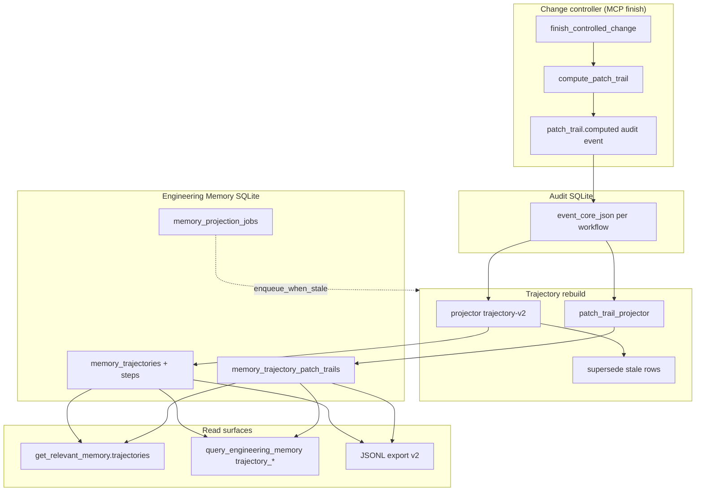

Module ownership:

| Module                                                 | Role                                                           |
|--------------------------------------------------------|----------------------------------------------------------------|
| `codeclone/audit/events.py`                            | Bounded `event_core_json`; `patch_trail.computed` compaction   |
| `codeclone/memory/trajectory/patch_trail.py`           | Finish-time Patch Trail compute (`PATCH_TRAIL_SCHEMA_VERSION`) |
| `codeclone/memory/trajectory/patch_trail_projector.py` | Rebuild Patch Trail from audit event cores                     |
| `codeclone/memory/trajectory/projector.py`             | Deterministic trajectory projection (`trajectory-v2`)          |
| `codeclone/memory/trajectory/store.py`                 | SQLite persistence, supersede, rebuild orchestration           |
| `codeclone/memory/trajectory/retrieval.py`             | Scoped ranking + `patch_trail_summary`                         |
| `codeclone/memory/trajectory/export_context.py`        | Export v2 context: precedents, citations, scope paths          |
| `codeclone/memory/trajectory/export.py`                | Local JSONL export (Phase 25+)                                 |
| `codeclone/memory/jobs/store.py`                       | Projection job queue + worker claim                            |
| `codeclone/memory/retrieval/service.py`                | MCP/CLI query router                                           |

### Config (`[tool.codeclone.memory]`)

| Key                                          | Default    | Meaning                                            |
|----------------------------------------------|------------|----------------------------------------------------|
| `trajectories_enabled`                       | `true`     | Gate rebuild/list/search                           |
| `trajectory_retention_days`                  | `365`      | Retention hint for vacuum tooling                  |
| `projection_rebuild_policy`                  | `off`      | `off` \| `enqueue_when_stale` — async rebuild jobs |
| `projection_rebuild_running_timeout_seconds` | `1800`     | Stale running job recovery                         |
| `projection_rebuild_spawn_worker`            | `true`     | Spawn worker subprocess on finish enqueue          |
| `trajectory_export_enabled`                  | `false`    | Gate JSONL export                                  |
| `trajectory_export_include_payloads`         | `false`    | Include compact step text in export rows           |
| `trajectory_export_max_record_bytes`         | `65536`    | Per-row cap                                        |
| `trajectory_export_max_file_bytes`           | `10485760` | Output file cap                                    |

Requires **`audit_enabled=true`** and a readable audit DB for rebuild input.

### CLI

```bash
codeclone memory trajectory status --root .
codeclone memory trajectory rebuild --root .
codeclone memory trajectory list --root . --limit 20
codeclone memory trajectory show TRAJ_ID --root .
codeclone memory trajectory search "recover stale intent" --root .
codeclone memory trajectory export \
  --root . \
  --profile agent-change-control-v1 \
  --out .codeclone/trajectories.jsonl \
  --force
```

Export profiles (schema contracts): `agent-change-control-v1`,
`agent-memory-retrieval-v1`, `agent-recovery-v1`, `agent-security-hardening-v1`.
Export row schema version is **`2`** (`TRAJECTORY_EXPORT_SCHEMA_VERSION`). Each row
includes:

| Field                           | Source                                                                |
|---------------------------------|-----------------------------------------------------------------------|
| `context.memory_precedents`     | Active memory records overlapping trajectory/path scope               |
| `context.trajectory_precedents` | Prior workflows with path overlap                                     |
| `citations`                     | Claim-validation event cores + report digests                         |
| `scope.paths`                   | Resolved from Patch Trail / declare / check event cores               |
| `patch_trail_summary`           | When persisted in `memory_trajectory_patch_trails`                    |
| `projection_version`            | `trajectory-v1` or `trajectory-v2` (v2 includes `patch_trail_digest`) |

Rebuild supersedes older projection rows for the same workflow (one canonical
trajectory per `workflow_id` in export). Legacy audit rows without path facts in
frozen event core are supplemented deterministically from stored audit payloads
during projection. Changing profile shape requires a profile version bump.

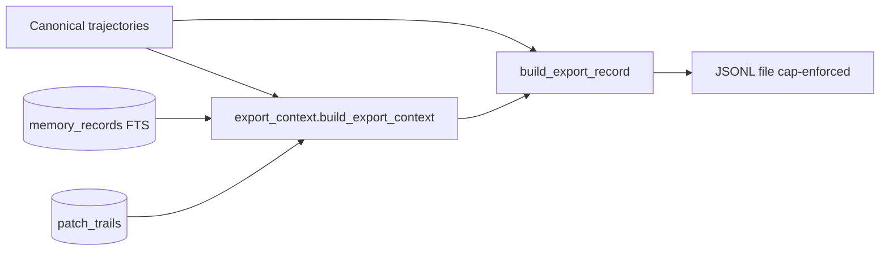

### MCP retrieval

`get_relevant_memory` adds **`trajectories[]`** beside **`records[]`** when path
subjects match (declare `scope_paths`, check `changed_files`, or
`untouched_in_declared`). When a stored Patch Trail exists for a matched
trajectory, each preview includes **`patch_trail_summary`** (counts, digest,
verification status). The top-ranked trajectory also surfaces
**`patch_trail_summary`** at the response root for quick scope context.

`query_engineering_memory(mode=trajectory_get)` returns **`patch_trail`** on the
trajectory payload when persisted for that workflow.

Trajectory rebuild (`memory trajectory rebuild` / MCP
`manage_engineering_memory(action=rebuild_trajectories)`) synthesizes Patch Trail
from audit event cores (`intent.declared`, `intent.checked`, verify events) and
stores it in **`memory_trajectory_patch_trails`**. Trajectory digest
(`trajectory-v2`) incorporates **`patch_trail_digest`** when present.

Scoped ranking adds a small boost when query scope paths intersect
**`untouched_in_declared`** paths from the stored Patch Trail.

`query_engineering_memory` modes:

| Mode                | Scope         | Notes                                                 |
|---------------------|---------------|-------------------------------------------------------|
| `trajectory_status` | project       | Projection run manifest                               |
| `trajectory_search` | query text    | Requires `query`; excludes `run:*` routine by default |
| `trajectory_get`    | trajectory id | `record_id` = trajectory id                           |

Filter: `filters.include_routine=true` on `trajectory_search` includes single-event
`run:*` analysis workflows.

Evidence kind **`trajectory`** links memory records to trajectories; human approve
still required for agent drafts.

### Enterprise boundary (export)

Community CodeClone writes **local JSONL only** — no remote API, upload, or
training pipeline. Corporate policy packs, signing, approval workflows, and dataset
registry are out of scope unless explicitly requested.

Refs:

- `codeclone/memory/trajectory/rebuild_workflow.py:execute_trajectory_rebuild`
- `codeclone/memory/trajectory/export.py:export_trajectories_jsonl`
- `tests/test_memory_trajectory_*.py`, `tests/test_audit_event_core_v2.py`

---

## Regressions and UX fixes (2.1.0a1)

These are documentation anchors for shipped fixes — see `CHANGELOG.md` **Fixed**
for the full controller list.

| Area                           | Symptom                                                   | Fix (code truth)                                                                                                                                           |
|--------------------------------|-----------------------------------------------------------|------------------------------------------------------------------------------------------------------------------------------------------------------------|
| VS Code session/audit webviews | Payload footprint table showed zeros for workflow metrics | Audit footprint JSON uses `calls` and `tokens` in `top_workflows`; the webview maps both legacy and mistaken field names (`workspaceInsightsRenderer.js`). |
| CLI session stats              | Import / duplication issues                               | Collection lives in `codeclone/controller_insights/`; CLI renders only (`surfaces/cli/session_stats.py`).                                                  |
| MCP vs CLI insights            | Session stats logic must not live only in MCP             | IDE-only tools `get_workspace_session_stats` / `get_controller_audit_trail` share the same collectors as `--session-stats` / `--audit`.                    |
| Patch verify                   | Identical before/after run accepted                       | `after_run_not_new` for `python_structural` and `governance_config` profiles.                                                                              |
| Finish hygiene                 | Over-blocking on foreign out-of-scope dirt                | Unattributed out-of-scope dirt is advisory; blocking reasons are `missing_evidence` and `foreign_dirty_overlap`.                                           |

---

## Integration with change control

Memory complements — does not replace — the Structural Change Controller
([12-structural-change-controller.md](12-structural-change-controller.md)):

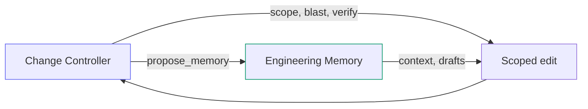

| Controller fact                | Memory fact                         |
|--------------------------------|-------------------------------------|
| `do_not_touch` — hard boundary | `risk_note` — informational hotspot |
| Patch verify `accepted`        | `change_rationale` draft proposal   |
| Blast radius dependents        | `module_role` inventory link        |

---

## Scope and token hygiene

Engineering Memory stores **short, evidence-linked cards** — not chat transcripts
or project-wide dumps.

| Rule                 | Contract                                                                                                                 |
|----------------------|--------------------------------------------------------------------------------------------------------------------------|
| Root scope forbidden | No `scope=["."]`, `path="."`, empty scope for `coverage`, or repo root as subject                                        |
| Scoped retrieval     | `get_relevant_memory` requires `scope`, `intent_id`, or `symbols`; use `status`/`search` for orientation                 |
| Compact lists        | Default `detail_level=compact`: statement preview + `statement_length`; full text via `mode=get` or `detail_level=full`  |
| Agent writes         | `record_candidate` requires `subject_path`; target ≤300 chars, soft warn >500, hard reject >1000 (`max_statement_chars`) |
| One fact per card    | Compress observations before write; store details in receipt/spec/docs                                                   |

---

## Invariants (MUST)

- Memory store path defaults under `.codeclone/memory/` — not baseline or analysis cache.
- Init ingest is deterministic given identical report + git inputs.
- MCP memory tools do not mutate baselines, analysis cache, canonical reports, or source files. Agent-visible writes
  create **draft** records only (`record_candidate`, finish `propose_memory`, atomic `propose_from_receipt`). System
  actions include `refresh_from_run`, semantic/trajectory/projection rebuild jobs, and finish-side staleness updates.
  Human approve/reject/archive stays IDE-only (VS Code Memory view).
- Subject rows deduplicated in retrieval payloads (one row per logical subject key).
- FTS rebuilt after init/refresh ingest completes.
- Schema migration is forward-only through `schema_migrate.py`.

---

## Failure modes

| Condition                  | Behavior                                                    |
|----------------------------|-------------------------------------------------------------|
| DB missing, policy `off`   | MCP error: run `refresh_from_run` or CLI init               |
| DB missing, default policy | Auto bootstrap on `get_relevant_memory` when MCP run exists |
| No MCP run for sync        | Auto sync skipped; DB missing → contract error              |
| At `max_candidates`        | `record_candidate` raises capacity error                    |
| At `max_records`           | Init upsert skips or rejects per store policy               |
| No cached report on init   | Init runs analysis or fails with clear message              |
| Git unavailable            | Init proceeds; git evidence/hotspots skipped                |
| Root scope path            | `MemoryContractError`: use status/search for orientation    |
| Unscoped retrieval         | `get_relevant_memory` rejected without scope/intent/symbols |
| Statement too long         | `record_candidate` rejected above `max_statement_chars`     |

---

## Locked by tests

- `tests/test_memory_mcp_sync.py`
- `tests/test_memory_store.py`
- `tests/test_memory_search.py`
- `tests/test_memory_retrieval.py`
- `tests/test_memory_staleness.py`
- `tests/test_memory_governance.py`
- `tests/test_memory_cli.py`
- `tests/test_mcp_service.py` (memory tool wiring)
- `tests/test_mcp_server.py` (tool registration)
- `tests/test_semantic_projection.py`, `tests/test_semantic_rebuild.py`,
  `tests/test_semantic_embedding.py`, `tests/test_semantic_index_null.py`
- `tests/test_cli_memory_semantic.py`, `tests/test_mcp_memory_semantic.py`
- `tests/test_config_semantic.py`, `tests/test_semantic_determinism_gate.py`
- `tests/test_controller_insights.py` (shared session/audit payloads)

---

## Related docs

- [MCP Interface](25-mcp-interface.md) — tool catalog
- [Structural Change Controller](12-structural-change-controller.md) — intent workflow
- [Claim Guard](14-claim-guard.md) — finish claims validation
- [CLI](11-cli.md) — `codeclone memory` commands
- [MCP for AI Agents](../mcp.md) — agent-oriented narrative
