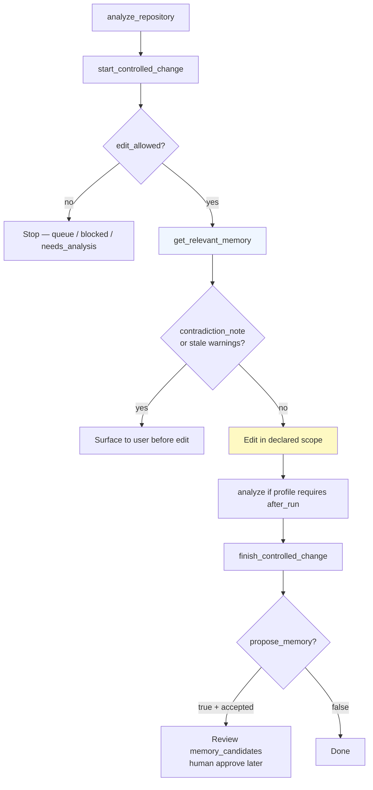

## Agent playbook

### When to read memory

| Moment                           | Tool                                                                     | Why                                           |
|----------------------------------|--------------------------------------------------------------------------|-----------------------------------------------|
| After `start`, before first edit | `get_relevant_memory(root=abs, scope=… \| intent_id=…)`                  | Ranked context for declared scope             |
| Need one path deep-dive          | `query_engineering_memory(mode=for_path, path=…)`                        | Targeted lookup                               |
| Need keyword across store        | `query_engineering_memory(mode=search, query=…, filters={match_mode:…})` | FTS discovery                                 |
| Before writing claims in finish  | `manage_engineering_memory(action=validate_claims, text=…)`              | Catch overclaims vs memory                    |
| After accepted patch (optional)  | `finish(..., propose_memory=true)`                                       | Draft candidates + staleness + coverage delta |

### When to write memory

| Situation                        | Action                                                                                   | Notes                                 |
|----------------------------------|------------------------------------------------------------------------------------------|---------------------------------------|
| Stable observation during edit   | `record_candidate`                                                                       | Draft only; cite scope in statement   |
| Patch accepted, workflow finish  | `propose_memory=true`                                                                    | Preferred batch proposal              |
| Atomic fallback (no finish hook) | `propose_from_receipt`                                                                   | Same receipt shape as finish          |
| System facts changed in repo     | `refresh_from_run` or ask human for `memory init --refresh`                              | Explicit MCP refresh always available |
| Promote draft to trusted fact    | **Not agent** — VS Code Memory view or `codeclone memory approve --i-know-what-im-doing` | Required for active/verified          |

### When **not** to use memory

- To justify touching `do_not_touch` paths
- To expand scope beyond declared intent
- To override CodeClone structural findings
- As a substitute for `analyze_repository` or `get_blast_radius`
- To treat `draft` / `inferred` / `stale` records as established facts

---
