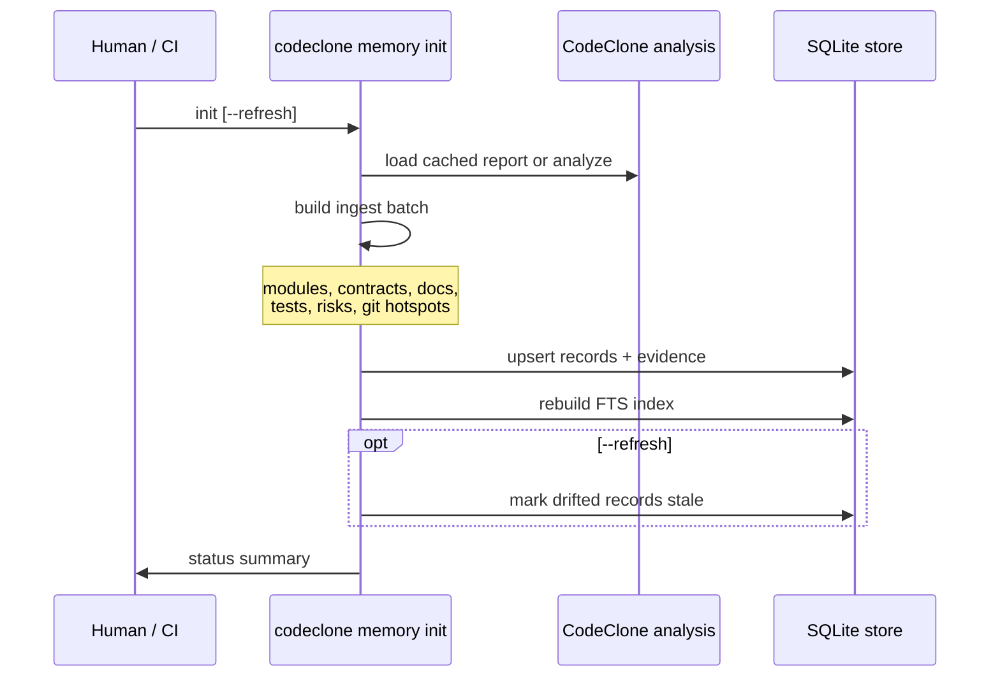
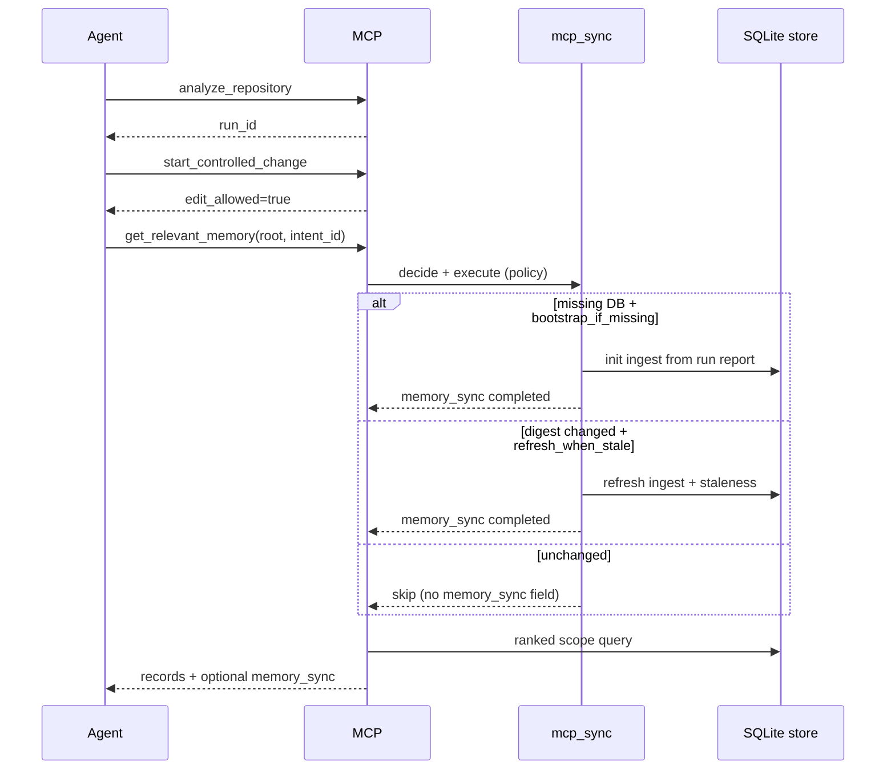

## Bootstrap: init, MCP sync, and refresh

The memory store can be created or refreshed through **CLI init**, **MCP auto-sync**
(default), or **explicit MCP refresh**. All paths call the same deterministic
ingest pipeline (`run_memory_init`).

### CLI init (human / CI)

```bash
codeclone memory init --root /abs/repo
codeclone memory init --root /abs/repo --refresh   # re-ingest + staleness pass
```



### MCP sync (default agent path)

Policy key: `mcp_sync_policy` in `[tool.codeclone.memory]` (default
`bootstrap_if_missing`).

| Policy                 | Auto behavior on `get_relevant_memory`            | Explicit `refresh_from_run` |
|------------------------|---------------------------------------------------|-----------------------------|
| `off`                  | No auto sync; DB must exist                       | Always runs ingest          |
| `bootstrap_if_missing` | Create store from latest MCP run when DB missing  | Always runs ingest          |
| `refresh_when_stale`   | Re-ingest when stored digest ≠ current run digest | Always runs ingest          |



**Explicit refresh:** `manage_engineering_memory(action="refresh_from_run", run_id?)`
always ingests from the selected MCP run (defaults to latest). Use after
`analyze_repository` when you need fresh system facts without waiting for policy
triggers.

**Agent rule:** MCP sync ingests **system records only** — same as CLI init.
Human `approve` is still required for agent drafts. MCP never runs
approve/reject/archive.

When auto-sync does not run and the DB is missing, memory tools return a contract
error pointing to `refresh_from_run` or CLI init.

Ingest sources (non-exhaustive):

| Record type          | Typical ingest source                                |
|----------------------|------------------------------------------------------|
| `module_role`        | Report file inventory                                |
| `contract_note`      | `contracts/__init__.py` paths (auto or configured)   |
| `document_link`      | Configured docs and/or `docs/**/*.md` from inventory |
| `test_anchor`        | Test file inventory                                  |
| `risk_note`          | Complexity / security surfaces from metrics          |
| `public_surface`     | MCP / CLI public API inventory                       |
| `contradiction_note` | Optional MCP tool-count doc vs snapshot              |

Git provenance: init attaches `git_commit` evidence when git is
available; optional git hotspot records use
`git_hotspot_period_days` / `git_hotspot_min_changes` from config.

Refs: `codeclone/memory/ingest/mcp_sync.py`, `codeclone/surfaces/mcp/_session_memory_mixin.py`.

---

## Configuration

Nested tables in `pyproject.toml` under `[tool.codeclone.memory]`,
`[tool.codeclone.memory.ingest]`, and `[tool.codeclone.memory.semantic]`.
Defaults live in `codeclone/config/memory_defaults.py`; key validation in
`codeclone/config/memory_specs.py` (flat memory keys) and
`codeclone/config/memory.py` (`IngestConfig`, `SemanticConfig`).

### Retention and capacity

| Key                              | Type | Default | Purpose                                          |
|----------------------------------|------|---------|--------------------------------------------------|
| `active_retention_days`          | int  | `-1`    | Active record retention (`-1` = no age purge)    |
| `stale_retention_days`           | int  | `180`   | Stale record retention before vacuum             |
| `draft_retention_days`           | int  | `14`    | Draft candidate retention                        |
| `rejected_retention_days`        | int  | `30`    | Rejected draft retention                         |
| `archived_retention_days`        | int  | `365`   | Archived record retention                        |
| `receipt_retention_days`         | int  | `90`    | Finish-receipt evidence retention                |
| `max_records`                    | int  | `10000` | Hard cap on persisted records                    |
| `max_candidates`                 | int  | `1000`  | Draft inbox capacity                             |
| `max_evidence_per_record`        | int  | `20`    | Evidence rows per record                         |
| `max_statement_chars`            | int  | `1000`  | Statement hard limit (target 300, soft warn 500) |
| `max_blast_radius_cache_entries` | int  | `500`   | Cached blast-radius projections per project      |
| `trajectory_retention_days`      | int  | `365`   | Stored trajectory projection retention           |

### Store backend and sync

| Key               | Type | Default                                        | Purpose                                                 |
|-------------------|------|------------------------------------------------|---------------------------------------------------------|
| `backend`         | str  | `sqlite`                                       | Persistence backend                                     |
| `db_path`         | str  | `.codeclone/memory/engineering_memory.sqlite3` | SQLite path                                             |
| `mcp_sync_policy` | str  | `bootstrap_if_missing`                         | `off` \| `bootstrap_if_missing` \| `refresh_when_stale` |

### Git hotspots (init ingest)

| Key                       | Type | Default | Purpose                                |
|---------------------------|------|---------|----------------------------------------|
| `git_hotspot_period_days` | int  | `90`    | Git history window for hotspot records |
| `git_hotspot_min_changes` | int  | `5`     | Minimum commits to emit a hotspot      |

### Trajectory projection and export

| Key                                  | Type | Default    | Purpose                                      |
|--------------------------------------|------|------------|----------------------------------------------|
| `trajectories_enabled`               | bool | `true`     | Enable trajectory projection from audit core |
| `trajectory_export_enabled`          | bool | `false`    | Gate CLI `trajectory export`                 |
| `trajectory_export_include_payloads` | bool | `false`    | Include step payloads in JSONL export        |
| `trajectory_export_max_record_bytes` | int  | `65536`    | Per-record export size cap                   |
| `trajectory_export_max_file_bytes`   | int  | `10485760` | Export file size cap                         |

### Projection rebuild coalesce

| Key                                          | Type | Default | Purpose                                                 |
|----------------------------------------------|------|---------|---------------------------------------------------------|
| `projection_rebuild_policy`                  | str  | `off`   | `off` \| `enqueue_when_stale` — finish may enqueue jobs |
| `projection_rebuild_running_timeout_seconds` | int  | `1800`  | Stale running-job reclaim timeout                       |
| `projection_rebuild_spawn_worker`            | bool | `true`  | Spawn detached worker on enqueue                        |
| `projection_rebuild_coalesce_window_seconds` | int  | `60`    | Batch sub-threshold rebuilds (`0` = immediate spawn)    |
| `projection_rebuild_coalesce_min_delta`      | int  | `25`    | Active-record delta bypassing coalesce window           |

### Ingest paths (`[tool.codeclone.memory.ingest]`)

| Key                             | Type           | Default | Purpose                                                                        |
|---------------------------------|----------------|---------|--------------------------------------------------------------------------------|
| `contract_constants_paths`      | string list    | `[]`    | Contract version files; empty uses auto discovery under `codeclone/contracts/` |
| `document_link_paths`           | string list    | `[]`    | Doc paths; empty uses README, AGENTS, CLAUDE, and docs tree                    |
| `mcp_tool_schema_snapshot_path` | string or null | `null`  | MCP tool schema snapshot for contradiction checks                              |
| `mcp_tool_count_doc_paths`      | string list    | `[]`    | Docs claiming MCP tool counts (requires snapshot path)                         |

### Semantic batching (`[tool.codeclone.memory.semantic]`)

| Key                                 | Type | Default                                  | Purpose                                               |
|-------------------------------------|------|------------------------------------------|-------------------------------------------------------|
| `enabled`                           | bool | `false`                                  | Opt-in semantic sidecar                               |
| `backend`                           | str  | `lancedb`                                | Vector backend                                        |
| `index_path`                        | str  | `.codeclone/memory/semantic_index.lance` | LanceDB path                                          |
| `embedding_provider`                | str  | `diagnostic`                             | `diagnostic` \| `fastembed` \| `local_model` \| `api` |
| `embedding_model`                   | str  | provider default                         | e.g. `BAAI/bge-small-en-v1.5` for fastembed           |
| `embedding_cache_dir`               | str  | `.codeclone/memory/fastembed`            | Model cache directory                                 |
| `allow_model_download`              | bool | `false`                                  | Permit fastembed downloads                            |
| `dimension`                         | int  | `256`                                    | Diagnostic provider dimension                         |
| `max_results`                       | int  | `20`                                     | Semantic search cap                                   |
| `index_audit`                       | bool | `true`                                   | Project audit summaries into index                    |
| `embed_max_documents_per_batch`     | int  | `64`                                     | Embedding batch document cap                          |
| `embed_max_padded_tokens_per_batch` | int  | `8192`                                   | Embedding batch token budget                          |
| `projection_token_estimator`        | str  | `chars_approx`                           | `chars_approx` \| `tiktoken`                          |

Environment overrides for memory and semantic fields:
[10-config Environment variable overrides](../10-config-and-defaults.md#environment-variable-overrides)
(Engineering Memory table).

Unknown keys under `[tool.codeclone.memory.semantic]` are contract errors
(Pydantic `extra="forbid"` on `SemanticConfig`).

Refs:

- `codeclone/config/memory_specs.py`
- `codeclone/config/memory_defaults.py`
- `codeclone/config/memory.py`

---
