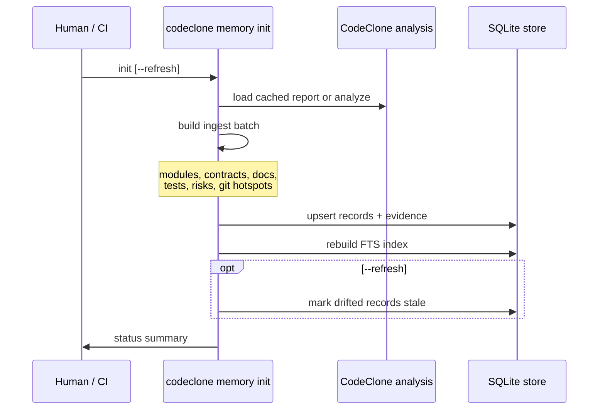
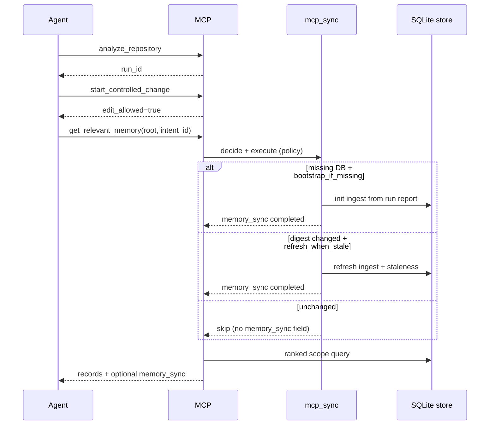

## Bootstrap: init, MCP sync, and refresh

The memory store can be created or refreshed through **CLI init**, **MCP auto-sync**
(default), or **explicit MCP refresh**. All paths call the same deterministic
ingest pipeline (`run_memory_init`).

### CLI init (human / CI)

```bash
codeclone memory init --root /abs/repo
codeclone memory init --root /abs/repo --refresh   # re-ingest + staleness pass
```



### MCP sync (default agent path)

Policy key: `mcp_sync_policy` in `[tool.codeclone.memory]` (default
`bootstrap_if_missing`).

| Policy                 | Auto behavior on `get_relevant_memory`            | Explicit `refresh_from_run` |
|------------------------|---------------------------------------------------|-----------------------------|
| `off`                  | No auto sync; DB must exist                       | Always runs ingest          |
| `bootstrap_if_missing` | Create store from latest MCP run when DB missing  | Always runs ingest          |
| `refresh_when_stale`   | Re-ingest when stored digest ≠ current run digest | Always runs ingest          |



**Explicit refresh:** `manage_engineering_memory(action="refresh_from_run", run_id?)`
always ingests from the selected MCP run (defaults to latest). Use after
`analyze_repository` when you need fresh system facts without waiting for policy
triggers.

**Agent rule:** MCP sync ingests **system records only** — same as CLI init.
Human `approve` is still required for agent drafts. MCP never runs
approve/reject/archive.

When auto-sync does not run and the DB is missing, memory tools return a contract
error pointing to `refresh_from_run` or CLI init.

Ingest sources (non-exhaustive):

| Record type          | Typical ingest source                       |
|----------------------|---------------------------------------------|
| `module_role`        | Report file inventory                       |
| `contract_note`      | `contracts/__init__.py` paths (auto or configured) |
| `document_link`      | Configured docs and/or `docs/**/*.md` from inventory |
| `test_anchor`        | Test file inventory                         |
| `risk_note`          | Complexity / security surfaces from metrics |
| `public_surface`     | MCP / CLI public API inventory              |
| `contradiction_note` | Optional MCP tool-count doc vs snapshot     |

Git provenance (Phase 18.6): init attaches `git_commit` evidence when git is
available; optional git hotspot records use
`git_hotspot_period_days` / `git_hotspot_min_changes` from config.

Refs: `codeclone/memory/ingest/mcp_sync.py`, `codeclone/surfaces/mcp/_session_memory_mixin.py`.

---

## Configuration

Nested table in `pyproject.toml`:

```toml
[tool.codeclone.memory]
backend = "sqlite"
db_path = ".codeclone/memory/engineering_memory.sqlite3"
max_records = 10000
max_candidates = 1000
git_hotspot_period_days = 90
git_hotspot_min_changes = 5
stale_retention_days = 180
draft_retention_days = 14
mcp_sync_policy = "bootstrap_if_missing"   # off | bootstrap_if_missing | refresh_when_stale

[tool.codeclone.memory.ingest]
# Empty lists use industry auto-discovery from the analysis file registry.
contract_constants_paths = []            # default: any */contracts/__init__.py
document_link_paths = []                 # default: README/AGENTS/CLAUDE + docs/**/*.md
# MCP tool-count contradiction checks are opt-in (both paths required):
# mcp_tool_schema_snapshot_path = "tests/fixtures/contract_snapshots/mcp_tool_schemas.json"
# mcp_tool_count_doc_paths = ["docs/book/25-mcp-interface/index.md"]

[tool.codeclone.memory.semantic]
enabled = false                          # default: off, zero extra deps
backend = "lancedb"
index_path = ".codeclone/memory/semantic_index.lance"
embedding_provider = "diagnostic"        # diagnostic | fastembed | local_model | api
# When embedding_provider = "fastembed", defaults apply:
# embedding_model = "BAAI/bge-small-en-v1.5", dimension = 384
embedding_cache_dir = ".codeclone/memory/fastembed"  # used by fastembed
allow_model_download = false             # fastembed: require pre-populated model cache
max_results = 20
index_audit = true                       # project audit summaries when audit DB exists
```

Environment overrides:

| Variable                                         | Effect                                     |
|--------------------------------------------------|--------------------------------------------|
| `CODECLONE_MEMORY_DB_PATH`                       | SQLite store path                          |
| `CODECLONE_MEMORY_SEMANTIC_ENABLED`              | `true` / `false` for `semantic.enabled`    |
| `CODECLONE_MEMORY_SEMANTIC_EMBEDDING_PROVIDER`   | Provider literal                           |
| `CODECLONE_MEMORY_SEMANTIC_EMBEDDING_MODEL`      | Provider model name                        |
| `CODECLONE_MEMORY_SEMANTIC_EMBEDDING_CACHE_DIR`  | Local embedding cache directory            |
| `CODECLONE_MEMORY_SEMANTIC_ALLOW_MODEL_DOWNLOAD` | `true` / `false`; opt in to model download |
| `CODECLONE_MEMORY_SEMANTIC_INDEX_PATH`           | LanceDB directory path                     |
| `CODECLONE_PROJECTION_REBUILD_POLICY`            | `off` or `enqueue_when_stale`              |

Unknown keys under `[tool.codeclone.memory.semantic]` are contract errors
(Pydantic `extra="forbid"` on `SemanticConfig`).

Refs:

- `codeclone/config/memory_specs.py`
- `codeclone/config/memory_defaults.py`

---
