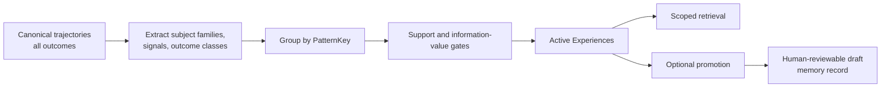

# Experience Layer

<!-- doc-scope: contract -->

Experiences are the third Engineering Memory knowledge tier:

1. memory records describe what the project knows;
2. trajectories describe what happened during agent work;
3. Experiences summarize recurring, evidence-linked patterns across
   trajectories.

Experiences are advisory. They do not authorize edits, override findings, or
replace the human-governed memory record lifecycle.

## Distillation pipeline

The current distillation version is `experience-v1`. Every canonical
trajectory may contribute, including partial, blocked, and incident-bearing
work. Distillation is not limited to verified or successful changes.

## Pattern identity

An Experience key contains:

- `subject_family`: a deterministic directory family derived from touched
  paths, with at most eight families per trajectory;
- `signal`: a non-ubiquitous label or a derived signal;
- `outcome_class`: `<outcome>:<quality_tier>`.

Derived signals include:

- `verification_incomplete` for partial or blocked work without a verified
  finish;
- `incident_present` when a trajectory contains incidents.

Agent and tool identity are deliberately excluded from `PatternKey`. They are
evidence facets, not pattern identity, so equivalent project behavior can
coalesce across agents.

## Admission and scoring

A candidate requires:

- support from at least five trajectories;
- information value of at least `50`;
- no more than twenty retained evidence trajectory IDs.

Information value is deterministic:

- `+60` when evidence spans at least two agent families;
- `+25` for a structural signal;
- capped at `100`.

A single-agent pattern therefore does not pass the current information-value
threshold by itself.

The Experience ID and digest exclude timestamps. They include the pattern key,
sorted member trajectory IDs, and the distillation version. This keeps
replace-all rebuilds reproducible.

## Storage and retrieval

Distillation replaces the project's Experience projection atomically in
deterministic order. Current records are `active`. The domain model reserves a
`dormant` state, but dormant lifecycle management is not implemented.

Scoped retrieval:

- returns active Experiences only;
- exact-matches the requested directory `subject_family`;
- sorts by support descending, information value descending, then ID;
- returns compact evidence counts and agent-family summaries by default;
- adds agent facets and evidence trajectory IDs at full detail.

The current distiller emits `agent_family` facets. Other facet kinds are
reserved by the domain types but are not currently populated.

## Promotion boundary

Promotion is explicit and idempotent. It creates a human-reviewable draft
memory candidate with the Experience statement, subject family, and trajectory
evidence. It obeys the project's draft capacity and does not silently approve
the result.

Only the IDE governance channel can approve, reject, or archive memory records.
See [Trust and lifecycle](trust-and-lifecycle.md),
[MCP surface](mcp-surface.md), and the
[trajectories and Experiences guide](../../guide/memory/trajectories-and-experiences.md).
