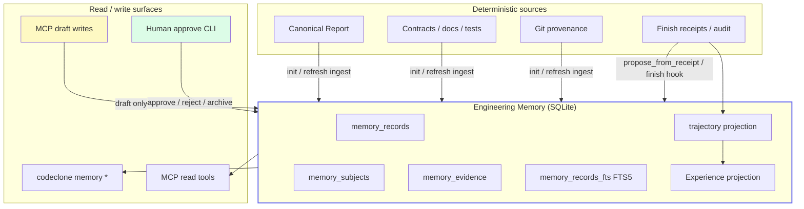

# Engineering Memory

## Purpose

Engineering Memory is a **local, evidence-linked knowledge store** for a Python
repository. It captures structural facts, document links, git provenance, and
governed human/agent notes — then surfaces them to AI agents **before and during**
controlled edits.

!!! note "Not a second analyzer"
    Memory reads from the same canonical report, contracts, docs, tests, and git
    facts as CodeClone analysis. It does **not** run a separate LLM inference
    path, mutate source files, or override structural findings.

!!! note "Not analysis cache"
    The SQLite database under `.codeclone/memory/` is a **governed memory
    contract**, separate from analysis cache (`cache.json`) and baselines
    (`codeclone.baseline.json`).

---

## Status

| Status           | Capability                                                    | Surface                                                                                  |
|------------------|---------------------------------------------------------------|------------------------------------------------------------------------------------------|
| Live             | Store, init ingest, CLI `init\|status\|for-path\|search`      | CLI                                                                                      |
| Live             | Scoped retrieval, ranking                                     | MCP `get_relevant_memory`, `query_engineering_memory`                                    |
| Live             | Refresh staleness, scope staleness, retention                 | CLI `stale`, `vacuum`; finish hook marks scope stale                                     |
| Live             | Draft governance, claim validation                            | MCP `manage_engineering_memory`; CLI `review-candidates\|approve\|reject\|archive`       |
| Live             | Scope coverage, finish proposals                              | `finish_controlled_change(propose_memory=true)`                                          |
| Live             | FTS search (`match_mode`), git hotspots, schema 1.1, Rich CLI | CLI `--match`; MCP `filters.match_mode`                                                  |
| Live             | MCP sync from analysis runs                                   | `mcp_sync_policy`; auto bootstrap on `get_relevant_memory`; `refresh_from_run`           |
| Optional sidecar | Semantic retrieval (LanceDB sidecar)                          | `[tool.codeclone.memory.semantic]`; CLI `memory semantic *`; MCP/CLI search `--semantic` |
| Live             | Audit event core for trajectory replay                        | `AUDIT_EVENT_CORE_VERSION`; audit `event_core_json` / `workflow_id`                      |
| Live             | Trajectory projection + SQLite storage                        | CLI `memory trajectory status\|rebuild\|list\|show\|search`                              |
| Live             | Scoped trajectory retrieval + memory evidence                 | MCP `get_relevant_memory.trajectories[]`; `query_engineering_memory(mode=trajectory_*)`  |
| Local opt-in     | Disabled-by-default local JSONL export profiles               | CLI `memory trajectory export --profile ... --out ...`                                   |
| Live             | Patch Trail persistence + scoped retrieval                    | `memory_trajectory_patch_trails`; `patch_trail_summary` on scoped retrieval              |
| Live             | Incremental projection jobs                                   | Watermarked trajectory rebuild, semantic hash-skip, coalesced worker                     |
| Live             | Trajectory quality and passport analytics                     | Quality/complexity contract, anomalies, agents, dashboard                                |
| Live             | Experience Layer                                              | Distillation job, scoped `experiences[]`, `promote_experience` draft bridge              |

Schema version constant: `ENGINEERING_MEMORY_SCHEMA_VERSION` in
`codeclone/contracts/__init__.py` (currently **`1.7`**).

Semantic index format (separate contract): `SEMANTIC_INDEX_FORMAT_VERSION`
(currently **`3`**) in the same module. The vector sidecar is independent of
the SQLite memory schema version.

---

## Architecture

Module ownership:

| Module                                            | Role                                                 |
|---------------------------------------------------|------------------------------------------------------|
| `codeclone/memory/sqlite_store.py`                | SQLite persistence, FTS sync, subject dedup          |
| `codeclone/memory/ingest/*`                       | Init/refresh batch builders from report + git + docs |
| `codeclone/memory/retrieval/*`                    | Scoped ranking and query router                      |
| `codeclone/memory/semantic/*`                     | Projections, LanceDB sidecar, rebuild, search hits   |
| `codeclone/memory/embedding/*`                    | Embedding providers (`diagnostic` default)           |
| `codeclone/memory/governance.py`                  | Draft candidates, approve/reject, claim validation   |
| `codeclone/memory/staleness.py`                   | Refresh-time and scope-time staleness                |
| `codeclone/memory/jobs/store.py`                  | Coalesced projection rebuild jobs (schema 1.3+)      |
| `codeclone/memory/trajectory/*`                   | Audit → trajectory projection, Patch Trail, export   |
| `codeclone/memory/experience/*`                   | Deterministic Experience distillation + persistence  |
| `codeclone/config/memory*.py`                     | `[tool.codeclone.memory]` resolution                 |
| `codeclone/surfaces/cli/memory*.py`               | Human CLI + Rich rendering                           |
| `codeclone/surfaces/mcp/_session_memory_mixin.py` | MCP memory tools + finish hook                       |

Refs:

- `codeclone/memory/ingest/runner.py:run_memory_init`
- `codeclone/memory/retrieval/service.py:query_engineering_memory`
- `codeclone/surfaces/mcp/_session_memory_mixin.py`

Normative detail:

- [Trajectory and Patch Trail](trajectory-and-patch-trail.md)
- [Trajectory quality and passport](trajectory-quality-and-passport.md)
- [Experience Layer](experience-layer.md)
- [Projection jobs](projection-jobs.md)
- [Practical trajectory and Experience guide](../../guide/memory/trajectories-and-experiences.md)

---

## Regressions and UX fixes (2.1.0a1)

These are documentation anchors for shipped fixes — see `CHANGELOG.md` **Fixed**
for the full controller list.

| Area                           | Symptom                                                   | Fix (code truth)                                                                                                                                           |
|--------------------------------|-----------------------------------------------------------|------------------------------------------------------------------------------------------------------------------------------------------------------------|
| VS Code session/audit webviews | Payload footprint table showed zeros for workflow metrics | Audit footprint JSON uses `calls` and `tokens` in `top_workflows`; the webview maps both legacy and mistaken field names (`workspaceInsightsRenderer.js`). |
| CLI session stats              | Import / duplication issues                               | Collection lives in `codeclone/controller_insights/`; CLI renders only (`surfaces/cli/session_stats.py`).                                                  |
| MCP vs CLI insights            | Session stats logic must not live only in MCP             | IDE-only tools `get_workspace_session_stats` / `get_controller_audit_trail` share the same collectors as `--session-stats` / `--audit`.                    |
| Patch verify                   | Identical before/after run accepted                       | `after_run_not_new` for `python_structural` and `governance_config` profiles.                                                                              |
| Finish hygiene                 | Over-blocking on foreign out-of-scope dirt                | Unattributed out-of-scope dirt is advisory; blocking reasons are `missing_evidence` and `foreign_dirty_overlap`.                                           |

---
