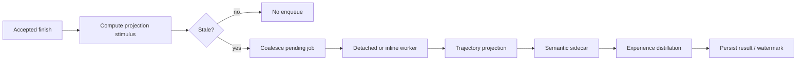

### Projection rebuild jobs (schema 1.3+)

Trajectory, semantic, and Experience projections can be rebuilt asynchronously
via a coalesced job row in Engineering Memory SQLite
(`memory_projection_jobs`). The worker rebuilds trajectories first, refreshes
the semantic sidecar, then distills Experiences from the resulting trajectory
corpus.
Default policy is **`off`**; opt in with:

```toml
[tool.codeclone.memory]
projection_rebuild_policy = "enqueue_when_stale"  # off | enqueue_when_stale
```

| Surface           | Command / action                                                                  |
|-------------------|-----------------------------------------------------------------------------------|
| CLI status        | `codeclone memory jobs status --root .`                                           |
| CLI enqueue       | `codeclone memory jobs enqueue --root . [--force] [--no-spawn]`                   |
| CLI worker        | `codeclone memory jobs run-once --root .`                                         |
| MCP enqueue       | `manage_engineering_memory(action=enqueue_projection_rebuild)`                    |
| MCP status        | `manage_engineering_memory(action=projection_rebuild_status)`                     |
| MCP worker        | `manage_engineering_memory(action=run_projection_jobs_once)`                      |
| MCP auto (finish) | When policy ≠ `off`, accepted `finish_controlled_change` enqueues + spawns worker |

Jobs never run in CI environments (`CI`, `GITHUB_ACTIONS`, …). Sync rebuild
escape hatches remain: `rebuild_trajectories` / `rebuild_semantic_index`.

## Queue and worker contract



The stimulus includes repository digest, projection version and enablement,
audit event-core counts/watermarks, and active memory-record counts. Pending
work for the same project is coalesced instead of duplicated.

The job store claims work with an immediate SQLite transaction and permits one
running job per project. Dead-worker and timeout states are reclaimed as
failed before new work is claimed. Trajectory rebuild is incremental when its
stored projection version and audit watermark are compatible; otherwise it
falls back to a full rebuild. Semantic projection may hash-skip unchanged
sources.

Job states are `pending`, `running`, `done`, `failed`, and `skipped`.
`run-once` returns `nothing_to_do` when the queue is empty. Worker results and
bounded errors remain job metadata; they do not alter canonical analysis.

Platform Observability can correlate accepted finish, worker spawn, and worker
execution without changing the queue contract. See
[Platform Observability](../26-platform-observability.md).
