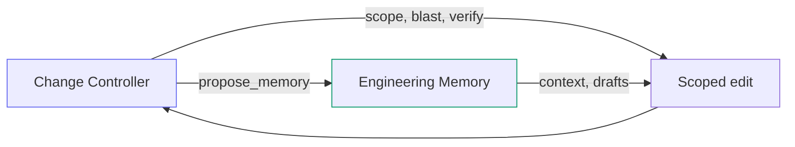

## Integration with change control

Memory complements — does not replace — the Structural Change Controller
([12-structural-change-controller/index.md](../12-structural-change-controller/index.md)):

| Controller fact                | Memory fact                         |
|--------------------------------|-------------------------------------|
| `do_not_touch` — hard boundary | `risk_note` — informational hotspot |
| Patch verify `accepted`        | `change_rationale` draft proposal   |
| Blast radius dependents        | `module_role` inventory link        |

---

## Scope and token hygiene

Engineering Memory stores **short, evidence-linked cards** — not chat transcripts
or project-wide dumps.

| Rule                 | Contract                                                                                                                 |
|----------------------|--------------------------------------------------------------------------------------------------------------------------|
| Root scope forbidden | No `scope=["."]`, `path="."`, empty scope for `coverage`, or repo root as subject                                        |
| Scoped retrieval     | `get_relevant_memory` requires `scope`, `intent_id`, or `symbols`; use `status`/`search` for orientation                 |
| Compact lists        | Default `detail_level=compact`: statement preview + `statement_length`; full text via `mode=get` or `detail_level=full`  |
| Agent writes         | `record_candidate` requires `subject_path`; target ≤300 chars, soft warn >500, hard reject >1000 (`max_statement_chars`) |
| One fact per card    | Compress observations before write; store details in receipt/spec/docs                                                   |

---

## Invariants (MUST)

- Memory store path defaults under `.codeclone/memory/` — not baseline or analysis cache.
- Init ingest is deterministic given identical report + git inputs.
- MCP memory tools do not mutate baselines, analysis cache, canonical reports, or source files. Agent-visible writes
  create **draft** records only (`record_candidate`, finish `propose_memory`, atomic `propose_from_receipt`). System
  actions include `refresh_from_run`, semantic/trajectory/projection rebuild jobs, and finish-side staleness updates.
  Human approve/reject/archive: VS Code Memory view **or**
  `codeclone memory approve|reject|archive` (not MCP agent tools).
- Subject rows deduplicated in retrieval payloads (one row per logical subject key).
- FTS rebuilt after init/refresh ingest completes.
- Schema migration is forward-only through `schema_migrate.py`.

---

## Failure modes

| Condition                  | Behavior                                                    |
|----------------------------|-------------------------------------------------------------|
| DB missing, policy `off`   | MCP error: run `refresh_from_run` or CLI init               |
| DB missing, default policy | Auto bootstrap on `get_relevant_memory` when MCP run exists |
| No MCP run for sync        | Auto sync skipped; DB missing → contract error              |
| At `max_candidates`        | `record_candidate` raises capacity error                    |
| At `max_records`           | Init upsert skips or rejects per store policy               |
| No cached report on init   | Init runs analysis or fails with clear message              |
| Git unavailable            | Init proceeds; git evidence/hotspots skipped                |
| Root scope path            | `MemoryContractError`: use status/search for orientation    |
| Unscoped retrieval         | `get_relevant_memory` rejected without scope/intent/symbols |
| Statement too long         | `record_candidate` rejected above `max_statement_chars`     |

---

## Locked by tests

- `tests/test_memory_mcp_sync.py`
- `tests/test_memory_store.py`
- `tests/test_memory_search.py`
- `tests/test_memory_retrieval.py`
- `tests/test_memory_staleness.py`
- `tests/test_memory_governance.py`
- `tests/test_memory_cli.py`
- `tests/test_mcp_service.py` (memory tool wiring)
- `tests/test_mcp_server.py` (tool registration)
- `tests/test_semantic_projection.py`, `tests/test_semantic_rebuild.py`,
  `tests/test_semantic_chunking.py`, `tests/test_semantic_projection_probe.py`,
  `tests/test_semantic_embedding.py`, `tests/test_semantic_index_null.py`
- `tests/test_cli_memory_semantic.py`, `tests/test_mcp_memory_semantic.py`
- `tests/test_config_semantic.py`, `tests/test_semantic_determinism_gate.py`
- `tests/test_controller_insights.py` (shared session/audit payloads)

---

## Related docs

- [MCP Interface](../25-mcp-interface/index.md) — tool catalog
- [Structural Change Controller](../12-structural-change-controller/index.md) — intent workflow
- [Claim Guard](../14-claim-guard.md) — finish claims validation
- [CLI](../11-cli.md) — `codeclone memory` commands
- [MCP for AI Agents](../../guide/mcp/README.md) — agent-oriented narrative
