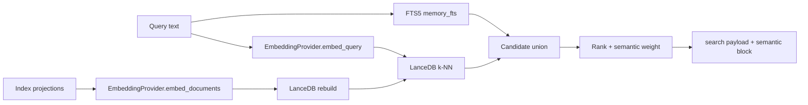

<!-- doc-scope: Semantic retrieval contract. class: contract max-lines: 150 -->

# Optional Semantic Retrieval

Semantic search is **opt-in** and **off by default** (`enabled = false` in
`codeclone/config/memory_defaults.py`). It does not replace FTS: keyword search
still runs first; when the index is available, vector proximity **merges extra
candidates** and adjusts ranking (`semantic_proximity * 0.3` in
`codeclone/memory/retrieval/ranking.py`).



**Prerequisites (all required for `semantic.used: true`):**

1. `memory.semantic.enabled = true` in effective config.
2. Optional vector backend installed: `pip install 'codeclone[semantic-lancedb]'`.
   For semantic-quality local embeddings, install `codeclone[semantic-local]`
   instead (or combine `semantic-lancedb` + `semantic-fastembed`).
3. Index built at `index_path` (default
   `.codeclone/memory/semantic_index.lance`) via
   `manage_engineering_memory(action="rebuild_semantic_index")` (MCP agents) or
   `codeclone memory semantic rebuild` (CLI/CI).

Minimal local semantic-quality setup:

```bash
pip install 'codeclone[semantic-local]'
```

```toml
[tool.codeclone.memory.semantic]
enabled = true
embedding_provider = "fastembed"
allow_model_download = true  # or pre-populate embedding_cache_dir and keep false
```

```bash
codeclone memory init --root .
# Agents (MCP): manage_engineering_memory(action=rebuild_semantic_index)
codeclone memory semantic rebuild --root .
codeclone memory semantic search "recover after MCP restart" --root .
codeclone memory search "recover after MCP restart" --semantic --root .
```

Use `codeclone[semantic-lancedb]` only when you intentionally want the derived
sidecar with the deterministic diagnostic provider; it is stable, but not
semantic-quality recall.

**Degraded states (never crash read paths):**

| Condition                      | Index behavior                                                 | Search `semantic` block                           |
|--------------------------------|----------------------------------------------------------------|---------------------------------------------------|
| `enabled=false`                | `NullSemanticIndex`                                            | `used: false`, `reason: disabled`                 |
| Enabled, index missing         | `UnavailableSemanticIndex` (`not_built`)                       | FTS only; `used: false`                           |
| Enabled, LanceDB extra missing | `UnavailableSemanticIndex` (`lancedb_not_installed`)           | FTS only; explicit `semantic rebuild` fails clear |
| Provider unavailable           | `semantic_reason` set (e.g. FastEmbed extra/model unavailable) | FTS only                                          |

The index is a **derived, rebuildable sidecar** — not updated on the memory
write hot path. Rebuild is idempotent on projection `text_hash`
(`codeclone/memory/semantic/rebuild.py`).

#### Embedding providers

| Provider               | Status                                    | Meaning                                                                                                                                                                                                                                                                                                 |
|------------------------|-------------------------------------------|---------------------------------------------------------------------------------------------------------------------------------------------------------------------------------------------------------------------------------------------------------------------------------------------------------|
| `diagnostic` (default) | Always available                          | `DeterministicHashEmbeddingProvider`: sha256-derived unit vectors. **Stable across runs, not semantic-quality recall.** CLI prints an advisory when `provider=diagnostic`.                                                                                                                              |
| `fastembed`            | Optional: `codeclone[semantic-fastembed]` | Local ONNX embeddings through FastEmbed. Default model is `BAAI/bge-small-en-v1.5` (`384` dimensions). Query text uses a `query:` prefix; indexed records use `passage:`. Model download is disabled unless `allow_model_download=true`, so air-gapped installs can pre-populate `embedding_cache_dir`. |
| `local_model`          | Raises `MemorySemanticUnavailableError`   | Reserved compatibility literal; use `fastembed` for community local semantic search.                                                                                                                                                                                                                    |
| `api`                  | Raises `MemorySemanticUnavailableError`   | Reserved for remote/API providers.                                                                                                                                                                                                                                                                      |

Model id for diagnostic: `diagnostic-hash-v1`
(`codeclone/memory/embedding/__init__.py`).
Model id for FastEmbed: `fastembed:<embedding_model>`.

#### What gets indexed

**Memory record types** (`INDEXED_MEMORY_TYPES` in
`codeclone/memory/semantic/projection.py`):

`contract_note`, `change_rationale`, `risk_note`, `architecture_decision`,
`contradiction_note`, `protocol_rule`, `human_note`.

**Not** semantically indexed (served by exact subject / path match instead):
`module_role`, `test_anchor`, `document_link`, `public_surface`, `stale_marker`.

**Audit incidents** when `index_audit=true` (default) and `audit_enabled=true`
with a readable audit DB — projected from **`controller_events.summary` only**
(never `payload_json`). Event types:

`intent.declared`, `patch_contract.violated`, `workspace.conflict_detected`,
`baseline_abuse.detected`, `claim_validation.violated`, `review_receipt.created`.

Empty audit summaries are skipped.

**Trajectory passports** when trajectories are enabled — projected via
`project_trajectory()` from bounded trajectory fields (summary, outcome, subjects;
see `codeclone/memory/semantic/projection.py`). Long texts become multiple index
units under format **`2`** (below).

#### Surfaces

| Surface                                                        | Semantic flag                                                |
|----------------------------------------------------------------|--------------------------------------------------------------|
| `query_engineering_memory(mode=search, semantic=true)`         | MCP                                                          |
| `manage_engineering_memory(action=rebuild_semantic_index)`     | MCP (build sidecar)                                          |
| `codeclone memory search --semantic`                           | CLI                                                          |
| `codeclone memory semantic search`                             | CLI (requires built index)                                   |
| `codeclone memory semantic rebuild`                            | CLI (build sidecar)                                          |
| `codeclone memory semantic probe [--exact-tokens] [--json]`    | CLI — per-lane projection length stats                       |
| VS Code `codeclone.memory.searchSemantic` (default **`true`**) | Passes MCP `semantic` on IDE search; server opt-in unchanged |
| `get_relevant_memory`                                          | **No** semantic parameter (scoped ranking only)              |

Search responses include a top-level **`semantic`** object:

| Field           | When set                                              |
|-----------------|-------------------------------------------------------|
| `used`          | `true` only when index + provider + rebuild succeeded |
| `backend`       | e.g. `lancedb` from index status                      |
| `provider`      | Config label (`diagnostic`, …)                        |
| `model`         | Provider `model_id` when used                         |
| `index_version` | `SEMANTIC_INDEX_FORMAT_VERSION` when used             |
| `reason`        | Degrade reason when `used` is false                   |

`codeclone memory semantic probe` emits per-lane stats under
`lanes.{memory,audit,trajectory}`. Default estimator is cheap planning; pass
`--exact-tokens` to load the FastEmbed tokenizer and measure passage-prefixed
texts that rebuild would embed. With `--exact-tokens`, trajectory uses the same
chunker as rebuild: `lanes.trajectory.chunking` reports
`{source_documents, index_units, multi_chunk_sources}` and `documents` counts
index units (not raw projections). Lane-level `overflow_examples` (up to five)
list index units still above the model window. Chunking reserves passage prefix
and model special tokens; rebuild fails closed with
`SemanticChunkingInvariantError` when a chunk cannot be proven to fit.

Format **`2`** indexes long trajectory projections as multiple chunk rows linked
by `parent_id` (single-chunk trajectories keep the trajectory id as `id`).
Hybrid search oversamples trajectory `k × TRAJECTORY_SEARCH_OVERSAMPLE` (4),
collapses chunk hits to the best score per trajectory, and sets
`matched_chunk_index` / `matched_chunk_count` on the returned trajectory hit.

When semantic hits audit rows, `payload.audit_events` lists hydrated incidents
(event type, bounded summary preview, score) alongside memory records.

Refs:

- `codeclone/memory/retrieval/service.py:_handle_semantic_search_mode`
- `codeclone/memory/semantic/__init__.py:resolve_semantic_index`
- `tests/test_semantic_projection.py`, `tests/test_semantic_rebuild.py`,
  `tests/test_semantic_chunking.py`, `tests/test_semantic_projection_probe.py`,
  `tests/test_mcp_memory_semantic.py`, `tests/test_cli_memory_semantic.py`

---
