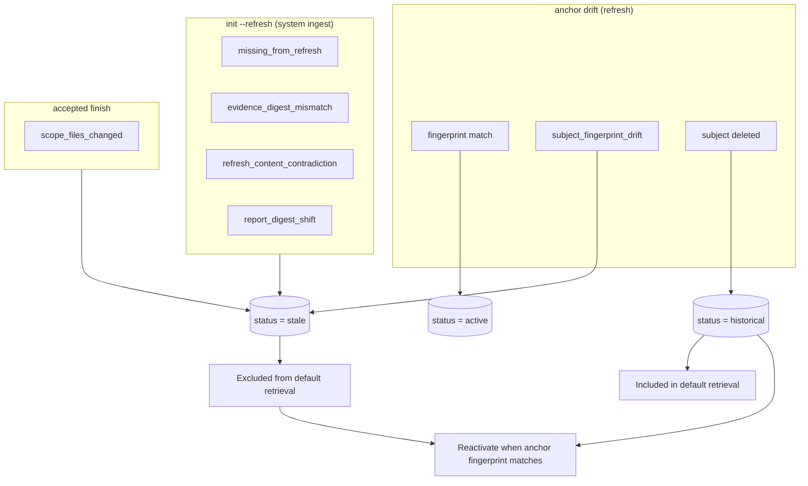

## Staleness and anchor durability

Records with a git anchor (`created_at_commit` + `code_fingerprint`) are judged
by **drift from that anchor**, not by whether the subject appears in the current
analysis inventory. Non-Python subjects (`.md`, `.toml`, `.js`, …) therefore
stay `active` across refresh when their on-disk bytes are unchanged.

| Anchor vs `HEAD`           | Status transition                                           |
|----------------------------|-------------------------------------------------------------|
| Fingerprint matches anchor | `active` (or reactivated from `historical` / drift `stale`) |
| Fingerprint differs        | `stale` (`subject_fingerprint_drift`)                       |
| Subject file absent        | `historical` (preserved, queryable)                         |

A record is **anchored** only when both `created_at_commit` and `code_fingerprint`
are present at write time. `record_candidate` sets git fields only when the
subject fingerprint resolves (commit without fingerprint is treated as
unanchored). Unanchored records skip anchor drift; system-ingest signals below
still apply.

Only `draft` records skip refresh drift evaluation. `human`-origin and
human-approved records follow the same anchor table — approval does not exempt
a record from honest content drift.

`historical` is a durable resting state — vacuum never auto-deletes it.
Stale records remain for audit but are **excluded** from `get_relevant_memory`
and default search unless explicitly included.

---
