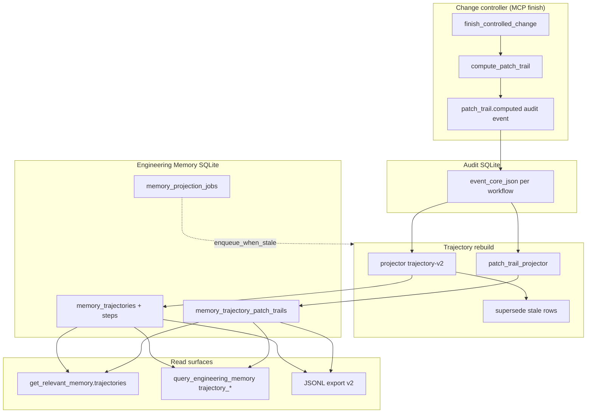
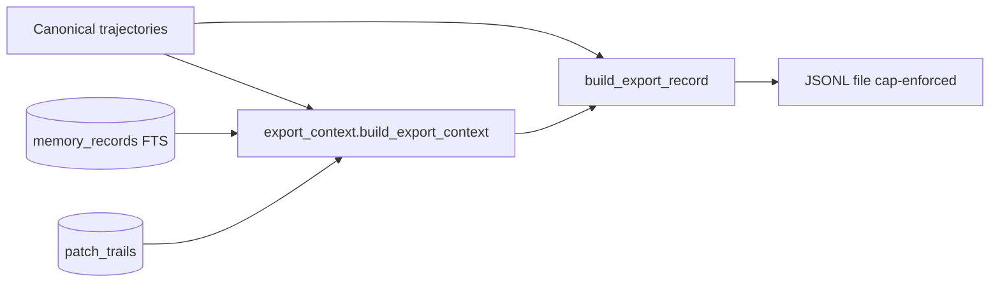

## Trajectory memory (Phases 22–26) {#trajectory-memory-phases-2226}

Trajectory memory is a **deterministic process narrative** derived from the audit
event core. It complements governed memory cards: cards hold durable repository
facts; trajectories hold bounded edit-cycle timelines (declare → check → verify →
receipt → optional Patch Trail).

!!! note "Not authorization"
    `trajectories[]` and export JSONL are **read-only forensics**. They do not
    expand scope, approve memory records, override structural findings, or
    substitute for `finish_controlled_change`.

!!! note "Projection timing"
    Trajectory **rows** are built by `rebuild_trajectories` (CLI or MCP) from
    the audit event core — not inline on every finish. Finish **does** compute
    Patch Trail and may **enqueue** a projection rebuild job when
    `memory.projection_rebuild_policy` is not `off` (skipped in CI). Run
    `codeclone memory jobs run-once` or wait for the worker to materialize
    trajectories after audit-enabled finishes.

    ```bash
    codeclone memory trajectory rebuild --root .
    ```

    MCP agents: `manage_engineering_memory(action=rebuild_trajectories)`.

### Architecture



Module ownership:

| Module                                                 | Role                                                           |
|--------------------------------------------------------|----------------------------------------------------------------|
| `codeclone/audit/events.py`                            | Bounded `event_core_json`; `patch_trail.computed` compaction   |
| `codeclone/memory/trajectory/patch_trail.py`           | Finish-time Patch Trail compute (`PATCH_TRAIL_SCHEMA_VERSION`) |
| `codeclone/memory/trajectory/patch_trail_projector.py` | Rebuild Patch Trail from audit event cores                     |
| `codeclone/memory/trajectory/projector.py`             | Deterministic trajectory projection (`trajectory-v2`)          |
| `codeclone/memory/trajectory/store.py`                 | SQLite persistence, supersede, rebuild orchestration           |
| `codeclone/memory/trajectory/retrieval.py`             | Scoped ranking + `patch_trail_summary`                         |
| `codeclone/memory/trajectory/export_context.py`        | Export v2 context: precedents, citations, scope paths          |
| `codeclone/memory/trajectory/export.py`                | Local JSONL export (Phase 25+)                                 |
| `codeclone/memory/jobs/store.py`                       | Projection job queue + worker claim                            |
| `codeclone/memory/retrieval/service.py`                | MCP/CLI query router                                           |

### Config (`[tool.codeclone.memory]`)

| Key                                          | Default    | Meaning                                            |
|----------------------------------------------|------------|----------------------------------------------------|
| `trajectories_enabled`                       | `true`     | Gate rebuild/list/search                           |
| `trajectory_retention_days`                  | `365`      | Retention hint for vacuum tooling                  |
| `projection_rebuild_policy`                  | `off`      | `off` \| `enqueue_when_stale` — async rebuild jobs |
| `projection_rebuild_running_timeout_seconds` | `1800`     | Stale running job recovery                         |
| `projection_rebuild_spawn_worker`            | `true`     | Spawn worker subprocess on finish enqueue          |
| `trajectory_export_enabled`                  | `false`    | Gate JSONL export                                  |
| `trajectory_export_include_payloads`         | `false`    | Include compact step text in export rows           |
| `trajectory_export_max_record_bytes`         | `65536`    | Per-row cap                                        |
| `trajectory_export_max_file_bytes`           | `10485760` | Output file cap                                    |

Requires **`audit_enabled=true`** and a readable audit DB for rebuild input.

### CLI

```bash
codeclone memory trajectory status --root .
codeclone memory trajectory rebuild --root .
codeclone memory trajectory list --root . --limit 20
codeclone memory trajectory show TRAJ_ID --root .
codeclone memory trajectory search "recover stale intent" --root .
codeclone memory trajectory export \
  --root . \
  --profile agent-change-control-v1 \
  --out .codeclone/trajectories.jsonl \
  --force
```

Export profiles (schema contracts): `agent-change-control-v1`,
`agent-memory-retrieval-v1`, `agent-recovery-v1`, `agent-security-hardening-v1`.
Export row schema version is **`2`** (`TRAJECTORY_EXPORT_SCHEMA_VERSION`). Each row
includes:

| Field                           | Source                                                                |
|---------------------------------|-----------------------------------------------------------------------|
| `context.memory_precedents`     | Active memory records overlapping trajectory/path scope               |
| `context.trajectory_precedents` | Prior workflows with path overlap                                     |
| `citations`                     | Claim-validation event cores + report digests                         |
| `scope.paths`                   | Resolved from Patch Trail / declare / check event cores               |
| `patch_trail_summary`           | When persisted in `memory_trajectory_patch_trails`                    |
| `projection_version`            | `trajectory-v1` or `trajectory-v2` (v2 includes `patch_trail_digest`) |

Rebuild supersedes older projection rows for the same workflow (one canonical
trajectory per `workflow_id` in export). Legacy audit rows without path facts in
frozen event core are supplemented deterministically from stored audit payloads
during projection. Changing profile shape requires a profile version bump.



### MCP retrieval

`get_relevant_memory` adds **`trajectories[]`** beside **`records[]`** when path
subjects match (declare `scope_paths`, check `changed_files`, or
`untouched_in_declared`). When a stored Patch Trail exists for a matched
trajectory, each preview includes **`patch_trail_summary`** (counts, digest,
verification status). With `detail_level=full`, the top-ranked trajectory also
surfaces **`patch_trail_summary`** at the response root. Compact retrieval omits
that root duplicate; the summary remains on the trajectory preview.

`query_engineering_memory(mode=trajectory_get)` returns **`patch_trail`** on the
trajectory payload when persisted for that workflow.

Trajectory rebuild (`memory trajectory rebuild` / MCP
`manage_engineering_memory(action=rebuild_trajectories)`) synthesizes Patch Trail
from audit event cores (`intent.declared`, `intent.checked`, verify events) and
stores it in **`memory_trajectory_patch_trails`**. Trajectory digest
(`trajectory-v2`) incorporates **`patch_trail_digest`** when present.

Scoped ranking adds a small boost when query scope paths intersect
**`untouched_in_declared`** paths from the stored Patch Trail.

`query_engineering_memory` modes:

| Mode                | Scope         | Notes                                                 |
|---------------------|---------------|-------------------------------------------------------|
| `trajectory_status` | project       | Projection run manifest                               |
| `trajectory_search` | query text    | Requires `query`; excludes `run:*` routine by default |
| `trajectory_get`    | trajectory id | `record_id` = trajectory id                           |

Filter: `filters.include_routine=true` on `trajectory_search` includes single-event
`run:*` analysis workflows.

Evidence kind **`trajectory`** links memory records to trajectories; human approve
still required for agent drafts.

Label taxonomy and **`step_label`** display names:
[Trajectory labels](trajectory-labels.md).

### Enterprise boundary (export)

Community CodeClone writes **local JSONL only** — no remote API, upload, or
training pipeline. Corporate policy packs, signing, approval workflows, and dataset
registry are out of scope unless explicitly requested.

Refs:

- `codeclone/memory/trajectory/rebuild_workflow.py:execute_trajectory_rebuild`
- `codeclone/memory/trajectory/export.py:export_trajectories_jsonl`
- `tests/test_memory_trajectory_*.py`, `tests/test_audit_event_core_v2.py`
