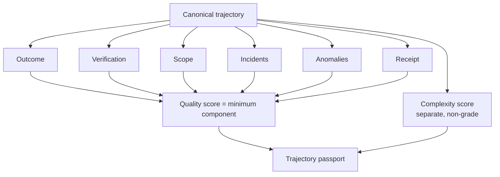

# Trajectory Quality and Passport

<!-- doc-scope: contract -->

Trajectory projection version `3` adds explainable quality, complexity,
anomaly, agent, and dashboard views. These are derived diagnostics over
canonical audit evidence, not analysis findings or edit permissions.

For the event-to-trajectory projection itself, see
[Trajectory and patch trail](trajectory-and-patch-trail.md).

## Passport model



The passport keeps quality and complexity separate:

- quality answers how well the workflow satisfied its contract;
- complexity describes how much declared scope, event activity, and workflow
  structure the trajectory contained.

High complexity is not a defect and does not reduce quality by itself.

## Quality score

Quality score version `2` is the minimum of six components:

| Component | Scoring |
|---|---|
| Outcome | accepted `100`, accepted external `85`, partial `55`, abandoned `40`, blocked `30`, violated `20` |
| Verification | accepted `100`, accepted external `85`, unverified `50`, violated/blocked `0`, not reached `40` |
| Scope | clean `100`, expanded `85`, partial `70`, violated `0` |
| Incidents | `max(0, 100 - 10 × incident_count)` |
| Anomalies | starts at `100`; error costs `12`, warning costs `5` |
| Receipt | change-control trajectory with receipt `100`, without `85`; non-change workflow `100` |

When patch-trail verification is unavailable, the verification component falls
back to quality tier: verified `100`, corrected `90`, routine `85`, partial
`60`, incident `45`.

The minimum-component rule makes the limiting evidence visible instead of
averaging a contract failure away.

## Complexity score

Complexity is:

```text
min(100,
    min(40, declared_scope_count * 2)
  + min(30, event_count * 3)
  + min(20, workflow_step_count * 2))
```

Bands are `low < 35`, `moderate 35..69`, and `high >= 70`.

## Anomalies

The projection can emit:

- outcome anomalies: violated, blocked, or abandoned;
- quality incidents and elevated incident count;
- incident labels such as baseline abuse, claim-guard failure, foreign
  conflict, hook failure, or recovered state;
- incomplete change cycles or missing intent cleanup;
- scope violations;
- verification gaps.

Anomalies are deterministic review cues. They are not repository findings.

## Analytics surfaces

Agent analytics group by the exact canonical `agent_label`, not an inferred
agent family. The dashboard combines projection status, agent aggregates,
anomalies, and recent trajectories.

Routine `run:*` workflows and trajectories with quality tier `routine` are
excluded by default. Callers can opt in with `include_routine=true`.

Available CLI commands:

```bash
codeclone memory trajectory status --root .
codeclone memory trajectory rebuild --root .
codeclone memory trajectory list --root .
codeclone memory trajectory search QUERY --root .
codeclone memory trajectory show TRAJECTORY_ID --root .
codeclone memory trajectory agents --root .
codeclone memory trajectory anomalies --root .
codeclone memory trajectory dashboard --root .
codeclone memory trajectory export --root . \
  --profile agent-change-control-v1 \
  --out trajectories.jsonl
```

MCP modes are `trajectory_status`, `trajectory_search`, `trajectory_get`,
`trajectory_anomalies`, `trajectory_agents`, and `trajectory_dashboard`.
`trajectory_get` uses `record_id` as the trajectory ID and always returns full
detail.

The VS Code extension exposes a dashboard, detail view, copyable dashboard
brief, and passport sections for quality, complexity, duration, events, steps,
incidents, evidence, patch trail, contract gates, and score calculations. See
[VS Code integration](../integrations/vs-code-extension.md).
