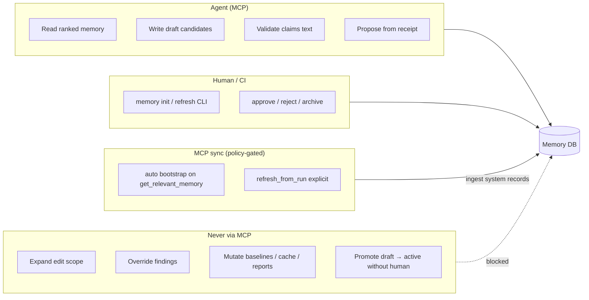
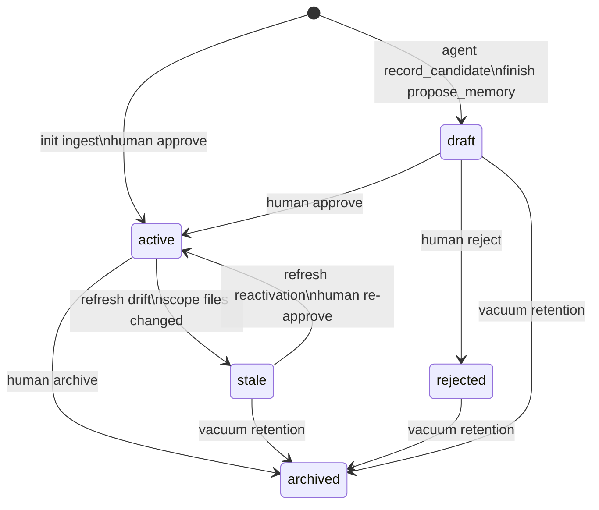

## Trust boundaries

| Action                                  | Who                                   | Resulting status                           |
|-----------------------------------------|---------------------------------------|--------------------------------------------|
| Init / refresh ingest                   | Human or CI (`codeclone memory init`) | `active` system records                    |
| Auto bootstrap / refresh from MCP run   | MCP when `mcp_sync_policy` allows     | `active` system records (same ingest path) |
| `refresh_from_run`                      | Agent MCP (explicit)                  | Force ingest from selected MCP run         |
| `record_candidate`                      | Agent MCP                             | `draft`                                    |
| `finish(propose_memory=true)` on accept | Agent MCP                             | `draft` proposals + staleness side effects |
| `approve`                               | Human CLI                             | `active` + `verified`/`supported`          |
| `reject`                                | Human CLI                             | `rejected`                                 |
| `archive`                               | Human CLI                             | `archived`                                 |
| Refresh detects drift                   | System on `init --refresh`            | `stale`                                    |
| Patch touches linked path               | System on accepted finish             | `stale`                                    |

---

## Record lifecycle

**Confidence** (`inferred` → `supported` → `verified`) and **origin**
(`system`, `agent`, `human`) are separate axes. Agents must treat `draft` and
`inferred` as non-authoritative.

Default retrieval excludes `stale`. Keyword `search` excludes `draft` unless
`include_drafts=true`; scoped `get_relevant_memory` and `for_path` /
`for_symbol` include draft agent notes automatically so handoffs are visible.
Draft records remain non-authoritative.

---
