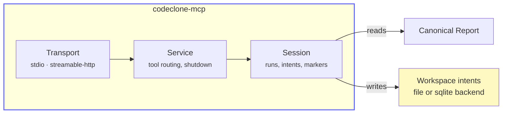
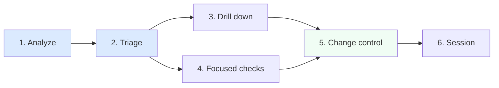

# 20. MCP Interface

## Purpose

Define the public MCP surface in the CodeClone `2.1` release line.

The MCP layer is optional, read-only, and built on the same canonical
pipeline/report contracts as the CLI. It does not create a second analysis
engine or a second persistence model.

!!! note "Integration surface, not a second analyzer"
    MCP composes over the canonical report and run state shared by CLI, HTML,
    and SARIF. It never mutates source files, baselines, analysis cache, or
    report artifacts.

---

## Public surface

| Artifact          | Path                                                                                                                                                           |
|-------------------|----------------------------------------------------------------------------------------------------------------------------------------------------------------|
| Package extra     | `codeclone[mcp]`                                                                                                                                               |
| Launcher          | `codeclone-mcp`                                                                                                                                                |
| Server wiring     | `codeclone/surfaces/mcp/server.py`                                                                                                                             |
| Message catalog   | `codeclone/surfaces/mcp/messages/*` (`tools`/`resources` titles, `help_topics`, `params`, `workflow`, `intent`, `errors`, patch-contract/verification copy, …) |
| Service / session | `codeclone/surfaces/mcp/service.py`, `codeclone/surfaces/mcp/session.py`                                                                                       |

---

## Shape

Current server characteristics:

- **Optional dependency** — base `codeclone` install does not require MCP
  runtime packages.
- **Transports** — `stdio` (default), `streamable-http`.
- **Run storage** — in-memory only, bounded by `--history-limit` (default 4,
  max 10). Latest-run pointer is process-local.
- **Roots** — analysis tools require an absolute repository root. Relative
  roots such as `.` are rejected.
- **Analysis modes** — `full`, `clones_only`.
- **Cache policies** — `reuse` (default) and `off` only; `refresh` is CLI-only
  and rejected by MCP.
- **Workspace intent registry** — `intent_registry_backend` selects `file`
  (ephemeral JSON under `.cache/codeclone/intents/`) or `sqlite` (auditable
  rows under `.cache/codeclone/db/intents.sqlite3` with closed-row retention;
  default 7 days, max 14 in open source). See
  [Plans and Retention](../plans-and-retention.md).

!!! warning "Absolute roots and remote exposure"
    Analysis tools require an absolute repository root. HTTP exposure beyond
    loopback requires explicit `--allow-remote` and has no built-in
    authentication.

---

## Tools

Current tool set: **31 tools** organized by workflow phase.

The surface is intentionally triage-first: analyze → summarize/triage →
drill into one finding or one hotspot family.

### Analysis and run-level tools

| Tool                    | Key parameters                                                                                                                                                  | Purpose                                                              |
|-------------------------|-----------------------------------------------------------------------------------------------------------------------------------------------------------------|----------------------------------------------------------------------|
| `analyze_repository`    | `root`, `analysis_mode`, thresholds, `api_surface`, `coverage_xml`, `baseline_path`, `metrics_baseline_path`, `cache_policy`, `changed_paths` or `git_diff_ref` | Full deterministic analysis; registers an in-memory run              |
| `analyze_changed_paths` | `root`, `changed_paths` or `git_diff_ref`, `analysis_mode`, thresholds, `api_surface`, `coverage_xml`, `cache_policy`                                           | Diff-aware analysis with changed-files projection                    |
| `get_run_summary`       | `run_id`                                                                                                                                                        | Cheapest run-level snapshot: health, findings, baseline/cache status |
| `get_production_triage` | `run_id`, `max_hotspots`, `max_suggestions`                                                                                                                     | Production-first first-pass view                                     |
| `compare_runs`          | `run_id_before`, `run_id_after`, `focus`                                                                                                                        | Run-to-run delta; returns `incomparable` when roots/settings differ  |
| `evaluate_gates`        | `run_id`, gate flags, threshold overrides, `coverage_min`                                                                                                       | Preview CI gating decisions without mutating state                   |
| `help`                  | `topic`, `detail`                                                                                                                                               | Bounded workflow/contract guidance                                   |

Selected analysis and workflow responses may include non-blocking `tips[]`
entries for workspace hygiene (for example when `.cache/codeclone/` is not
covered by the repository root `.gitignore`). The CLI prints the same
advisory after interactive analysis runs (suppressed in `--quiet`, CI, and
non-TTY contexts). Tips are advisory only; MCP and CLI never edit
`.gitignore` automatically.

### Report and finding projection tools

| Tool                  | Key parameters                                                                                                                     | Purpose                                             |
|-----------------------|------------------------------------------------------------------------------------------------------------------------------------|-----------------------------------------------------|
| `get_report_section`  | `run_id`, `section`, `family`, `path`, `offset`, `limit`                                                                           | Read report sections; `metrics_detail` is paginated |
| `list_findings`       | `run_id`, `family`, `category`, `severity`, `source_kind`, `novelty`, `sort_by`, `detail_level`, changed-scope filters, pagination | Filtered, paginated finding list                    |
| `get_finding`         | `finding_id`, `run_id`, `detail_level`                                                                                             | One canonical finding by short or full ID           |
| `get_remediation`     | `finding_id`, `run_id`, `detail_level`                                                                                             | Remediation/explainability for one finding          |
| `list_hotspots`       | `kind`, `run_id`, `detail_level`, changed-scope filters, pagination                                                                | Priority-ranked hotspot views by kind               |
| `generate_pr_summary` | `run_id`, `changed_paths`, `git_diff_ref`, `format`                                                                                | PR-oriented markdown or JSON summary                |

### Focused check tools

| Tool               | Key parameters                                                                         | Purpose                  |
|--------------------|----------------------------------------------------------------------------------------|--------------------------|
| `check_clones`     | `run_id` or `root`, `path`, `clone_type`, `source_kind`, `max_results`, `detail_level` | Narrow clone-only query  |
| `check_complexity` | `run_id` or `root`, `path`, `min_complexity`, `max_results`, `detail_level`            | Complexity hotspot query |
| `check_coupling`   | `run_id` or `root`, `path`, `max_results`, `detail_level`                              | Coupling hotspot query   |
| `check_cohesion`   | `run_id` or `root`, `path`, `max_results`, `detail_level`                              | Cohesion hotspot query   |
| `check_dead_code`  | `run_id` or `root`, `path`, `min_severity`, `max_results`, `detail_level`              | Dead code query          |

### Workflow tools (preferred)

| Tool                       | Key parameters                                                                                                                                                           | Purpose                                                                                                                                                                                                                                                                                                                                                   |
|----------------------------|--------------------------------------------------------------------------------------------------------------------------------------------------------------------------|-----------------------------------------------------------------------------------------------------------------------------------------------------------------------------------------------------------------------------------------------------------------------------------------------------------------------------------------------------------|
| `start_controlled_change`  | `root`, `scope`, `intent`, `expected_effects`, `on_conflict`, `strictness`, `blast_radius_depth`, `dirty_scope_policy`                                                   | Pre-edit: workspace check + declare + blast radius + budget in one call. Returns `intent_id` for `finish`. `dirty_scope_policy=continue_own_wip` resumes known dirty scope when no foreign overlap. Does not run analysis                                                                                                                                 |
| `finish_controlled_change` | `intent_id`, `changed_files` or `diff_ref`, `after_run_id`, `review_text`, `claims_text`, `propose_memory`, `create_receipt`, `auto_clear`, `strictness`, `detail_level` | Post-edit pipeline: hygiene gate → scope check → verify → optional claims → receipt → clear. `after_run_id` required for Python structural / governance config profiles. Hygiene: `detail_level="full"` for per-path attribution; otherwise counts/blocking only. Top-level `status` may be `accepted_with_external_changes` when verify passes but out-of-scope git dirt remains. Set `propose_memory=true` for draft memory candidates on accept |

`finish_controlled_change` separates human notes from validated claims:
`review_text` is an optional note, while `claims_text` is the text passed to
Claim Guard. The response includes a compact `summary` plus the full
`scope_check`, `verification`, `claims`, `receipt`, and `workspace_hygiene_after`
payloads. When `create_receipt` fails, verify may still be `accepted` but
`intent_cleared` stays `false`.

??? info "Start/finish workspace hygiene"
    Edit permission requires `start_controlled_change` to return
    `status == "active"` **and** `edit_allowed == true`. Workflow
    `status: "blocked"` is not persisted registry lifecycle. Start may attach
    scoped `workspace_hygiene`; finish runs `finish_hygiene_check` before check/verify.
    Hygiene path detail (`dirty_attribution`, classification arrays) requires
    `detail_level="full"`; `summary`/`normal` return counts and blocking fields only.
    **Blocking finish** (`reason: workspace_hygiene`, `blocks_finish: true`) happens
    only for `finish_block_reason` `missing_evidence` (in-scope git dirty not in
    evidence) or `foreign_dirty_overlap` (live foreign intent on overlapping
    in-scope paths). Out-of-scope unattributed dirt is **advisory** — it may
    surface as `external_changes` and elevate top-level status to
    `accepted_with_external_changes` without failing verify. Unchanged
    preexisting out-of-scope dirty is informational. Foreign active/stale dirt
    outside your scope → `foreign_attributed_outside_scope` (ignored).
    **Recoverable** intents do not grant foreign attribution. Queued foreign
    intents do not populate `foreign_dirty_overlaps`. `files_for_scope_check` is
    agent evidence only. Full pipeline and field reference:
    [finish_controlled_change](24-structural-change-controller.md#finish_controlled_change).
    `manage_change_intent(list_workspace)` returns repo-level
    `workspace_dirty_summary` only. Registry lazy close vs `gc_workspace`: see
    [Workspace hygiene and registry consistency](24-structural-change-controller.md#workspace-hygiene-and-registry-consistency).

### Atomic change control tools (advanced / diagnostic)

| Tool                        | Key parameters                                                                                                                 | Purpose                                                                                                                                                                                                                                                                                                                                                                                                                       |
|-----------------------------|--------------------------------------------------------------------------------------------------------------------------------|-------------------------------------------------------------------------------------------------------------------------------------------------------------------------------------------------------------------------------------------------------------------------------------------------------------------------------------------------------------------------------------------------------------------------------|
| `manage_change_intent`      | `action`, `root`, `run_id`, `intent_id`, `scope`, `on_conflict`, `ttl_seconds`, `lease_seconds`, `changed_files` or `diff_ref` | Intent lifecycle: declare, get, check, clear, renew, promote, list_workspace, gc_workspace, recover, reset_workspace. Use for queue/promote/recover operations alongside workflow tools                                                                                                                                                                                                                                       |
| `get_blast_radius`          | `run_id`, `files`, `depth`, `include`                                                                                          | Pre-change risk boundary: full transitive graph, custom include filters                                                                                                                                                                                                                                                                                                                                                       |
| `get_relevant_memory`       | `root`, `scope`, `intent_id`, `symbols`, `max_records`, `include_stale`, `include_drafts`                                      | Ranked engineering memory for declared edit scope. Auto-bootstraps store when `mcp_sync_policy=bootstrap_if_missing` (default). See [Engineering Memory](26-engineering-memory.md)                                                                                                                                                                                                                                            |
| `query_engineering_memory`  | `root`, `mode`, `record_id`, `path`, `symbol`, `query`, `scope`, `filters`, `max_results`, `include_stale`, `include_drafts`   | Mode router: search, get, for_path, for_symbol, stale, coverage, status. `filters` supports `types`, `statuses`, `confidences`, and `match_mode` (`any`\|`all`) for search. See [Engineering Memory](26-engineering-memory.md)                                                                                                                                                                                                |
| `manage_engineering_memory` | `root`, `action`, …                                                                                                            | Agent-side: `refresh_from_run`, `record_candidate`, `validate_claims`, `propose_from_receipt`. Human approve/reject/archive: VS Code **Memory** view via IDE governance channel (`register_ide_governance`, `prepare_governance`, `commit_governance` with `--ide-governance-channel`). Agents calling `approve`/`reject`/`archive` receive `governance_mode_unavailable`. See [Engineering Memory](26-engineering-memory.md) |
| `check_patch_contract`      | `mode`, `run_id`, `before_run_id`, `after_run_id`, `intent_id`, `strictness`, `changed_files` or `diff_ref`                    | Manual budget query or step-by-step verification                                                                                                                                                                                                                                                                                                                                                                              |
| `create_review_receipt`     | `run_id`, `intent_id`, `format`, `include_blast_radius`, `include_patch_contract`                                              | Manual receipt generation                                                                                                                                                                                                                                                                                                                                                                                                     |
| `validate_review_claims`    | `text`, `run_id`, `require_citations`, `patch_health_delta`                                                                    | Standalone citation-based overclaim detection; pass `patch_health_delta` from verify when using the atomic workflow                                                                                                                                                                                                                                                                                                           |

??? info "Blast radius: do_not_touch vs review_context"
    `do_not_touch` is limited to actionable negative context: baselines,
    generated CodeClone state, explicit forbidden paths. Report-only signals
    such as security boundary inventory and overloaded-module candidates are
    returned as `review_context` — information, not edit prohibitions. Long
    context sections include `total`, `shown`, and `truncated` summaries.

??? info "Patch contract modes"
    **Budget** reads one stored run and optional intent. Shows regression
    headroom per quality dimension before editing. Queued intents return
    `edit_allowed=false`. **Verify** compares explicit before/after stored
    runs, previews gates, validates scope, and reports baseline-abuse
    signals. When `intent_id` is provided but `before_run_id` is omitted,
    verify auto-resolves the before-run from the intent record. Missing runs
    return `status="unverified"`. Identical before/after runs for
    `python_structural` / `governance_config` return
    `reason="after_run_not_new"`. Non-accepted responses include a
    `next_step` hint and `claim_validation_recommended` flag.

    Verify regressions are run-relative, not baseline-novelty-relative: a
    finding absent from the clean before-run and present in the after-run is a
    patch regression even when its fingerprint is `novelty="known"` against
    the trusted baseline.

    When a change intent is active, verify mode attributes regressions and
    gate changes to the declared scope. Intent-scope regressions produce
    contract violations; external regressions are reported as informational
    context. Queued intents are rejected with `reason="intent_not_active"`.
    See [Scope-Aware Patch Contract Verification](24-structural-change-controller.md#scope-aware-patch-contract-verification)
    and [Verify Ergonomics](24-structural-change-controller.md#verify-ergonomics).

### Session-local tools

| Tool                     | Key parameters                 | Purpose                                                                                               |
|--------------------------|--------------------------------|-------------------------------------------------------------------------------------------------------|
| `mark_finding_reviewed`  | `finding_id`, `run_id`, `note` | Session-local review marker (in-memory)                                                               |
| `list_reviewed_findings` | `run_id`                       | List reviewed markers for a run                                                                       |
| `clear_session_runs`     | —                              | Reset in-memory runs, session review markers, and workspace intent registry state for the MCP process |

---

## Resources

Resources are deterministic read-only projections over stored runs. They do
not trigger analysis.

### Fixed resources (7)

| URI                              | Content                                         |
|----------------------------------|-------------------------------------------------|
| `codeclone://latest/summary`     | Compact summary for the latest stored run       |
| `codeclone://latest/report.json` | Canonical JSON report for the latest stored run |
| `codeclone://latest/health`      | Health/metrics snapshot                         |
| `codeclone://latest/gates`       | Last gate-evaluation result                     |
| `codeclone://latest/changed`     | Changed-files projection                        |
| `codeclone://latest/triage`      | Production-first triage payload                 |
| `codeclone://schema`             | Canonical report shape descriptor               |

### Run-scoped templates (3)

| URI template                                      | Content                         |
|---------------------------------------------------|---------------------------------|
| `codeclone://runs/{run_id}/summary`               | Summary for a specific run      |
| `codeclone://runs/{run_id}/report.json`           | Report for a specific run       |
| `codeclone://runs/{run_id}/findings/{finding_id}` | One finding from a specific run |

`codeclone://latest/*` always resolves to the most recent run.

---

## Contract rules

- MCP is **read-only** with respect to source files, baselines, analysis
  cache (`cache.json`), and report artifacts.
- MCP reuses the same canonical report document as CLI/JSON/HTML/SARIF.
- Finding IDs, ordering, and summary data are deterministic projections over
  the stored run.
- `analyze_changed_paths` requires either explicit `changed_paths` or
  `git_diff_ref`.
- Analysis tools require an absolute `root`.
- `check_*` tools may resolve against a stored run; if `root` is provided it
  must be absolute.
- `git_diff_ref` is validated before any subprocess call.
- Review markers are session-local in-memory state only.
- Change intent, blast-radius cache, and workspace registry state do not
  enter canonical report integrity, baseline, or cache artifacts.
- Run history is process-local and does not survive restart.
- MCP accepts cache policies `reuse` and `off`; `refresh` is rejected at runtime.
- Missing optional MCP dependency is surfaced explicitly by the launcher.
- `metrics_detail(family="security_surfaces")` exposes a compact, report-only
  inventory of security-relevant capability surfaces. It does not claim
  vulnerabilities or exploitability.
- `validate_review_claims` detects deterministic overclaims. See
  [28-claim-guard.md](28-claim-guard.md) for the full pattern catalog.

---

## Security model

| Property          | Guarantee                                                                                                                                                              |
|-------------------|------------------------------------------------------------------------------------------------------------------------------------------------------------------------|
| Default transport | Local `stdio`                                                                                                                                                          |
| Remote exposure   | Explicit `--allow-remote` required for non-loopback                                                                                                                    |
| Lazy loading      | Base installs and CI do not require MCP packages                                                                                                                       |
| Read-only         | Never mutates source, baseline, cache, or report artifacts; optional workspace intent registry (file or sqlite) and audit DB under `.cache/codeclone/db/` when enabled |

---

## Determinism

- Run identity is derived from canonical report integrity digest.
- Summary, hotspots, findings, and remediation payloads are deterministic
  projections over stored run state.
- MCP must not create MCP-only analysis semantics or MCP-only gate
  semantics.

---

## Locked by tests

- `tests/test_mcp_service.py`
- `tests/test_mcp_server.py`
- `tests/test_mcp_tool_schema_snapshot.py`

---

## See also

- [28-claim-guard.md](28-claim-guard.md) — citation-based review validation
- [24-structural-change-controller.md](24-structural-change-controller.md) — change control workflow
- [09-cli.md](09-cli.md) — CLI reference
- [08-report.md](08-report.md) — canonical report schema
- [MCP deep dive](../mcp.md) — architecture, client setup, workflows, and prompt patterns
