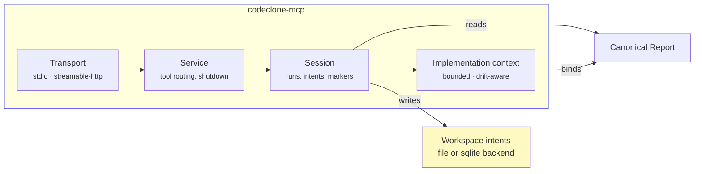
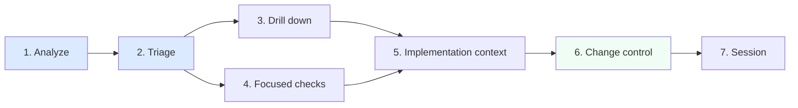

# MCP Interface

Agent workflows and setup: [MCP guide](../../guide/mcp/README.md).

## Purpose

Define the public MCP surface in the CodeClone **`2.1.0a1`** release line
(structural change controller + Engineering Memory MCP tools are live in this alpha).

The MCP layer is optional and built on the same canonical pipeline/report
contracts as the CLI. It does not create a second analysis engine.

!!! note "Integration surface, not a second analyzer"
    MCP composes over the canonical report and run state shared by CLI, HTML,
    and SARIF. It **never** mutates source files, baselines, analysis cache
    (`.codeclone/cache.json`), or canonical report artifacts. It **may** write
    ephemeral workspace intent records, Engineering Memory **drafts** (human
    approve required), and optional audit evidence when enabled.

---

## Public surface

| Artifact          | Path                                                                                                                                                           |
|-------------------|----------------------------------------------------------------------------------------------------------------------------------------------------------------|
| Package extra     | `codeclone[mcp]`                                                                                                                                               |
| Launcher          | `codeclone-mcp`                                                                                                                                                |
| Server wiring     | `codeclone/surfaces/mcp/server.py`                                                                                                                             |
| Message catalog   | `codeclone/surfaces/mcp/messages/*` (`tools`/`resources` titles, `help_topics`, `params`, `workflow`, `intent`, `errors`, patch-contract/verification copy, …) |
| Service / session | `codeclone/surfaces/mcp/service.py`, `codeclone/surfaces/mcp/session.py`                                                                                       |

---

## Shape

Current server characteristics:

- **Optional dependency** — base `codeclone` install does not require MCP
  runtime packages.
- **Transports** — `stdio` (default), `streamable-http`.
- **Run storage** — in-memory only, bounded by `--history-limit` (default 4,
  max 10). Latest-run pointer is process-local.
- **Roots** — analysis tools require an absolute repository root. Relative
  roots such as `.` are rejected.
- **Analysis modes** — `full`, `clones_only`.
- **Cache policies** — `reuse` (default) and `off` only; `refresh` is CLI-only
  and rejected by MCP.
- **Workspace intent registry** — `intent_registry_backend` selects `file`
  (ephemeral JSON under `.codeclone/intents/`) or `sqlite` (auditable
  rows under `.codeclone/db/intents.sqlite3` with closed-row retention;
  default 7 days, max 14 in open source). See
  [Plans and Retention](../../plans-and-retention.md).

!!! warning "Absolute roots and remote exposure"
    Analysis tools require an absolute repository root. HTTP exposure beyond
    loopback requires explicit `--allow-remote`. For authenticated
    `streamable-http`, set `CODECLONE_MCP_AUTH_TOKEN` — see
    [Environment variable overrides](../10-config-and-defaults.md#mcp-http-authentication)
    and [Security Model](../21-security-model.md).

---

## Contract rules

- MCP is **read-only** with respect to source files, baselines, analysis
  cache (`cache.json`), and report artifacts.
- MCP reuses the same canonical report document as CLI/JSON/HTML/SARIF.
- Finding IDs, ordering, and summary data are deterministic projections over
  the stored run.
- `analyze_changed_paths` requires either explicit `changed_paths` or
  `git_diff_ref`.
- Analysis tools require an absolute `root`.
- `check_*` tools may resolve against a stored run; if `root` is provided it
  must be absolute.
- `git_diff_ref` is validated before any subprocess call.
- Review markers are session-local in-memory state only.
- Change intent, blast-radius cache, and workspace registry state do not
  enter canonical report integrity, baseline, or cache artifacts.
- Run history is process-local and does not survive restart.
- `get_implementation_context` reads one existing run and reports live
  workspace drift; it never auto-analyzes or authorizes an edit.
- MCP accepts cache policies `reuse` and `off`; `refresh` is rejected at runtime.
- Missing optional MCP dependency is surfaced explicitly by the launcher.
- `metrics_detail(family="security_surfaces")` exposes a compact, report-only
  inventory of security-relevant capability surfaces. It does not claim
  vulnerabilities or exploitability.
- `validate_review_claims` detects deterministic overclaims. See
  [14-claim-guard.md](../14-claim-guard.md) for the full pattern catalog.

---

## Tools

Current tool set: **33 tools** for agent clients, organized by workflow phase.

When the MCP server starts with `--ide-governance-channel` (CodeClone VS Code
extension), two additional read-only tools register:
`get_workspace_session_stats` and `get_controller_audit_trail` (**35 tools**
total). They are not listed in generic agent tool catalogs; payloads mirror CLI
`--session-stats` and `--audit` via `codeclone/controller_insights/`.

The surface is intentionally triage-first: analyze → summarize/triage →
drill into one finding or one hotspot family.

Tool families and exact parameters are split under
[Tools](tools/analysis.md), including the
[Platform Observability slicer](tools/platform-observability.md).
