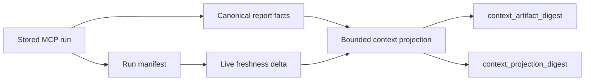

### Analysis and run-level tools

| Tool                         | Key parameters                                                                                                                                                                              | Purpose                                                              |
|------------------------------|---------------------------------------------------------------------------------------------------------------------------------------------------------------------------------------------|----------------------------------------------------------------------|
| `analyze_repository`         | `root`, `analysis_mode`, thresholds, `api_surface`, `coverage_xml`, `baseline_path`, `metrics_baseline_path`, `cache_policy`, `allow_external_artifacts`, `changed_paths` or `git_diff_ref` | Full deterministic analysis; registers an in-memory run              |
| `analyze_changed_paths`      | `root`, `changed_paths` or `git_diff_ref`, `analysis_mode`, thresholds, `api_surface`, `coverage_xml`, `cache_policy`, `allow_external_artifacts`                                           | Diff-aware analysis with changed-files projection                    |
| `get_run_summary`            | `run_id`                                                                                                                                                                                    | Cheapest run-level snapshot: health, findings, baseline/cache status |
| `get_production_triage`      | `run_id`, `max_hotspots`, `max_suggestions`                                                                                                                                                 | Production-first first-pass view                                     |
| `get_implementation_context` | `root`, `paths`, `mode`, `include`, `depth`, `detail_level`, `budget`, `run_id`                                                                                                             | Bounded, drift-aware structural context from one stored run          |
| `compare_runs`               | `run_id_before`, `run_id_after`, `focus`                                                                                                                                                    | Run-to-run delta; returns `incomparable` when roots/settings differ  |
| `evaluate_gates`             | `run_id`, gate flags, threshold overrides, `coverage_min`                                                                                                                                   | Preview CI gating decisions without mutating state                   |
| `help`                       | `topic`, `detail`                                                                                                                                                                           | Bounded workflow/contract guidance                                   |

`allow_external_artifacts` (default `false`): when `true`, optional artifact
path parameters may resolve to absolute or out-of-repo locations. See
[Security Model](../../21-security-model.md).

Selected analysis and workflow responses may include non-blocking `tips[]`
entries for workspace hygiene (for example when `.codeclone/` is not
covered by the repository root `.gitignore`). The CLI prints the same
advisory after interactive analysis runs (suppressed in `--quiet`, CI, and
non-TTY contexts). Tips are advisory only; MCP and CLI never edit
`.gitignore` automatically.

## Implementation context

`get_implementation_context` is a read-only projection over one stored run. In
the initial path-owned slice, pass explicit repo-relative `paths` and use
`mode="implementation"`. Default facets include module role, direct imports,
importers, public API rows, blast radius, and test importers. One global
`budget` bounds all emitted entries; each collection carries deterministic
`total`, `shown`, and `truncated` counts.

The artifact digest binds the canonical run and off-report context artifact.
The projection digest additionally binds the normalized request and exact
bounded evidence returned. Presentation hints are excluded. A missing run
returns `needs_analysis`; invalid facets and paths outside the root raise a
contract error. `freshness.status="drifted"` means analyze again before relying
on the projection. The tool never changes `edit_allowed`.

Symbol subjects, intent overlays, inferred changed scope, memory fusion, and
call/reference relationships are additive Phase 30 slices. Until their owning
slice lands, requesting them is rejected or reported unavailable rather than
fabricated.
