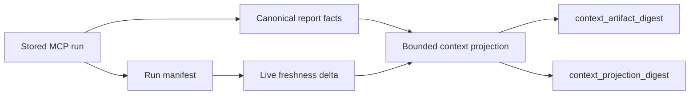

# Implementation context

`get_implementation_context` is a read-only projection over one stored MCP run.
It never re-analyzes, never changes `edit_allowed`, and never substitutes
`start_controlled_change`. For workflow placement, see
[Analysis tools](analysis.md).

---

## Parameters

| Parameter       | Default          | Purpose                                                                                              |
|-----------------|------------------|------------------------------------------------------------------------------------------------------|
| `root`          | — (required)     | Absolute repository root                                                                             |
| `paths`         | `null`           | Repo-relative file or directory subjects                                                             |
| `symbols`       | `null`           | `module:symbol` qualnames (colon separator; dot notation rejected)                                   |
| `intent_id`     | `null`           | Active intent — pins run and adds `change_control` block                                             |
| `changed_scope` | `false`          | Use bounded live git-dirty set as subject; **mutually exclusive** with explicit `paths` or `symbols` |
| `mode`          | `implementation` | `implementation`, `impact`, or `contract`                                                            |
| `include`       | `null`           | Optional closed facet set                                                                            |
| `depth`         | `1`              | Structural traversal depth (`0`–`3`)                                                                 |
| `detail_level`  | `compact`        | `compact`, `normal`, or `full`                                                                       |
| `budget`        | `50`             | Global evidence-entry cap (`1`–`200`)                                                                |
| `run_id`        | `null`           | Stored run; latest when omitted                                                                      |

`changed_scope=true` selects the dirty set explicitly. Without explicit
subjects, precedence is: paths/symbols → active intent `allowed_files` → bounded
git-dirty set. A clean tree with no subject returns `no_current_work`, never
whole-repository context.

---

## Modes and facets

| Mode             | Orientation                                                                                             |
|------------------|---------------------------------------------------------------------------------------------------------|
| `implementation` | Editing context: module role, imports/importers, callees, public API, blast radius, tests, docs, memory |
| `impact`         | Transitive dependency context, baseline-sensitive findings; adds callers                                |
| `contract`       | Truth-map: `definition_sites`, `version_constants`, `contract_tests`, `memory_conflicts`                |

`contract` mode emits path-specific caller facets
(`persistence_path_callers`, `serialization_path_callers`,
`deserialization_path_callers`, `store_api_consumers`) only with a typed
contract-registry, protocol, or Engineering Memory anchor. Without an anchor they
report `status: "not_available"` rather than being guessed from names.

`call_context` projects callers, callees, references, and `test_callers` from
run-bound relationship facts. Every edge is tagged `relation_kind` ×
`resolution_status`. Production and test-origin callers stay in separate lanes;
test edges never make production code live. Unresolved calls use
`target_qualname: null`. `analysis.call_graph_status` is `complete`, `partial`,
or `unavailable`.

Import, importer, and test-importer roles collapse into
`structural_context.related_modules` with explicit `relations`
(`imports`, `imported_by`, `tested_by`).

---

## Freshness and digests

- `context_artifact_digest` binds the canonical run and off-report context artifact.
- `context_projection_digest` binds the normalized request and exact bounded evidence returned.
- `analysis.freshness` compares run manifest with live mtime+size and, when available, git `DirtySnapshot` delta.
- `freshness.status="drifted"` means analyze again before relying on the projection.

A missing run returns `needs_analysis`. Invalid facets and paths outside the root
raise a contract error.

---

## Budget and safety overflow

`budget` is one global evidence-entry cap, not per-facet. Every bounded collection
reports `total`, `shown`, `truncated`, and `omitted`. Intent `do_not_touch` and
review-required entries consume budget first. The effective limit expands up to
the server hard cap so a small requested budget cannot hide safety context.

If safety entries alone exceed that cap, the response uses
`status="safety_context_overflow"` and reports the omitted count.

Symbol-only queries that resolve nothing return `status="subject_not_found"` with
actionable `next_steps` and omit empty facet scaffolding.

---

## Intent and memory lanes

With `intent_id`, the selected active intent pins the source run and adds
`change_control`:

- `allowed_files` and `allowed_related` from declared scope;
- report-derived `review_context`;
- explicit and built-in `do_not_touch` boundaries;
- guards with `authorization_source="start_controlled_change"`.

Engineering Memory records, test anchors, doc anchors, trajectories, and
Experiences project into separate bounded lanes. Memory is evidence, not edit
authority.

---

## Related

- Overview and sibling analysis tools: [Analysis tools](analysis.md)
- `help(topic=implementation_context)`: [Help topics](help-and-topics.md)
- Agent guide: [Implementation context](../../../guide/mcp/workflows/analyze-and-triage.md#implementation-context)
