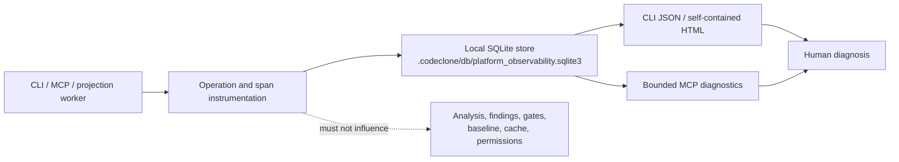

# 26. Platform Observability

<!-- doc-scope: contract -->

Platform Observability is a local diagnostics surface for CodeClone development.
It explains the cost and shape of CodeClone's own execution. It does **not**
describe repository quality and must never affect analysis truth, gates,
baselines, cache compatibility, findings, or edit authorization.

For practical commands, see the
[observability diagnostics guide](../guide/observability/diagnostics.md). For
the bounded MCP projection, see
[query_platform_observability](25-mcp-interface/tools/platform-observability.md).

## Trust boundary



The observer:

- is disabled by default;
- stores data locally only;
- records metadata, counters, durations, bounded payload sizes, and normalized
  literal-free SQL fingerprints;
- never records prompt or MCP payload bodies;
- exposes telemetry hints, not findings or vulnerabilities;
- remains inert when disabled or when no store exists.

## Enabling instrumentation

Configuration is environment-only. There is no `[tool.codeclone]`
observability table.

| Variable                                          | Meaning                                                                 |
|---------------------------------------------------|-------------------------------------------------------------------------|
| `CODECLONE_OBSERVABILITY_ENABLED=1`               | Enable instrumentation.                                                 |
| `CODECLONE_OBSERVABILITY_FORCE=1`                 | Permit observation in CI; it does not enable instrumentation by itself. |
| `CODECLONE_OBSERVABILITY_PROFILE=1`               | Capture optional process metrics; requires `codeclone[perf]`.           |
| `CODECLONE_OBSERVABILITY_PERSIST=0`               | Instrument without persisting completed operations.                     |
| `CODECLONE_OBSERVABILITY_CAPTURE_PAYLOAD_SIZES=0` | Disable request/response size and token estimates.                      |
| `CODECLONE_OBSERVABILITY_PAYLOAD_SNAPSHOT=1`      | Reserved and rejected: raw payload snapshots are not supported.         |

An explicit `CODECLONE_OBSERVABILITY_ENABLED=1` is sufficient in CI.
`CODECLONE_OBSERVABILITY_FORCE` never enables observation by itself and is
reserved as an explicit CI-gate override.

Configuration fields for retention and row caps are reserved in the internal
model but are not automatic pruning guarantees in the current release.

## Data model

The local schema version is `1.0`. A completed operation and its spans are
written in one transaction.

An operation records stable identifiers, parent/correlation IDs, surface,
operation name, timestamps, duration, status, bounded error classification,
session and root digests, request/response sizes, token estimates, and optional
process metrics.

A span records its parent, duration, reason kind, deduplication state, numeric
counters, optional process metrics, and at most eight normalized SQL
fingerprints. SQL literals are removed before persistence.

Reindex reasons are classified as:

- `content_changed`
- `schema_version_changed`
- `model_changed`
- `manual_rebuild`
- `first_index`
- `unknown`

## CLI projection

```bash
codeclone observability trace --root .
codeclone observability trace --root . --last 50 --html /tmp/codeclone-observer.html
codeclone observability trace --root . --operation OPERATION_ID --json /tmp/trace.json
codeclone observability trace --root . --correlation CORRELATION_ID
```

Without `--json` or `--html`, the command writes JSON to stdout. A missing
store is an informational empty state and exits successfully.

The HTML cockpit is self-contained and includes operation chains, a span
waterfall, pipeline and Engineering Memory costs, MCP tool aggregates, database
costs, normalized SQL fingerprints, agent context, and costly no-op signals.
It has no external assets or JavaScript dependency.

## MCP projection

`query_platform_observability` returns one bounded section per call:

- `summary`
- `slow_operations`
- `memory_pipeline_cost`
- `db_cost`
- `agent_context`
- `mcp_tool_matrix`
- `correlated_chains`
- `costly_noops`
- `pipeline`

`detail_level=compact` returns at most five rows. `normal` honors `limit`,
clamped to `1..50`; `full` currently downgrades to `normal`. `window` accepts
`latest` or a correlation ID. `operation_id` and `span_id` are reserved and
reported as ignored parameters.

The response explicitly declares a CodeClone-development audience and states
that it is not user-facing quality evidence. See
[MCP determinism and tests](25-mcp-interface/determinism-and-tests.md) for the
bounded-projection contract.

## Privacy and lifecycle

The SQLite database is optional local diagnostic state. It is outside the
canonical report, baseline, and analysis cache contracts. Deleting it only
removes diagnostics; it does not alter analysis results.

There is no network exporter. Automatic retention pruning is not currently
enforced, so operators who enable persistence own local database lifecycle.
See [Security model](21-security-model.md) and
[Plans and retention](../plans-and-retention.md).
