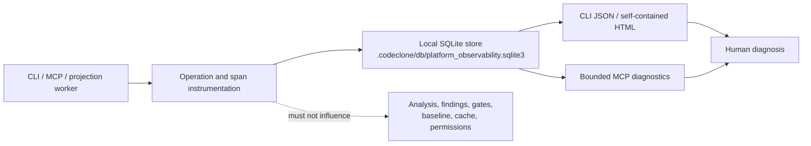

# 26. Platform Observability

<!-- doc-scope: contract -->

Platform Observability is a local diagnostics surface for CodeClone development.
It explains the cost and shape of CodeClone's own execution. It does **not**
describe repository quality and must never affect analysis truth, gates,
baselines, cache compatibility, findings, or edit authorization.

!!! warning "Not for CodeClone end users"
    If you use CodeClone to analyze **your** Python project, observer tooling
    will not help with clones, health score, CI gates, or MCP review. Use the
    normal CLI/MCP workflow instead. Platform Observability is **only** for
    people developing **CodeClone itself**.

    Instrumentation is **disabled by default** and requires explicit environment
    configuration before any telemetry is collected. See
    [Maintainer workflow](../guide/observability/maintainer-workflow.md).

    For practical commands, see the
    [observability diagnostics guide](../guide/observability/diagnostics.md). Maintainer
    playbook: [Developing CodeClone with Platform Observability](../guide/observability/maintainer-workflow.md).
    For the bounded MCP projection, see
    [query_platform_observability](25-mcp-interface/tools/platform-observability.md).

## Trust boundary



The observer:

- is disabled by default;
- stores data locally only;
- records metadata, counters, durations, bounded payload sizes, and normalized
  literal-free SQL fingerprints;
- never records prompt or MCP payload bodies;
- exposes telemetry hints, not findings or vulnerabilities;
- remains inert when disabled or when no store exists.

## Enabling instrumentation

Configuration is environment-only. There is no `[tool.codeclone]`
observability table.

| Variable                                          | Meaning                                                                 |
|---------------------------------------------------|-------------------------------------------------------------------------|
| `CODECLONE_OBSERVABILITY_ENABLED=1`               | Enable instrumentation.                                                 |
| `CODECLONE_OBSERVABILITY_FORCE=1`                 | Permit observation in CI; it does not enable instrumentation by itself. |
| `CODECLONE_OBSERVABILITY_PROFILE=1`               | Capture optional process metrics; requires `codeclone[perf]`.           |
| `CODECLONE_OBSERVABILITY_PERSIST=0`               | Instrument without persisting completed operations.                     |
| `CODECLONE_OBSERVABILITY_CAPTURE_PAYLOAD_SIZES=0` | Disable request/response size and token estimates.                      |
| `CODECLONE_OBSERVABILITY_PAYLOAD_SNAPSHOT=1`      | Reserved and rejected: raw payload snapshots are not supported.         |

An explicit `CODECLONE_OBSERVABILITY_ENABLED=1` is sufficient in CI.
`CODECLONE_OBSERVABILITY_FORCE` never enables observation by itself and is
reserved as an explicit CI-gate override.

Configuration fields for retention and row caps are reserved in the internal
model but are not automatic pruning guarantees in the current release.

## Data model

The local schema version is `1.1`. A completed operation and its spans are
written in one transaction.

An operation records stable identifiers, parent/correlation IDs, surface,
operation name, timestamps, duration, status, bounded error classification,
session and root digests, request/response sizes, token estimates, and optional
process metrics (`rss_mb`, `rss_delta_mb`, `peak_rss_mb`, `peak_rss_delta_mb`,
CPU time, thread count, open file descriptors when `codeclone[perf]` is
installed).

A span records its parent, duration, reason kind, deduplication state, numeric
counters, the same optional process metrics, and at most eight normalized SQL
fingerprints. SQL literals are removed before persistence.

### Engineering Memory and semantic rebuild spans

When observability is enabled, `codeclone memory …` commands record a CLI
operation (`cli.memory.{command}` or `cli.memory.semantic.{action}`) and
nested product spans:

| Span                                                 | When                                                 |
|------------------------------------------------------|------------------------------------------------------|
| `memory.semantic.rebuild`                            | Semantic index rebuild (CLI, MCP, projection worker) |
| `memory.semantic.bootstrap`                          | Provider and LanceDB writer resolution               |
| `memory.semantic.source.{memory\|audit\|trajectory}` | Per-source projection scan                           |
| `memory.semantic.embed`                              | Changed-row embedding batches                        |
| `memory.semantic.reconcile`                          | Stale-id deletion                                    |
| `memory.semantic.search`                             | CLI semantic search                                  |
| `memory.embedding.model_load`                        | First FastEmbed ONNX load in-process                 |
| `memory.embedding.infer`                             | FastEmbed batch inference                            |
| `memory.embedding.documents`                         | Document embedding helper                            |
| `memory.embedding.query`                             | Query embedding helper                               |

The rebuild span carries counters such as `indexed`, `embedded`,
`skipped_unchanged`, `deleted`, `embedding_dimensions`, `embedding_batch_size`,
and `lane_{source}` tallies.

Semantic rebuild reasons are classified as:

- `content_changed` — rows were embedded and/or stale ids pruned
- `manual_rebuild` — full reconcile but index already current (hash-skip only)
- `schema_version_changed`
- `model_changed`
- `first_index`
- `unknown`

Memory pipeline cost rows include `memory.*` product spans regardless of
whether they ran under a `memory`, `cli`, or `mcp` operation surface.

## CLI projection

```bash
codeclone observability trace --root .
codeclone observability trace --root . --last 50 --html /tmp/codeclone-observer.html
codeclone observability trace --root . --operation OPERATION_ID --json /tmp/trace.json
codeclone observability trace --root . --correlation CORRELATION_ID
```

Without `--json` or `--html`, the command writes JSON to stdout. A missing
store is an informational empty state and exits successfully.

The HTML cockpit is self-contained and includes operation chains, a span
waterfall, pipeline and Engineering Memory costs, MCP tool aggregates, database
costs, normalized SQL fingerprints, agent context, and costly no-op signals.
It has no external assets or JavaScript dependency.

## MCP projection

`query_platform_observability` returns one bounded section per call:

- `summary`
- `slow_operations`
- `memory_pipeline_cost`
- `db_cost`
- `agent_context`
- `mcp_tool_matrix`
- `correlated_chains`
- `costly_noops`
- `pipeline`

`detail_level=compact` returns at most five rows. `normal` honors `limit`,
clamped to `1..50`; `full` currently downgrades to `normal`. `window` accepts
`latest` or a correlation ID. `operation_id` and `span_id` are reserved and
reported as ignored parameters.

The response explicitly declares a CodeClone-development audience and states
that it is not user-facing quality evidence. See
[MCP determinism and tests](25-mcp-interface/determinism-and-tests.md) for the
bounded-projection contract.

## Privacy and lifecycle

The SQLite database is optional local diagnostic state. It is outside the
canonical report, baseline, and analysis cache contracts. Deleting it only
removes diagnostics; it does not alter analysis results.

There is no network exporter. Automatic retention pruning is not currently
enforced, so operators who enable persistence own local database lifecycle.
See [Security model](21-security-model.md) and
[Plans and retention](../plans-and-retention.md).
