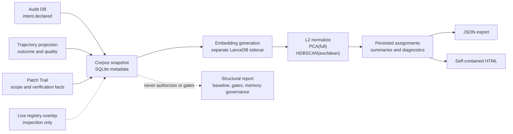
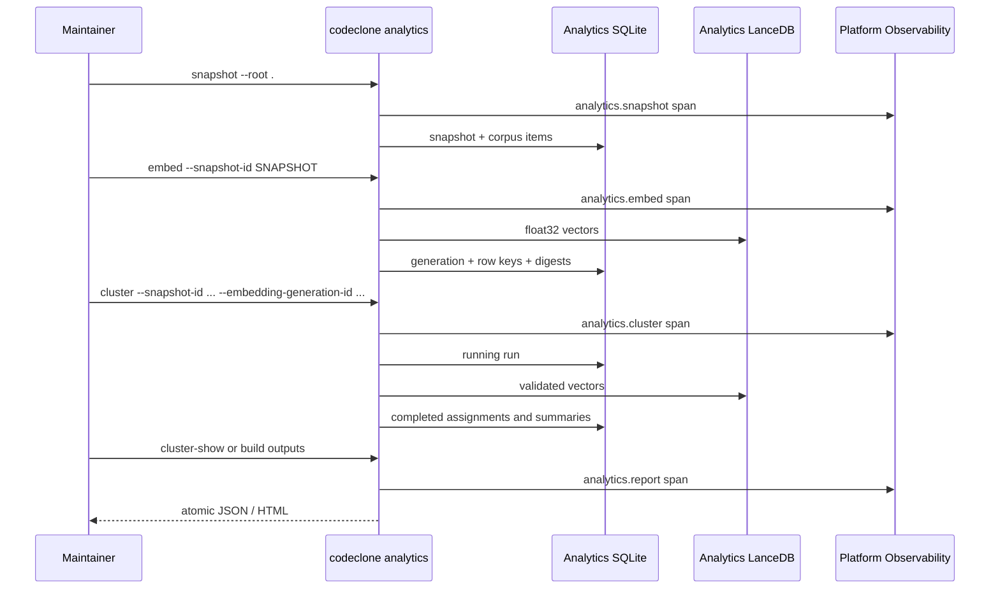

# Corpus Analytics

Corpus Analytics is an optional, offline analytics lane for clustering
historical change-control intents. It reconstructs an intent corpus from
retained controller evidence, creates immutable-by-contract snapshots, writes
separate analytics embeddings, and runs deterministic PCA + HDBSCAN clustering.

It is **derived evidence, not authority**. Corpus Analytics never changes the
canonical structural report, reports/gates/baselines, cache compatibility,
Engineering Memory governance, or edit authorization.

For a command-oriented walkthrough, see the
[Corpus Analytics guide](../guide/analytics/overview.md). Configuration is
indexed in [Config and Defaults](10-config-and-defaults.md), CLI behavior in
[CLI](11-cli.md), and storage layout in
[Schema Layouts](appendix/b-schema-layouts.md).

## Trust Boundary



Source ownership is explicit:

| Fact | Owner |
|------|-------|
| Original description and declaration order | Earliest audit `intent.declared` by `audit_sequence` |
| Declared/changed files and verification facts | Patch Trail |
| Outcome, quality tier, labels, anomalies | Selected current-version trajectory |
| Lease/status and other live coordination state | Optional registry overlay |

The registry overlay is exported for inspection when present, but it never
changes normalized text, representation identity, or `source_digest`.

## End-to-End Lifecycle



Every clustering run is inserted as `running`. A successful run atomically
commits assignments, summaries, and `completed`; a processing error rolls those
artifacts back and persists `failed` with an error message.

## Installation

```bash
uv sync --extra analytics
# or
pip install "codeclone[analytics]"
```

Capability tiers:

| Tier | Packages | Commands |
|------|----------|----------|
| `base` | core only | `snapshot`, `clusters`, `cluster-show`, `outliers`, `cluster --select-run` |
| `embed` | FastEmbed + LanceDB | `embed` |
| `cluster` | scikit-learn + external `hdbscan` | clustering and sweep |
| `full` | all of the above | `build` |

Missing optional dependencies are contract errors (exit `2`) with an install
hint. Inspection/export commands do not import FastEmbed.

`umap-learn` remains an optional dependency on supported Python versions, but
Slice 1 does not emit a UMAP visualization. Any later UMAP view must be labeled
visualization-only and must never feed clustering.

## Configuration

`[tool.codeclone.analytics]` overrides repository-local defaults. Relative paths
resolve from the repository root; absolute paths are allowed but are represented
as `<external>` in snapshot manifests so user-specific paths do not enter
portable identity.

| Key | Default | Contract |
|-----|---------|----------|
| `db_path` | `.codeclone/analytics/corpus_clustering.sqlite3` | Analytics metadata store |
| `vectors_path` | `.codeclone/analytics/corpus_vectors` | Dedicated LanceDB vectors |
| `embedding_model` | `BAAI/bge-small-en-v1.5` | FastEmbed model id |
| `embedding_dimension` | `384` | Vector width |
| `embedding_provider` | `fastembed` | Only supported provider in Slice 1 |
| `embedding_cache_dir` | memory semantic cache | Shared model artifact cache, not shared vectors |
| `min_correlation_sample_size` | `5` | Correlation denominator guard |
| `cluster_random_seed` | `42` | PCA deterministic seed |
| `default_pca_dimensions` | `64` | Requested PCA width |
| `default_min_cluster_size` | `8` | HDBSCAN default |
| `default_min_samples` | `3` | HDBSCAN default |
| `default_cluster_selection_method` | `eom` | `eom` or `leaf` |
| `allow_model_download` | memory semantic setting | Whether FastEmbed may download |

The historical audit database follows top-level
`[tool.codeclone].audit_path`. This prevents Analytics from silently reading a
different audit source than the controller.

## Identity And Digests

Corpus identity has three layers:

```text
source_record_key = sha256(project_id + "\n" + intent_id)
representation_key = sha256(lane + kind + version + source_record_key)
snapshot_item_id = sha256(snapshot_id + "\n" + representation_key)
```

`source_digest` hashes source schema versions, lane, representation contract,
normalizer version, and sorted source/provenance digests. It excludes:

- snapshot ids and timestamps;
- absolute source paths;
- live registry overlay state.

Representation contract `2` hashes raw representation-owned fields **before**
normalization. For `description_with_frame`, that includes description, intent
kind, declared path families, and typed declared constraints.

Cluster membership identity is:

```text
membership_digest = sha256(sorted(snapshot_item_ids) joined by "\n")
```

HDBSCAN numeric labels are not stable identity. Display ids are assigned after
canonical ordering by size descending, actual PCA-space medoid item id, then
membership digest. Noise remains an explicit non-display bucket.

## Storage And Integrity

Current analytics store schema is `1.1`.

- Writable open migrates supported `1.0` stores after checking for orphan and
  duplicate records.
- Read-only open never migrates and rejects a stale schema.
- SQLite relationship triggers reject orphan-producing inserts/updates/deletes.
- Vector row keys and non-null display cluster ids are unique.
- Reporting and inspection open the metadata store read-only.

SQLite and LanceDB cannot participate in one physical transaction. The
embedding workflow therefore:

1. computes a new generation;
2. stages SQLite metadata;
3. writes LanceDB rows;
4. commits SQLite only after the sidecar write succeeds;
5. rolls back metadata and removes the generation on ordinary failures.

Before clustering, CodeClone validates the generation contract, exact snapshot
item set, dimensions, row keys, and vector digests. Cross-snapshot runs,
missing sidecar rows, stale embedding contracts, or corrupted float32 payloads
are rejected rather than accepted as completed analytics.

## Embedding Reproducibility

Embedding contract `2` stores:

- provider and provider package version;
- model id, optional revision, optional artifact fingerprint;
- dimensions and embedding contract version;
- cosine similarity manifest and L2 preprocessing contract;
- vector row key and SHA-256 digest over canonical little-endian float32 bytes.

When model revision/artifact fingerprint is unavailable,
`exact_model_artifact_reproducibility=false`. JSON and HTML then state:

> Full vector reproducibility is not guaranteed from model id alone.

Exact reproduction additionally depends on the model artifact, provider and
numeric-library versions, hardware/runtime behavior, and identical normalized
inputs. Old embedding contract generations must be regenerated.

## Clustering Contract

The fixed path is:

```text
float32 embeddings
  -> L2 normalization
  -> PCA(svd_solver="full", whiten=false, random_state=42)
  -> external hdbscan.HDBSCAN(metric="euclidean", core_dist_n_jobs=1)
  -> canonical partitions
  -> diagnostics
```

The run manifest records Python, NumPy, SciPy, scikit-learn, and HDBSCAN
versions plus all fixed algorithm choices. `run_digest` covers snapshot,
embedding generation, effective sample/feature dimensions, effective
parameters, random seed, and the algorithm manifest.

A sweep discards invalid small-corpus candidates and deduplicates requested
settings that collapse to the same effective parameters. A corpus with no valid
candidate fails explicitly instead of producing an empty successful sweep.

Sweep ranking sets exactly one `recommended_by_heuristic=true`.
`selected_by_maintainer` remains false until an explicit:

```bash
codeclone analytics cluster --root . --select-run RUN_ID
```

Recommendation is evidence, not a human decision.

## Diagnostics

Each cluster summary includes:

- size and corpus percentage;
- average membership strength;
- PCA-space medoid;
- representatives and low-strength/far-boundary items;
- nearest cluster ids by PCA centroid distance;
- metadata distributions with numerator and denominator;
- explicit `insufficient_sample` when the denominator is below the configured
  guard.

The noise explorer emits only observable text/membership flags:
`short_text`, `long_text`, `multiple_paragraphs`,
`high_conjunction_count`, `template_match`, and
`low_membership_strength`. It does not invent semantic classes.

## CLI And Reports

The approved direct namespace is `codeclone analytics`:

| Command | Purpose |
|---------|---------|
| `snapshot` | Build an intent corpus snapshot |
| `embed` | Generate a separate analytics embedding generation |
| `cluster` | Run one configuration or a bounded sweep |
| `build` | Run snapshot → embed → cluster |
| `clusters` | List runs for a snapshot |
| `cluster-show` | Export one completed run as JSON |
| `outliers` | Emit noise assignment ids |

`build --sweep --use-recommended` renders the heuristic winner but does not
record a maintainer selection. `--use-recommended` without `--sweep` is rejected
before dependency checks or artifact creation.

Output behavior:

- single-run JSON contains snapshot/generation manifests, embedding references,
  run and algorithm manifest, clusters, assignments, noise, item metadata, and
  compatible sweep summaries;
- sweep JSON contains every completed candidate with full assignments,
  diagnostics, and recommendation/selection flags;
- sweep HTML without `--use-recommended` is comparison-only;
- detailed HTML includes overview, cluster index, representative/boundary
  groups, correlations with denominators, and the noise explorer;
- JSON and HTML are self-contained and written atomically to explicit output
  paths.

Expected user/config/capability/schema/integrity errors exit `2` on stderr
without a traceback.

## Observability

With `CODECLONE_OBSERVABILITY_ENABLED=1`, the CLI creates one operation named
`cli.analytics.<command>` with nested spans:

- `analytics.snapshot`
- `analytics.embed`
- `analytics.cluster`
- `analytics.build`
- `analytics.report` when an export is rendered

Observability is bootstrapped before analytics stores open, so instrumented
SQLite queries are attributed to the active stage. These measurements are
development telemetry only; see
[Platform Observability](26-platform-observability.md).

## Cross-Links

- Historical trajectory evidence:
  [Trajectory Quality and Passport](13-engineering-memory/trajectory-quality-and-passport.md)
- Runtime configuration:
  [Config and Defaults](10-config-and-defaults.md)
- Exit semantics and terminal surfaces:
  [CLI](11-cli.md)
- Version bump rules:
  [Compatibility and Versioning](24-compatibility-and-versioning.md)
- SQLite/LanceDB layout:
  [Schema Layouts](appendix/b-schema-layouts.md)

## Locked By Tests

- `tests/test_analytics_foundation.py`
- `tests/test_analytics_trajectory_selection.py`
- `tests/test_analytics_integration.py`
- `tests/test_analytics_cli.py`
- `tests/test_config_analytics.py`
- `tests/test_sqlite_readonly_openers.py`
- `tests/test_architecture.py::test_analytics_package_does_not_import_forbidden_surfaces`
