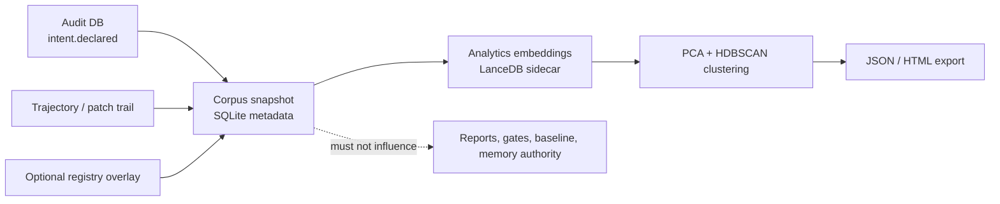

# Corpus Analytics

Corpus Analytics is an optional, offline analytics lane for clustering historical
change-control intents. It reads audit, Engineering Memory trajectory, and optional
workspace intent registry overlays, builds immutable corpus snapshots, generates
**separate** analytics embeddings, and runs deterministic PCA + HDBSCAN clustering.

It is **not** analysis truth: outputs never affect reports, gates, baselines,
cache compatibility, Engineering Memory records, or edit authorization.

For a practical walkthrough, see the
[Corpus Analytics guide](../guide/analytics/overview.md).

## Trust boundary



Properties:

- requires `codeclone[analytics]` optional dependencies;
- stores artifacts under `.codeclone/analytics/` (SQLite + LanceDB);
- uses dedicated contract versions in `codeclone/contracts/__init__.py`
  (`CORPUS_ANALYTICS_STORE_SCHEMA_VERSION`, `CORPUS_EXPORT_SCHEMA_VERSION`, …);
- keeps analytics vectors separate from Engineering Memory semantic index, while
  reusing the shared FastEmbed model artifact (not a second download);
- excludes live registry text from normalized corpus digests;
- opens all SQLite through `codeclone/observability/sqlite_access.py` (wrapping
  `codeclone/utils/sqlite_store.py`) so connection-open is instrumented only when
  observability is enabled (lazy import).

## Install

```bash
uv sync --extra analytics
# or
pip install "codeclone[analytics]"
```

Capability tiers:

| Tier      | Packages                         | Commands                          |
|-----------|----------------------------------|-----------------------------------|
| `base`    | core only                        | snapshot metadata, list runs      |
| `embed`   | fastembed + lancedb              | `embed`, vector IO                |
| `cluster` | scikit-learn + hdbscan           | `cluster`, sweep, diagnostics     |
| `full`    | all of the above                 | `build` end-to-end                |

`umap-learn` (in the `analytics` extra, Python versions before 3.14) is optional and
used only for the HTML report's 2-D visualization — never for clustering input.

## Configuration

`[tool.codeclone.analytics]` in `pyproject.toml` overrides repository-local
defaults. Paths resolve under the repository root unless absolute.

| Key                               | Default                                         | Role                                      |
|-----------------------------------|-------------------------------------------------|-------------------------------------------|
| `db_path`                         | `.codeclone/analytics/corpus_clustering.sqlite3`| Snapshot / clustering metadata SQLite     |
| `vectors_path`                    | `.codeclone/analytics/corpus_vectors`           | Analytics LanceDB directory               |
| `embedding_model`                 | `BAAI/bge-small-en-v1.5`                        | FastEmbed model id                        |
| `embedding_dimension`             | `384`                                           | Vector width contract                     |
| `embedding_provider`              | `fastembed`                                     | Embedding backend                         |
| `embedding_cache_dir`             | inherits memory (`.codeclone/memory/fastembed`) | Shared FastEmbed model artifact cache     |
| `min_correlation_sample_size`     | `5`                                             | Minimum sample size for correlation stats |
| `cluster_random_seed`             | `42`                                            | Deterministic clustering seed             |
| `default_pca_dimensions`          | `64`                                            | PCA projection width                      |
| `default_min_cluster_size`        | `8`                                             | HDBSCAN `min_cluster_size` default        |
| `default_min_samples`             | `3`                                             | HDBSCAN `min_samples` default             |
| `default_cluster_selection_method`| `eom`                                           | HDBSCAN selection method                  |
| `allow_model_download`            | inherits memory (`false` by default)            | FastEmbed may download the model when `true` |

Resolver: `codeclone/config/analytics.py:resolve_analytics_config`.

`embedding_cache_dir` and `allow_model_download` default to the resolved
`[tool.codeclone.memory.semantic]` values, so the FastEmbed model is downloaded
once and shared with Engineering Memory. Only the analytics **vectors**
(`vectors_path`) and snapshot/clustering metadata (`db_path`) live under
`.codeclone/analytics/`.

## CLI

Terminal-only commands under `codeclone analytics`:

| Command         | Purpose                                              |
|-----------------|------------------------------------------------------|
| `snapshot`      | Build immutable intent corpus snapshot               |
| `embed`         | Generate analytics embeddings for a snapshot         |
| `cluster`       | Cluster embedded snapshot (optional `--sweep`)       |
| `build`         | Snapshot → embed → cluster end-to-end                |
| `clusters`      | List clustering runs for a snapshot                  |
| `cluster-show`  | Export one clustering run as JSON                      |
| `outliers`      | Show noise-cluster assignments                       |

Representations:

- `description` — intent text only (default);
- `description_with_frame` — adds bounded structural frame fields.

Sweep modes write both `recommended_by_heuristic` and
`selected_by_maintainer` metadata; maintainer selection is explicit via
`cluster --select-run`.

Full CLI contract: [11-cli.md](11-cli.md).

## Module map

| Area            | Path                                      |
|-----------------|-------------------------------------------|
| Config          | `codeclone/config/analytics.py`           |
| Workflow        | `codeclone/analytics/workflow.py`         |
| Corpus adapters | `codeclone/analytics/corpus/`             |
| Store           | `codeclone/analytics/store/`              |
| Clustering      | `codeclone/analytics/clustering/`         |
| CLI             | `codeclone/surfaces/cli/analytics.py`     |

## Refs

- `codeclone/contracts/__init__.py` — corpus analytics version constants
- `tests/test_analytics_foundation.py`, `tests/test_analytics_integration.py`
- `docs/book/appendix/b-schema-layouts.md` — store layout summary
