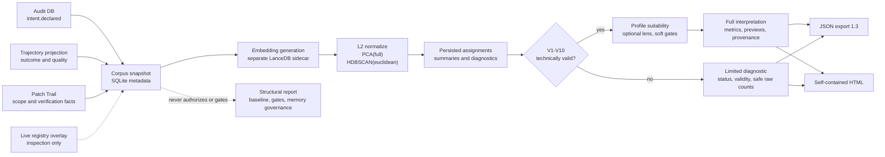
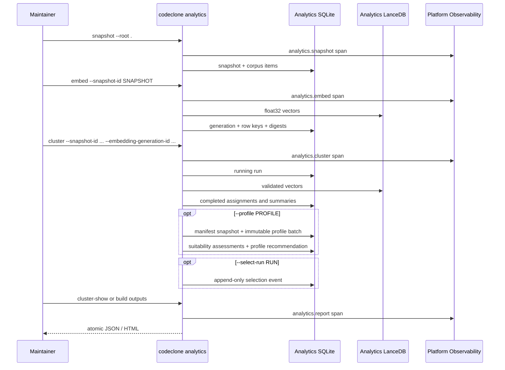
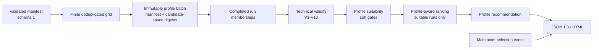
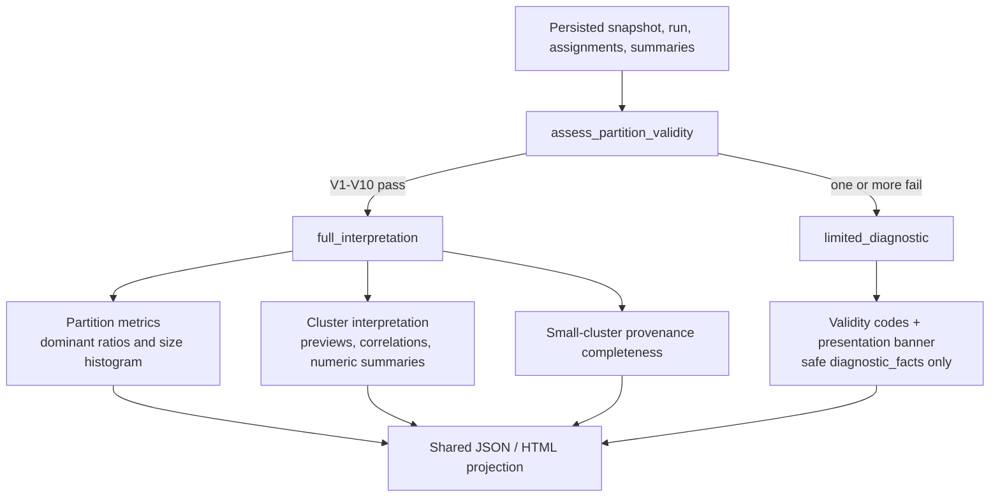

# Corpus Analytics

Corpus Analytics is an optional, offline analytics lane for clustering
historical change-control intents. It reconstructs an intent corpus from
retained controller evidence, creates immutable-by-contract snapshots, writes
separate analytics embeddings, and runs deterministic PCA + HDBSCAN clustering.
Slice 1.1 adds an interpretation plane over those persisted facts. Slice 1.2
adds a control plane: versioned profile lenses, finite profile-scoped sweeps,
separate suitability and ranking, immutable batch receipts, and append-only
maintainer selection events.

It is **derived evidence, not authority**. Corpus Analytics never changes the
canonical structural report, reports/gates/baselines, cache compatibility,
Engineering Memory governance, or edit authorization.

For a command-oriented walkthrough, see the
[Corpus Analytics guide](../guide/analytics/overview.md). Configuration is
indexed in [Config and Defaults](10-config-and-defaults.md), CLI behavior in
[CLI](11-cli.md), and storage layout in
[Schema Layouts](appendix/b-schema-layouts.md).

## Trust Boundary



Source ownership is explicit:

| Fact                                           | Owner                                                |
|------------------------------------------------|------------------------------------------------------|
| Original description and declaration order     | Earliest audit `intent.declared` by `audit_sequence` |
| Declared/changed files and verification facts  | Patch Trail                                          |
| Outcome, quality tier, labels, anomalies       | Selected current-version trajectory                  |
| Lease/status and other live coordination state | Optional registry overlay                            |

The registry overlay is exported for inspection when present, but it never
changes normalized text, representation identity, or `source_digest`.

## End-to-End Lifecycle



Every clustering run is inserted as `running`. A successful run atomically
commits assignments, summaries, and `completed`; a processing error rolls those
artifacts back and persists `failed` with an error message.

## Installation

```bash
uv sync --extra analytics
# or
pip install "codeclone[analytics]"
```

Capability tiers:

| Tier      | Packages                          | Commands                                                                   |
|-----------|-----------------------------------|----------------------------------------------------------------------------|
| `base`    | core only                         | `snapshot`, `clusters`, `cluster-show`, `outliers`, `cluster --select-run` |
| `embed`   | FastEmbed + LanceDB               | `embed`                                                                    |
| `cluster` | scikit-learn + external `hdbscan` | clustering and sweep                                                       |
| `full`    | all of the above                  | `build`                                                                    |

Missing optional dependencies are contract errors (exit `2`) with an install
hint. Inspection/export commands do not import FastEmbed.

`umap-learn` remains an optional dependency on supported Python versions, but
Slice 1 does not emit a UMAP visualization. Any later UMAP view must be labeled
visualization-only and must never feed clustering.

## Configuration

`[tool.codeclone.analytics]` overrides repository-local defaults. Relative paths
resolve from the repository root; absolute paths are allowed but are represented
as `<external>` in snapshot manifests so user-specific paths do not enter
portable identity.

| Key                                | Default                                          | Contract                                        |
|------------------------------------|--------------------------------------------------|-------------------------------------------------|
| `db_path`                          | `.codeclone/analytics/corpus_clustering.sqlite3` | Analytics metadata store                        |
| `vectors_path`                     | `.codeclone/analytics/corpus_vectors`            | Dedicated LanceDB vectors                       |
| `embedding_model`                  | `BAAI/bge-small-en-v1.5`                         | FastEmbed model id                              |
| `embedding_dimension`              | `384`                                            | Vector width                                    |
| `embedding_provider`               | `fastembed`                                      | Only supported provider in Slice 1              |
| `embedding_cache_dir`              | memory semantic cache                            | Shared model artifact cache, not shared vectors |
| `min_correlation_sample_size`      | `5`                                              | Correlation denominator guard                   |
| `cluster_random_seed`              | `42`                                             | PCA deterministic seed                          |
| `default_pca_dimensions`           | `64`                                             | Requested PCA width                             |
| `default_min_cluster_size`         | `8`                                              | HDBSCAN default                                 |
| `default_min_samples`              | `3`                                              | HDBSCAN default                                 |
| `default_cluster_selection_method` | `eom`                                            | `eom` or `leaf`                                 |
| `default_profile_id`               | unset                                            | Used only by explicit `--profile auto`          |
| `profile_paths`                    | `[]`                                             | Additional repo-contained manifest files        |
| `sweep_pca_dimensions`             | `[32, 64, 128]`                                  | Non-profile sweep PCA axis                       |
| `sweep_min_cluster_sizes`          | `[5, 8, 12, 15]`                                 | Non-profile sweep size axis                      |
| `sweep_min_samples`                | `[1, 3, 5]`                                      | Non-profile sweep sample axis                    |
| `sweep_selection_methods`          | `["eom", "leaf"]`                                | Non-profile sweep method axis                    |
| `allow_model_download`             | memory semantic setting                          | Whether FastEmbed may download                  |

The historical audit database follows top-level
`[tool.codeclone].audit_path`. This prevents Analytics from silently reading a
different audit source than the controller.

## Identity And Digests

Corpus identity has three layers:

```text
source_record_key = sha256(project_id + "\n" + intent_id)
representation_key = sha256(lane + kind + version + source_record_key)
snapshot_item_id = sha256(snapshot_id + "\n" + representation_key)
```

`source_digest` hashes source schema versions, lane, representation contract,
normalizer version, and sorted source/provenance digests. It excludes:

- snapshot ids and timestamps;
- absolute source paths;
- live registry overlay state.

Representation contract `3` retains the contract-2 raw-input hashing rules and
materializes explicit provenance presence facts for new snapshots:

- `provenance.trajectory.selected`;
- `provenance.patch_trail.present`;
- `provenance.registry_overlay.present`.

For `description_with_frame`, representation identity includes description,
intent kind, declared path families, and typed declared constraints before
normalization. Registry-overlay content and presence remain outside
`source_digest`; existing contract-2 snapshots are immutable and are not
backfilled.

Cluster membership identity is:

```text
membership_digest = sha256(sorted(snapshot_item_ids) joined by "\n")
```

HDBSCAN numeric labels are not stable identity. Display ids are assigned after
canonical ordering by size descending, actual PCA-space medoid item id, then
membership digest. Noise remains an explicit non-display bucket.

## Storage And Integrity

Current analytics store schema is `1.2`.

- Writable open migrates supported `1.0` stores through `1.1` to `1.2`.
- Read-only open never migrates and rejects a stale schema.
- SQLite relationship triggers reject orphan-producing inserts/updates/deletes.
- Vector row keys and non-null display cluster ids are unique.
- Reporting and inspection open the metadata store read-only.

SQLite and LanceDB cannot participate in one physical transaction. The
embedding workflow therefore:

1. computes a new generation;
2. stages SQLite metadata;
3. writes LanceDB rows;
4. commits SQLite only after the sidecar write succeeds;
5. rolls back metadata and removes the generation on ordinary failures.

Before clustering, CodeClone validates the generation contract, exact snapshot
item set, dimensions, row keys, and vector digests. Cross-snapshot runs,
missing sidecar rows, stale embedding contracts, or corrupted float32 payloads
are rejected rather than accepted as completed analytics.

## Embedding Reproducibility

Embedding contract `2` stores:

- provider and provider package version;
- model id, optional revision, optional artifact fingerprint;
- dimensions and embedding contract version;
- cosine similarity manifest and L2 preprocessing contract;
- vector row key and SHA-256 digest over canonical little-endian float32 bytes.

When model revision/artifact fingerprint is unavailable,
`exact_model_artifact_reproducibility=false`. JSON and HTML then state:

> Full vector reproducibility is not guaranteed from model id alone.

Exact reproduction additionally depends on the model artifact, provider and
numeric-library versions, hardware/runtime behavior, and identical normalized
inputs. Old embedding contract generations must be regenerated.

## Clustering Contract

The fixed path is:

```text
float32 embeddings
  -> L2 normalization
  -> PCA(svd_solver="full", whiten=false, random_state=42)
  -> external hdbscan.HDBSCAN(metric="euclidean", core_dist_n_jobs=1)
  -> canonical partitions
  -> diagnostics
```

The run manifest records Python, NumPy, SciPy, scikit-learn, and HDBSCAN
versions plus all fixed algorithm choices. `run_digest` covers snapshot,
embedding generation, effective sample/feature dimensions, effective
parameters, random seed, and the algorithm manifest.

A sweep discards invalid small-corpus candidates and deduplicates requested
settings that collapse to the same effective parameters. A corpus with no valid
candidate fails explicitly instead of producing an empty successful sweep.

Sweep ranking sets exactly one generation-wide
`recommended_by_heuristic=true`. Maintainer selection is an append-only event:

```bash
codeclone analytics cluster --root . --select-run RUN_ID \
  --selected-by "$USER" \
  --selection-rationale "Best inspectable partition"
```

The legacy `selected_by_maintainer` run field is synchronized only for global
selection and is not authoritative. Recommendation is evidence, not a human
decision.

## Profile Control Plane (Slice 1.2)

A profile is a versioned lens over completed clustering facts, not a property
of a run and not a semantic taxonomy. The bundled registry contains stable,
balanced, discovery, and outlier-oriented lenses. Inspect it with:

```bash
codeclone analytics profiles list --root .
codeclone analytics profiles show --root . \
  --profile-id intent-small-balanced-v1
codeclone analytics profiles validate --root .
```



Run a profile sweep explicitly:

```bash
codeclone analytics cluster \
  --root . \
  --snapshot-id SNAPSHOT_ID \
  --embedding-generation-id GENERATION_ID \
  --profile intent-small-discovery-v1
```

`--profile` implies `--sweep`. `--profile auto` uses
`default_profile_id`; when `--profile` is absent, the default profile is never
applied. Profile grids are authoritative for profile sweeps. For ordinary
sweeps, `--sweep-pca`, `--sweep-min-cluster-size`,
`--sweep-min-samples`, and `--sweep-selection-method` replace the matching
configured axes. Single-run flags (`--pca-dimensions`,
`--min-cluster-size`, `--min-samples`, `--cluster-selection-method`) are
mutually exclusive with sweep mode.

Every profile execution creates a new immutable batch receipt. Candidate
failures are retained as failed runs but do not abort remaining candidates;
the batch becomes `completed_partial` when at least one candidate succeeds.
Technical validity, profile suitability, and maintainer acceptance remain
three separate verdict levels.

Profile-scoped selection names a batch directly, or resolves the latest batch
for a profile:

```bash
codeclone analytics cluster --root . --select-run RUN_ID \
  --selection-profile pbatch-0123456789abcdef
```

See [Schema Layouts](appendix/b-schema-layouts.md#corpus-analytics-store-12)
for the immutable tables and
[CLI](11-cli.md#public-surface) for the complete flag matrix.

## Diagnostics

Each cluster summary includes:

- size and corpus percentage;
- average membership strength;
- PCA-space medoid;
- representatives and low-strength/far-boundary items;
- nearest cluster ids by PCA centroid distance;
- metadata distributions with numerator and denominator;
- explicit `insufficient_sample` when the denominator is below the configured
  guard.

The noise explorer emits only observable text/membership flags:
`short_text`, `long_text`, `multiple_paragraphs`,
`high_conjunction_count`, `template_match`, and
`low_membership_strength`. It does not invent semantic classes.

## Report Interpretability (Slice 1.1)

The report layer does not decide whether a cluster is semantically meaningful.
It first evaluates formal persisted-data invariants, then projects only the
facts that those invariants permit.



Technical validity covers:

| Invariant | Formal check                                                             |
|-----------|--------------------------------------------------------------------------|
| `V1`      | assignments exactly cover snapshot items with no duplicate item ids      |
| `V2`      | assignment labels and unique summaries are fully linked, including noise |
| `V3`      | every summary size and membership digest matches its members             |
| `V4`      | every assignment carries its summary membership digest                   |
| `V5`      | non-noise clusters satisfy effective `min_cluster_size`                  |
| `V6a`     | persisted numeric values used by interpretation are finite or `null`     |
| `V7`      | run is completed and carries the canonical algorithm manifest            |
| `V8`      | embedding generation metadata covers the snapshot item set               |
| `V9`      | representative and boundary ids exist and belong to their cluster        |
| `V10`     | every decoded persisted JSON field has the expected object shape         |

An invalid run is still inspectable. JSON and HTML expose its invariant codes,
status, presentation banner, and only the raw counts allowed by the safe-output
matrix. They omit `partition_metrics`, cluster interpretation, item previews,
and heuristic score. A missing embedding-generation record is represented as
`embedding_generation: null` with an empty `embedding_items` array.

Presentation is separate from validity:

- `maintainer_selected` is explicit persisted provenance, not taxonomy truth;
- `heuristic_recommended` is sweep evidence, not a semantic verdict;
- `candidate_only` is a valid run selected by neither mechanism;
- `technically_invalid` always forces `limited_diagnostic`.

Slice 1.2 adds `profile_recommended`, `valid_but_profile_rejected`, and the
comparison-level `no_profile_suitable_candidate` banner. Profile rejection
never removes partition metrics or changes a technically valid run to limited
diagnostic mode. Labels and descriptions come from the persisted manifest
snapshot linked to the batch, not from the current working tree.

Full interpretation includes the largest-cluster ratio against the whole corpus
and against assigned non-noise items, a fixed cluster-size histogram,
representative and boundary previews, categorical correlations, numeric
summaries for file counts and description length, and observable
machine-inspectability signals. Small clusters (up to 15 items) also show
provenance completeness.

Previews are normalized corpus text, truncated to 240 Unicode code points.
They appear only for representatives, boundary items, and noise exploration.
JSON keeps raw strings with ordinary JSON escaping; HTML escapes text at render
time. `content_disclosure` is computed from the previews actually emitted and
lists their scopes. Default exports never attach text previews to every
`items[]` entry.

Export schema `1.2` introduced the interpretation fields:

- `interpretation_contract_version = "1.0"` and `content_disclosure`;
- `clustering_run.validity` and `clustering_run.presentation`;
- `partition_metrics` in full mode or `diagnostic_facts` in limited mode;
- per-cluster `interpretation` blocks in full mode;
- candidate-local nullable `comparison` facts and top-level
  `comparison_summary`.

Export schema `1.3` preserves those keys and adds:

- `interpretation_contract_version = "1.1"`;
- `control_plane_contract_version = "1.0"`;
- optional run-level `profile_context` and active `selection`;
- optional sweep-level `profile_summary`;
- candidate-local `profile_suitable` and `is_profile_recommended`.

Sweep comparison includes every persisted run for the requested snapshot and
embedding generation, including failed or otherwise invalid runs. Only valid
runs receive a score and rank. Invalid dominant ratios and largest-cluster size
are `null` in JSON and `unavailable` in HTML.

For the wire layout, see
[Schema Layouts](appendix/b-schema-layouts.md#corpus-analytics-json-export-13).
For compatibility rules, see
[Compatibility and Versioning](24-compatibility-and-versioning.md).

## CLI And Reports

The approved direct namespace is `codeclone analytics`:

| Command        | Purpose                                                             |
|----------------|---------------------------------------------------------------------|
| `snapshot`     | Build an intent corpus snapshot                                     |
| `embed`        | Generate a separate analytics embedding generation                  |
| `cluster`      | Run one configuration or a bounded sweep                            |
| `build`        | Run snapshot → embed → cluster                                      |
| `clusters`     | List runs for a snapshot                                            |
| `cluster-show` | Export a resolved run as full interpretation or limited diagnostics |
| `outliers`     | Emit noise assignment ids                                           |
| `profiles`     | List, show, or validate profile manifests                           |

`build --sweep --use-recommended` renders the global heuristic winner.
`build --profile PROFILE --use-recommended` renders the profile-batch winner,
or the comparison view when no candidate satisfies the lens. Neither action
records a maintainer selection. `--use-recommended` without explicit or
profile-implied sweep is rejected before dependency checks or artifact
creation.

Output behavior:

- single-run JSON contains snapshot/generation manifests, validity,
  presentation, and either full interpretation or limited diagnostic facts;
- sweep JSON contains every persisted candidate, nullable comparison fields,
  and aggregate valid/invalid/recommendation/selection counts;
- sweep HTML without `--use-recommended` is comparison-only;
- detailed full-mode HTML includes dominant ratios, cluster index, escaped
  representative/boundary previews, split categorical/numeric metadata,
  provenance completeness, and the noise explorer;
- detailed limited-mode HTML includes the technical-invalid banner and safe
  diagnostic overview, without cluster interpretation panels;
- JSON and HTML are self-contained and written atomically to explicit output
  paths.

Expected user/config/capability/schema/integrity errors exit `2` on stderr
without a traceback.

## Observability

With `CODECLONE_OBSERVABILITY_ENABLED=1`, the CLI creates one operation named
`cli.analytics.<command>` with nested spans:

- `analytics.snapshot`
- `analytics.embed`
- `analytics.cluster`
- `analytics.build`
- `analytics.report` when an export is rendered

Observability is bootstrapped before analytics stores open, so instrumented
SQLite queries are attributed to the active stage. These measurements are
development telemetry only; see
[Platform Observability](26-platform-observability.md).

## Cross-Links

- Historical trajectory evidence:
  [Trajectory Quality and Passport](13-engineering-memory/trajectory-quality-and-passport.md)
- Runtime configuration:
  [Config and Defaults](10-config-and-defaults.md)
- Exit semantics and terminal surfaces:
  [CLI](11-cli.md)
- Version bump rules:
  [Compatibility and Versioning](24-compatibility-and-versioning.md)
- SQLite/LanceDB layout:
  [Schema Layouts](appendix/b-schema-layouts.md)

## Locked By Tests

- `tests/test_analytics_foundation.py`
- `tests/test_analytics_trajectory_selection.py`
- `tests/test_analytics_integration.py`
- `tests/test_analytics_integrity.py`
- `tests/test_analytics_reporting.py`
- `tests/test_analytics_cli.py`
- `tests/test_config_analytics.py`
- `tests/test_sqlite_readonly_openers.py`
- `tests/test_architecture.py::test_analytics_package_does_not_import_forbidden_surfaces`
