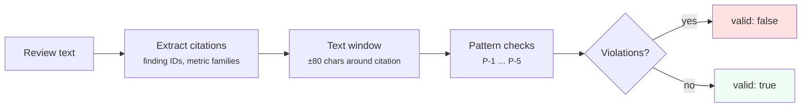

# 28. Claim Guard

## Purpose

Define the `validate_review_claims` MCP tool in the CodeClone `2.1` release
line.

Claim guard keeps review text disciplined. It validates cited claims against
semantic flags already present in stored MCP runs. It does not perform
free-form NLP, source analysis, or fact checking.

---

## Public surface

| Artifact       | Path                                                   |
|----------------|--------------------------------------------------------|
| MCP tool       | `validate_review_claims`                               |
| Service method | `CodeCloneMCPService.validate_review_claims`           |
| Session mixin  | `codeclone/surfaces/mcp/_session_claim_guard_mixin.py` |
| Pure validator | `codeclone/surfaces/mcp/_claim_guard.py`               |

---

## Validation pipeline

The pipeline is fully deterministic:

1. Resolve the stored run.
2. Index canonical and short finding IDs from the canonical report.
3. Read metric-family gate semantics from the metric registry.
4. Extract citations from the supplied text.
5. Check keyword patterns inside a bounded text window around each citation.

---

## Parameters

| Parameter            | Type          | Default  | Meaning                                                                                                                                   |
|----------------------|---------------|----------|-------------------------------------------------------------------------------------------------------------------------------------------|
| `text`               | `str`         | required | Markdown, plain text, or JSON string to validate                                                                                          |
| `run_id`             | `str \| None` | latest   | Stored MCP run whose report semantics are used                                                                                            |
| `require_citations`  | `bool`        | `true`   | Warn when no known finding IDs or metric family names are cited                                                                           |
| `patch_health_delta` | `int \| None` | omitted  | Optional `health_after - health_before` from verify. When negative, flags regression-free or fully-clean claims even if verify `accepted` |

!!! info "Text limits"
    Text must be non-empty and at most `50,000` characters.

---

## Contract

The tool is **read-only**. It does not mutate source files, baselines,
reports, analysis cache, review markers, or change intents.

### Response shape

| Field                 | Type   | Meaning                              |
|-----------------------|--------|--------------------------------------|
| `valid`               | `bool` | `true` when no violations were found |
| `citations_found`     | `int`  | Number of recognized citations       |
| `violations`          | `list` | Deterministic overclaim records      |
| `warnings`            | `list` | Missing or unknown citations         |
| `validated_citations` | `list` | Per-citation validity summary        |

Warnings do not make the response invalid. Only violations set
`valid=false`.

---

## Patterns

Five deterministic overclaim patterns, each checking keyword proximity
around cited finding IDs or metric family names. An additional
profile-aware warning detects structural claims on non-structural profiles.

### P-1: Security surface overclaim

Security Surfaces described as vulnerabilities or exploitability.
Security Surfaces are a **report-only boundary inventory** — they show
where security-relevant capabilities exist, not whether they are
exploitable.

### P-2: Gate overclaim

A report-only metric family described as a CI failure or blocking gate.
Not all metric families participate in gating; report-only families are
informational.

### P-3: Regression overclaim

A finding with `novelty="known"` described as new or introduced. Known
findings are accepted baseline debt, not new regressions.

### P-4: Dead code certainty overclaim

Dead-code certainty claimed despite runtime reachability evidence. When
framework reachability patterns match a dead-code candidate, certainty
claims are invalid.

### P-5: Fix overclaim

A finding claimed as fixed or resolved before a post-patch run is
available. Without a comparison run, fix claims cannot be verified.

### Structural scope warning

When the verification profile is not `python_structural`, the guard emits a
`structural_checks_not_applicable` warning if the review text contains keywords
suggesting structural checks were performed (e.g. "no regressions",
"all checks passed", "structural verification"). This is a warning, not a
violation — it does not set `valid=false`.

### Health regression overclaim

When `patch_health_delta` is negative (from `check_patch_contract` verify or
`finish_controlled_change` → `verification.structural_delta.health_delta`), the
guard emits a `health_regression_overclaim` **warning** and a matching
**violation** if the text contains structural-scope keywords such as
"no regressions", "regression-free", or "all checks passed". Verify may still
return `accepted`; negative health delta is advisory context, not an automatic
verify failure. `finish_controlled_change` also surfaces
`health_regression_advisory` on accepted verify when delta is negative.

Pass `patch_health_delta` explicitly when using the atomic workflow
(`check_patch_contract` → `validate_review_claims`). `finish_controlled_change`
passes it automatically when `claims_text` is supplied. `review_text` on
`finish_controlled_change` is a human note and is not claim-validated.

Finish top-level `status: accepted_with_external_changes` still runs Claim Guard
when `claims_text` is provided — external workspace dirt is advisory, not a
verify failure. Do not claim "clean working tree" when `external_changes` is
non-empty unless the user explicitly scoped to ignore peer WIP.

---

## Non-goals

!!! warning "What claim guard is not"
    - Not a vulnerability scanner
    - Not a CI gate
    - Not an LLM fact checker
    - Not proof that uncited text is correct
    - Not a replacement for `check_patch_contract`

---

## Locked by tests

- `tests/test_mcp_service.py`
- `tests/test_mcp_server.py`
- `tests/test_mcp_tool_schema_snapshot.py`

---

## See also

- [20-mcp-interface.md](20-mcp-interface.md) — full MCP tool and resource contract
- [MCP deep dive](../mcp.md) — architecture, workflows, prompt patterns
