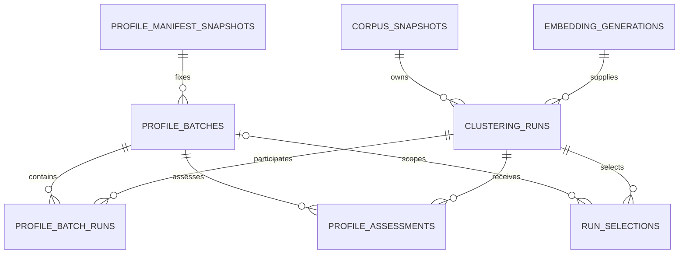

<!-- doc-scope: APPENDIX — schema layouts (baseline / cache / report / memory).
     owns: JSON schema shape tables, field-level layout documentation.
     does-not-own: schema semantics (→ respective contract chapters). -->

# Appendix B. Schema Layouts

## Purpose

Compact structural layouts for baseline/cache/report contracts in the current
`2.1` release line. Generator/package version in JSON examples is illustrative;
the actual version is defined in `codeclone/contracts/__init__.py` and
`pyproject.toml`.

## Baseline schema (`2.1`)

```json
{
  "meta": {
    "generator": {
      "name": "codeclone",
      "version": "2.0.2"
    },
    "schema_version": "2.1",
    "fingerprint_version": "1",
    "python_tag": "cp314",
    "created_at": "2026-03-11T00:00:00Z",
    "payload_sha256": "...",
    "metrics_payload_sha256": "...",
    "api_surface_payload_sha256": "..."
  },
  "clones": {
    "functions": [
      "<fingerprint>|<loc_bucket>"
    ],
    "blocks": [
      "<block_hash>|<block_hash>|<block_hash>|<block_hash>"
    ]
  },
  "metrics": {
    "...": "optional embedded metrics snapshot"
  },
  "api_surface": {
    "...": "optional embedded public API snapshot"
  }
}
```

Compact embedded `api_surface` symbol layout:

```json
{
  "module": "pkg.mod",
  "filepath": "pkg/mod.py",
  "symbols": [
    {
      "local_name": "PublicClass.method",
      "kind": "method",
      "start_line": 10,
      "end_line": 14,
      "params": [],
      "returns_hash": "",
      "exported_via": "name"
    }
  ]
}
```

Notes:

- `local_name` is stored on disk to avoid repeating the containing module path.
- `filepath` is stored as a baseline-directory-relative wire path when
  possible, rather than as a machine-local absolute path.
- Runtime reconstructs canonical full qualnames as `module:local_name` before
  API-surface diffing and restores runtime filepaths from the wire path.

## Standalone metrics-baseline schema (`1.2`)

```json
{
  "meta": {
    "generator": {
      "name": "codeclone",
      "version": "2.0.2"
    },
    "schema_version": "1.2",
    "python_tag": "cp314",
    "created_at": "2026-03-11T00:00:00Z",
    "payload_sha256": "...",
    "api_surface_payload_sha256": "..."
  },
  "metrics": {
    "...": "metrics snapshot"
  },
  "api_surface": {
    "modules": [
      {
        "module": "pkg.mod",
        "filepath": "pkg/mod.py",
        "all_declared": [],
        "symbols": [
          {
            "local_name": "run",
            "kind": "function",
            "start_line": 10,
            "end_line": 14,
            "params": [],
            "returns_hash": "",
            "exported_via": "name"
          }
        ]
      }
    ]
  }
}
```

## Cache schema (`2.8`)

```json
{
  "v": "2.8",
  "payload": {
    "py": "cp314",
    "fp": "1",
    "ap": {
      "min_loc": 10,
      "min_stmt": 6,
      "block_min_loc": 20,
      "block_min_stmt": 8,
      "segment_min_loc": 20,
      "segment_min_stmt": 10,
      "collect_api_surface": false
    },
    "files": {
      "codeclone/cache/store.py": {
        "st": [
          1730000000000000000,
          2048
        ],
        "ss": [
          450,
          12,
          3,
          1
        ],
        "u": [
          [
            "qualname",
            1,
            2,
            2,
            1,
            "fp",
            "0-19",
            1,
            0,
            "low",
            "raw_hash",
            0,
            "none",
            0,
            "fallthrough",
            "none",
            "none"
          ]
        ],
        "b": [
          [
            "qualname",
            10,
            14,
            5,
            "block_hash"
          ]
        ],
        "s": [
          [
            "qualname",
            10,
            14,
            5,
            "segment_hash",
            "segment_sig"
          ]
        ],
        "cm": [
          [
            "qualname",
            1,
            30,
            3,
            2,
            4,
            2,
            "low",
            "low"
          ]
        ],
        "cc": [
          [
            "qualname",
            [
              "pkg.a",
              "pkg.b"
            ]
          ]
        ],
        "md": [
          [
            "pkg.a",
            "pkg.b",
            "import",
            10
          ]
        ],
        "dc": [
          [
            "pkg.a:unused_fn",
            "unused_fn",
            20,
            24,
            "function"
          ]
        ],
        "rn": [
          "used_name"
        ],
        "rq": [
          "pkg.dep:used_name"
        ],
        "in": [
          "pkg.dep"
        ],
        "cn": [
          "ClassName"
        ],
        "rr": [
          [
            "pkg.api:list_items",
            20,
            24,
            "function",
            "fastapi",
            "registers_handler",
            "medium",
            "route decorator",
            "router.get",
            "pkg.api:router"
          ]
        ],
        "sc": [
          [
            "process_boundary",
            "subprocess_run",
            "pkg.runner",
            "pkg.runner:run",
            10,
            10,
            "callable",
            "exact_call",
            "call",
            "subprocess.run"
          ]
        ],
        "sf": [
          [
            "duplicated_branches",
            "key",
            [
              [
                "stmt_seq",
                "Expr,Return"
              ]
            ],
            [
              [
                "pkg.a:f",
                10,
                12
              ]
            ]
          ]
        ]
      }
    }
  },
  "sig": "..."
}
```

Notes:

- File keys are wire paths (repo-relative when root is configured).
- Optional sections are omitted when empty.
- `ss` stores per-file source stats and is required for full cache-hit accounting
  in discovery.
- `rn`/`rq` are optional and decode to empty arrays when absent.
- `rr` stores runtime reachability facts used to keep dead-code behavior
  equivalent between cold and cached runs.
- Cached public-API symbol payloads preserve declaration order for `params`;
  canonicalization must not rewrite callable signature order.
- `u` row decoder accepts both legacy 11-column rows and canonical 17-column rows
  (legacy rows map new structural fields to neutral defaults).

## Report schema (`2.11`)

```json
{
  "report_schema_version": "2.11",
  "meta": {
    "codeclone_version": "2.0.2",
    "project_name": "codeclone",
    "scan_root": ".",
    "analysis_mode": "full",
    "report_mode": "full",
    "analysis_profile": {
      "min_loc": 10,
      "min_stmt": 6,
      "block_min_loc": 20,
      "block_min_stmt": 8,
      "segment_min_loc": 20,
      "segment_min_stmt": 10
    },
    "analysis_thresholds": {
      "design_findings": {
        "complexity": {
          "metric": "cyclomatic_complexity",
          "operator": ">",
          "value": 20
        },
        "coupling": {
          "metric": "cbo",
          "operator": ">",
          "value": 10
        },
        "cohesion": {
          "metric": "lcom4",
          "operator": ">=",
          "value": 4
        }
      }
    },
    "baseline": {
      "...": "..."
    },
    "cache": {
      "...": "..."
    },
    "metrics_baseline": {
      "...": "..."
    },
    "runtime": {
      "analysis_started_at_utc": "2026-03-11T08:36:29Z",
      "report_generated_at_utc": "2026-03-11T08:36:32Z"
    }
  },
  "inventory": {
    "files": {
      "...": "..."
    },
    "code": {
      "...": "..."
    },
    "file_registry": {
      "encoding": "relative_path",
      "items": []
    }
  },
  "findings": {
    "summary": {
      "...": "...",
      "suppressed": {
        "dead_code": 0,
        "clones": 1
      }
    },
    "groups": {
      "clones": {
        "functions": [],
        "blocks": [],
        "segments": [],
        "suppressed": {
          "functions": [
            {
              "...": "..."
            }
          ],
          "blocks": [],
          "segments": []
        }
      },
      "structural": {
        "groups": [
          {
            "kind": "duplicated_branches",
            "...": "..."
          },
          {
            "kind": "clone_guard_exit_divergence",
            "...": "..."
          },
          {
            "kind": "clone_cohort_drift",
            "...": "..."
          }
        ]
      },
      "dead_code": {
        "groups": []
      },
      "design": {
        "groups": []
      }
    }
  },
  "metrics": {
    "summary": {
      "...": "...",
      "dead_code": {
        "total": 0,
        "high_confidence": 0,
        "suppressed": 1
      },
      "overloaded_modules": {
        "total": 0,
        "candidates": 0,
        "population_status": "limited",
        "top_score": 0.0,
        "average_score": 0.0
      },
      "coverage_adoption": {
        "modules": 0,
        "params_total": 0,
        "params_annotated": 0,
        "param_permille": 0,
        "returns_total": 0,
        "returns_annotated": 0,
        "return_permille": 0,
        "public_symbol_total": 0,
        "public_symbol_documented": 0,
        "docstring_permille": 0,
        "typing_any_count": 0
      },
      "coverage_join": {
        "status": "ok",
        "source": "coverage.xml",
        "files": 0,
        "units": 0,
        "measured_units": 0,
        "overall_executable_lines": 0,
        "overall_covered_lines": 0,
        "overall_permille": 0,
        "missing_from_report_units": 0,
        "coverage_hotspots": 0,
        "scope_gap_hotspots": 0,
        "hotspot_threshold_percent": 50,
        "invalid_reason": null
      },
      "api_surface": {
        "enabled": false,
        "modules": 0,
        "public_symbols": 0,
        "added": 0,
        "breaking": 0,
        "strict_types": false
      },
      "security_surfaces": {
        "items": 0,
        "modules": 0,
        "exact_items": 0,
        "category_count": 0,
        "production": 0,
        "tests": 0,
        "fixtures": 0,
        "other": 0,
        "report_only": true
      }
    },
    "families": {
      "complexity": {},
      "coupling": {},
      "cohesion": {},
      "dependencies": {},
      "dead_code": {
        "summary": {
          "total": 0,
          "high_confidence": 0,
          "suppressed": 1
        },
        "items": [],
        "suppressed_items": [
          {
            "...": "..."
          }
        ],
        "runtime_reachability": {
          "summary": {
            "total": 0,
            "by_framework": {},
            "by_edge_kind": {},
            "by_confidence": {}
          },
          "items": []
        }
      },
      "overloaded_modules": {
        "summary": {
          "total": 0,
          "candidates": 0,
          "population_status": "limited",
          "top_score": 0.0,
          "average_score": 0.0
        },
        "detection": {
          "version": "1",
          "scope": "report_only",
          "strategy": "project_relative_composite"
        },
        "items": []
      },
      "coverage_adoption": {
        "summary": {
          "modules": 0,
          "params_total": 0,
          "params_annotated": 0,
          "param_permille": 0,
          "baseline_diff_available": false,
          "param_delta": 0,
          "returns_total": 0,
          "returns_annotated": 0,
          "return_permille": 0,
          "return_delta": 0,
          "public_symbol_total": 0,
          "public_symbol_documented": 0,
          "docstring_permille": 0,
          "docstring_delta": 0,
          "typing_any_count": 0
        },
        "items": []
      },
      "coverage_join": {
        "summary": {
          "status": "ok",
          "source": "coverage.xml",
          "files": 0,
          "units": 0,
          "measured_units": 0,
          "overall_executable_lines": 0,
          "overall_covered_lines": 0,
          "overall_permille": 0,
          "missing_from_report_units": 0,
          "coverage_hotspots": 0,
          "scope_gap_hotspots": 0,
          "hotspot_threshold_percent": 50,
          "invalid_reason": null
        },
        "items": []
      },
      "api_surface": {
        "summary": {
          "enabled": false,
          "baseline_diff_available": false,
          "modules": 0,
          "public_symbols": 0,
          "added": 0,
          "breaking": 0,
          "strict_types": false
        },
        "items": []
      },
      "security_surfaces": {
        "summary": {
          "items": 0,
          "modules": 0,
          "exact_items": 0,
          "category_count": 0,
          "categories": {},
          "by_source_kind": {
            "production": 0,
            "tests": 0,
            "fixtures": 0,
            "other": 0
          },
          "production": 0,
          "tests": 0,
          "fixtures": 0,
          "other": 0,
          "report_only": true
        },
        "items": []
      },
      "health": {}
    }
  },
  "derived": {
    "suggestions": [],
    "overview": {
      "families": {
        "clones": 0,
        "structural": 0,
        "dead_code": 0,
        "design": 0
      },
      "top_risks": [],
      "source_scope_breakdown": {
        "production": 0,
        "tests": 0,
        "fixtures": 0
      },
      "health_snapshot": {
        "score": 100,
        "grade": "A"
      },
      "directory_hotspots": {
        "...": "..."
      }
    },
    "hotlists": {
      "most_actionable_ids": [],
      "highest_spread_ids": [],
      "production_hotspot_ids": [],
      "test_fixture_hotspot_ids": []
    }
  },
  "integrity": {
    "canonicalization": {
      "version": "1",
      "scope": "canonical_only",
      "sections": [
        "report_schema_version",
        "meta",
        "inventory",
        "findings",
        "metrics"
      ]
    },
    "digest": {
      "verified": true,
      "algorithm": "sha256",
      "value": "..."
    }
  }
}
```

## Markdown projection (`1.0`)

```text
# CodeClone Report
- Markdown schema: 1.0
- Source report schema: 2.11
...
## Overview
## Inventory
## Findings Summary
## Top Risks
## Suggestions
## Findings
## Metrics
## Integrity
```

## SARIF projection (`2.1.0`, profile `1.0`)

```json
{
  "$schema": "https://json.schemastore.org/sarif-2.1.0.json",
  "version": "2.1.0",
  "runs": [
    {
      "originalUriBaseIds": {
        "%SRCROOT%": {
          "uri": "file:///repo/project/",
          "description": {
            "text": "The root of the scanned source tree."
          }
        }
      },
      "tool": {
        "driver": {
          "name": "codeclone",
          "version": "2.0.2",
          "rules": [
            {
              "id": "CCLONE001",
              "name": "codeclone.CCLONE001",
              "shortDescription": {
                "text": "Function clone group"
              },
              "fullDescription": {
                "text": "Multiple functions share the same normalized function body."
              },
              "help": {
                "text": "...",
                "markdown": "..."
              },
              "defaultConfiguration": {
                "level": "warning"
              },
              "helpUri": "https://orenlab.github.io/codeclone/",
              "properties": {
                "category": "clone",
                "kind": "clone_group",
                "precision": "high",
                "tags": [
                  "clone",
                  "clone_group",
                  "high"
                ]
              }
            }
          ]
        }
      },
      "automationDetails": {
        "id": "codeclone/full/2026-03-11T08:36:32Z"
      },
      "artifacts": [
        {
          "location": {
            "uri": "codeclone/report/renderers/sarif.py",
            "uriBaseId": "%SRCROOT%"
          }
        }
      ],
      "invocations": [
        {
          "executionSuccessful": true,
          "startTimeUtc": "2026-03-11T08:36:29Z",
          "workingDirectory": {
            "uri": "file:///repo/project/"
          }
        }
      ],
      "properties": {
        "profileVersion": "1.0",
        "reportSchemaVersion": "2.11"
      },
      "results": [
        {
          "kind": "fail",
          "ruleId": "CCLONE001",
          "ruleIndex": 0,
          "baselineState": "new",
          "message": {
            "text": "Function clone group (Type-2), 2 occurrences across 2 files."
          },
          "locations": [
            {
              "physicalLocation": {
                "artifactLocation": {
                  "uri": "codeclone/report/renderers/sarif.py",
                  "uriBaseId": "%SRCROOT%",
                  "index": 0
                },
                "region": {
                  "startLine": 1,
                  "endLine": 10
                }
              },
              "logicalLocations": [
                {
                  "fullyQualifiedName": "codeclone.report.sarif:render_sarif_report_document"
                }
              ],
              "message": {
                "text": "Representative occurrence"
              }
            }
          ],
          "properties": {
            "primaryPath": "codeclone/report/renderers/sarif.py",
            "primaryQualname": "codeclone.report.sarif:render_sarif_report_document",
            "primaryRegion": "1:10"
          },
          "relatedLocations": [],
          "partialFingerprints": {
            "primaryLocationLineHash": "0123456789abcdef:1"
          }
        }
      ]
    }
  ]
}
```

## TXT report sections

```text
REPORT METADATA
INVENTORY
FINDINGS SUMMARY
METRICS SUMMARY
DERIVED OVERVIEW
SUGGESTIONS
FUNCTION CLONES (NEW)
FUNCTION CLONES (KNOWN)
BLOCK CLONES (NEW)
BLOCK CLONES (KNOWN)
SEGMENT CLONES (NEW)
SEGMENT CLONES (KNOWN)
STRUCTURAL FINDINGS
DEAD CODE FINDINGS
DESIGN FINDINGS
INTEGRITY
```

## Engineering Memory schema (`1.7`)

SQLite database at `.codeclone/memory/engineering_memory.sqlite3` (default).
Schema version stored in `memory_meta.schema_version`.

Core tables:

| Table                    | Role                                                        |
|--------------------------|-------------------------------------------------------------|
| `memory_records`         | Typed statements with status, confidence, origin, payload   |
| `memory_subjects`        | Path/symbol/module links (`subject_kind`, `subject_key`)    |
| `memory_evidence`        | Deterministic evidence refs (report, git_commit, doc, …)    |
| `memory_fts`             | FTS5 search index (schema 1.1+)                             |
| `memory_revisions`       | Governance audit trail                                      |
| `memory_ingestion_runs`  | Init/refresh run metadata                                   |
| `memory_projection_jobs` | Coalesced trajectory/semantic/Experience jobs (schema 1.3+); `flush_claimed_by` flush-scheduling slot (schema 1.7+) |

Trajectory tables (schema **`1.2`**+ trajectory DDL, active projection
**`trajectory-v3`**):

| Table                               | Role                                                                           |
|-------------------------------------|--------------------------------------------------------------------------------|
| `memory_trajectories`               | One row per `(project_id, workflow_id, projection_version)` with quality score |
| `memory_trajectory_steps`           | Ordered audit steps with frozen `event_core_json`                              |
| `memory_trajectory_subjects`        | Path/module subjects linked to a trajectory                                    |
| `memory_trajectory_evidence`        | Report/run/audit evidence refs                                                 |
| `memory_trajectory_patch_trails`    | Patch Trail JSON + digest per trajectory (schema **`1.4`**, Phase 26)          |
| `memory_trajectory_projection_runs` | Rebuild run manifest                                                           |

Experience tables (schema **`1.6`**, derived from trajectory evidence):

| Table                        | Role                                                         |
|------------------------------|--------------------------------------------------------------|
| `memory_experiences`         | Advisory distilled patterns (`experience-v1`)                |
| `memory_experience_facets`   | Agent-family facets today; profile/intent kinds are reserved |
| `memory_experience_evidence` | Contributing trajectory ids and outcomes                     |

Patch Trail JSON uses `PATCH_TRAIL_SCHEMA_VERSION` (currently **`1`**) in
`codeclone/contracts/__init__.py`. Trajectory JSONL export rows use
`TRAJECTORY_EXPORT_SCHEMA_VERSION` (**`2`**) in
`codeclone/memory/trajectory/profiles.py` — separate from SQLite schema version.

Record identity uses stable `identity_key` strings for upsert during refresh.
Migration path: `codeclone/memory/schema_migrate.py`.

See [Engineering Memory](../13-engineering-memory/index.md) for lifecycle and agent
surfaces.

## Semantic index sidecar (format `1`)

Optional LanceDB directory (default `.codeclone/memory/semantic_index.lance`).
Format version constant: `SEMANTIC_INDEX_FORMAT_VERSION` in
`codeclone/contracts/__init__.py` (currently **`1`**).

- **Not** governed by `ENGINEERING_MEMORY_SCHEMA_VERSION` — bumping memory SQLite
  schema does not automatically invalidate the vector sidecar.
- **Rebuild** on incompatible format bumps (`codeclone memory semantic rebuild`);
  no SQLite migration path for the sidecar.
- Row/projection semantics: [Engineering Memory](../13-engineering-memory/index.md);
  bump rules: [24-compatibility-and-versioning.md](../24-compatibility-and-versioning.md).

## Platform Observability schema (`1.0`)

Optional local SQLite database at
`.codeclone/db/platform_observability.sqlite3`. It is disposable development
telemetry, not report, baseline, cache, audit, or Engineering Memory truth.

| Table                 | Role                                                                                                                   |
|-----------------------|------------------------------------------------------------------------------------------------------------------------|
| `platform_meta`       | Schema version metadata.                                                                                               |
| `platform_operations` | Surface-level operation identity, correlation, duration, status, bounded payload sizes, and optional process metrics.  |
| `platform_spans`      | Ordered subsystem timing, reason/dedupe metadata, counters, normalized SQL fingerprints, and optional process metrics. |

Operation and span rows are persisted together in one transaction. Profile
columns are nullable and populated only when profiling is enabled with
`codeclone[perf]`. `db_fingerprints` is additively migrated for older local
stores.

See [Platform Observability](../26-platform-observability.md) for configuration,
privacy, query, and anti-inference rules.

## Corpus analytics store (`1.2`)

Optional SQLite database (default `.codeclone/analytics/corpus_clustering.sqlite3`)
and LanceDB vector directory (default `.codeclone/analytics/corpus_vectors`).
Derived offline analytics — not report, baseline, cache, audit, or Engineering
Memory truth.

| Artifact                | Role                                                                  |
|-------------------------|-----------------------------------------------------------------------|
| `corpus_snapshots`      | Immutable-by-contract snapshot metadata and source digests            |
| `corpus_items`          | Normalized representation, metadata, and optional registry overlay    |
| `embedding_generations` | Provider/model/preprocessing manifest                                  |
| `embedding_items`       | Vector row keys, float32 digests, dimensions; no vector blobs          |
| `clustering_runs`       | Requested/effective parameters, algorithm manifest, lifecycle status  |
| `cluster_assignments`   | Per-run item label, strength, and membership digest                    |
| `cluster_summaries`     | Canonical display id and persisted diagnostics per cluster/noise       |
| `profile_manifest_snapshots` | Immutable canonical manifest values, labels, and descriptions     |
| `profile_batches`       | One immutable execution receipt per profile sweep                      |
| `profile_batch_runs`    | Ordered effective-parameter membership for each batch                  |
| `profile_assessments`   | Technical-validity-aware suitability facts for batch members           |
| `run_selections`        | Append-only global or profile-batch maintainer decisions               |
| LanceDB sidecar         | Separate float32 vectors from Engineering Memory semantic index        |

Store schema version: `CORPUS_ANALYTICS_STORE_SCHEMA_VERSION` in
`codeclone/contracts/__init__.py` (currently **`1.2`**).

Writable open chains `1.0 → 1.1 → 1.2`; it never skips the intermediate
integrity migration. Read-only open never migrates and rejects stale schema.
SQLite triggers prevent orphan-producing inserts, relationship updates, and
parent deletes; unique indexes protect vector row keys, non-null display
cluster ids, and one effective candidate per profile batch.

Profile state is an overlay over immutable clustering facts:



`clustering_runs` has no profile columns. A re-sweep creates a new
`profile_batches` row with the exact manifest and candidate-space digests.
`run_selections` supersedes earlier active heads in the same
`(snapshot_id, embedding_generation_id, profile_batch_id)` scope. A null batch
means global selection. The legacy `selected_by_maintainer` field is a
global-scope mirror only.

The SQLite transaction and LanceDB sidecar cannot share one physical
transaction. The embedding workflow therefore writes metadata and vectors as
one controlled operation, rolls SQLite back and removes the generation on
ordinary failures, and validates row keys, dimensions, and float32 digests
before clustering. Crash residue is detected as an integrity error rather than
accepted as a completed generation.

### Corpus analytics JSON export (`1.3`)

`CORPUS_EXPORT_SCHEMA_VERSION = "1.3"` projects interpretation contract `1.1`
and control-plane contract `1.0` over store schema `1.2`; it does not migrate
the SQLite database.

```text
export
├── schema_version = "1.3"
├── interpretation_contract_version = "1.1"
├── control_plane_contract_version = "1.0"
├── snapshot
├── embedding_generation | null
├── embedding_items[]
├── clustering_run
│   ├── validity
│   ├── presentation
│   ├── profile_context?       # stored batch assessment + manifest snapshot
│   ├── selection?             # active event for export scope
│   └── partition_metrics | diagnostic_facts
├── clusters[]                 # full mode only
│   └── interpretation
│       ├── representative_previews[]
│       ├── boundary_previews[]
│       ├── categorical_correlations
│       ├── numeric_summaries
│       ├── provenance_completeness
│       └── machine_inspectability_signals
├── assignments[]              # full mode only
├── noise_items[]              # full mode only
├── profile_summary?           # sweep export, sibling of comparison_summary
└── content_disclosure
```

`clustering_run.validity.failed_invariants` is a deterministic ordered subset
of `V1` through `V10`. `presentation.projection_mode` is
`full_interpretation` only when every invariant passes; otherwise it is
`limited_diagnostic`, `partition_metrics` is omitted, `score` is `null`, and
cluster/item interpretation arrays are absent.

Sweep comparison exports every persisted run for the requested snapshot and
embedding generation. Each candidate has a sibling `comparison` object:

```json
{
  "score": null,
  "rank": null,
  "recommended_by_heuristic": false,
  "dominant_cluster_ratio": null,
  "dominant_assigned_ratio": null,
  "largest_cluster_size": null
}
```

Only technically valid candidates receive non-null comparison metrics, score,
and rank. Profile-scoped candidates add `profile_suitable` and
`is_profile_recommended`. `comparison_summary` preserves its Slice 1.1 keys;
`profile_summary` is a sibling with batch identity, manifest snapshot metadata,
suitability counts, recommendation rationale, and active selection.

`content_disclosure` is derived from the final payload. Its preview scopes are
`cluster_representatives`, `cluster_boundaries`, and `noise_items`; the
contract limit is 240 Unicode code points. Default `items[]` entries do not
contain normalized text previews.

### Corpus representation contract (`3`)

New intent snapshots persist explicit provenance booleans inside
`corpus_items.metadata_json`:

```json
{
  "provenance": {
    "trajectory": {"selected": false},
    "patch_trail": {"present": false},
    "registry_overlay": {"present": false}
  }
}
```

Trajectory and Patch Trail identity evidence retains its existing digest
behavior. Registry-overlay content and presence remain advisory and excluded
from source identity. Contract-2 snapshots are immutable and are interpreted
with conservative legacy rules; they are not rewritten.

See [Corpus Analytics](../27-corpus-analytics.md) for CLI, configuration, and trust
boundaries, and
[Profile Control Plane](../27-corpus-analytics.md#profile-control-plane-slice-12)
for batch and selection semantics, and
[Report Interpretability](../27-corpus-analytics.md#report-interpretability-slice-11)
for validity and privacy rules.

## Refs

- `codeclone/baseline/clone_baseline.py`
- `codeclone/cache/store.py`
- `codeclone/memory/schema.py`
- `codeclone/memory/schema_trajectory.py`
- `codeclone/memory/schema_migrate.py`
- `codeclone/memory/semantic/models.py`
- `codeclone/observability/store/schema.py`
- `codeclone/contracts/__init__.py` (`SEMANTIC_INDEX_FORMAT_VERSION`)
- `codeclone/report/document/builder.py`
- `codeclone/report/renderers/text.py`
- `codeclone/report/renderers/markdown.py`
- `codeclone/report/renderers/sarif.py`
