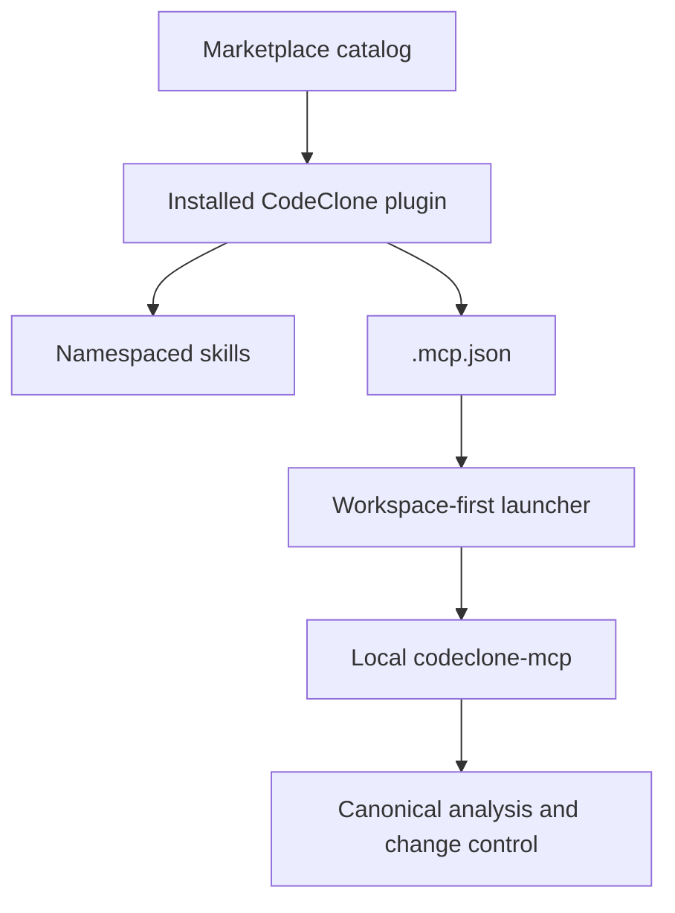

<!-- doc-scope: Claude Code Plugin contract. class: contract max-lines: 160 -->

# Claude Code Plugin

## Distribution contract

The monorepo source lives under `plugins/claude-code-codeclone/`.
`scripts/sync_integrations.py --target claude-code` publishes it into the
dedicated `orenlab/codeclone-claude-code` storefront.

The distribution repository contains:

| Path                                           | Role                                                             |
|------------------------------------------------|------------------------------------------------------------------|
| `.claude-plugin/marketplace.json`              | Marketplace catalog named `orenlab-codeclone`                    |
| `plugins/codeclone/.claude-plugin/plugin.json` | Plugin identity and metadata                                     |
| `plugins/codeclone/.mcp.json`                  | Local stdio MCP definition                                       |
| `plugins/codeclone/skills/`                    | Review, hotspots, change control, memory, implementation context, platform observability (maintainer-only) |
| `plugins/codeclone/scripts/launch_mcp.py`      | Standalone workspace-first launcher                              |

## Installation contract

Public installation is the two-step marketplace flow:

```bash
claude plugin marketplace add orenlab/codeclone-claude-code
claude plugin install codeclone@orenlab-codeclone
```

Local `--plugin-dir` loading is a development path, not the user installation
contract.

## Runtime model



The plugin is additive. It provides six skills and the standard agent MCP
surface from the locally resolved `codeclone-mcp` version. It does not install
the Python package, filter tools, or create a second analysis model.

The MCP configuration uses `${CLAUDE_PLUGIN_ROOT}` because Claude Code copies
installed plugins into a versioned cache. Storefront sync replaces the
monorepo delegate launcher with the full standalone implementation.

The plugin manifest intentionally omits `version`. For a Git-based marketplace,
Claude Code can identify the installed revision by commit SHA; adding an
explicit version would require the distribution release process to bump it for
every plugin change or risk retaining a stale cache entry.

## Read-only and state boundaries

The server must not mutate source files, baselines, analysis cache, or canonical
reports. Controller coordination, audit, and Engineering Memory may write only
their documented bounded local state.

## Separation from Claude Desktop

Claude Code and Claude Desktop are different install surfaces:

- Claude Code installs a marketplace plugin with skills and `.mcp.json`.
- Claude Desktop installs the local `.mcpb` bundle.

Neither surface owns analysis semantics; both connect to `codeclone-mcp`.

## Current limits

- `codeclone[mcp]` must already be available in the workspace environment or on
  `PATH`.
- Duplicate manual MCP registration can expose the same server twice; keep one
  active setup path.
- Plugin skills are namespaced as `/codeclone:<skill-name>`.

## Further reading

- [Claude Code setup](../../guide/integrations/claude-code/setup.md)
- [MCP usage guide](../../guide/mcp/README.md)
- [MCP interface contract](../25-mcp-interface/index.md)
- [Claude Desktop bundle](claude-desktop-bundle.md)
