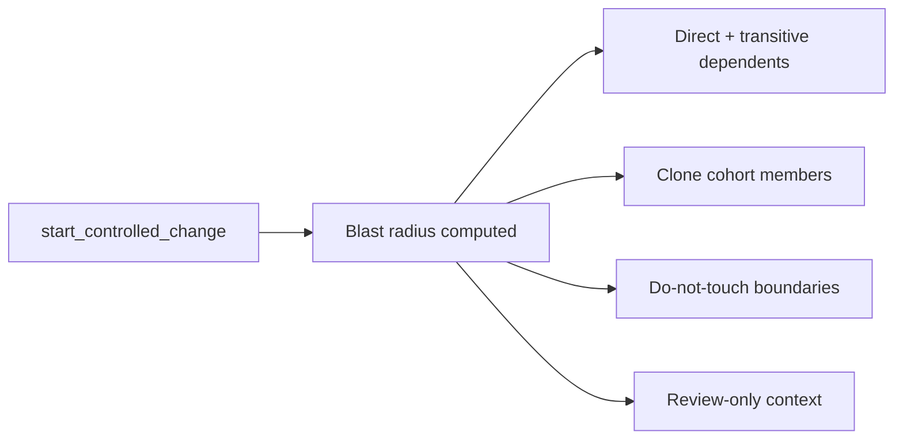

## What it is

Blast radius is the structural risk boundary around a set of files you're about to change. It shows which functions and modules directly depend on the files in scope, where coverage gaps make impact harder to verify, and which paths are off-limits without explicit approval (do-not-touch boundaries).

Blast radius is deterministic and read-only: it is computed from the canonical analysis report, not inferred or guessed, and computing it never mutates the repository or grants permission to edit.

## Why it exists

Before editing a file, "what else depends on this?" is normally answered by grepping for imports and hoping nothing was missed — a process that scales badly and misses indirect dependents, clone cohorts, and low-coverage areas that make a regression hard to catch with tests. Blast radius exists to answer that question exhaustively and consistently, every time, instead of relying on a reviewer's memory of the codebase.

It is deliberately separate from permission: knowing the blast radius of a change tells you the *risk*, not whether you are *allowed* to proceed. That authorization question belongs to [edit_allowed](edit-allowed.md).

## How it fits together

Blast radius is computed as part of declaring a [controlled change](controlled-change.md): calling `start_controlled_change` returns it alongside the intent id and patch budget. It is not a standalone permission check and it is not the same thing as test coverage — a coverage gap in the blast radius means the risk is harder to verify, not that no risk exists.

| Element | What it tells you |
|---------|---------------------|
| Direct + transitive dependents | Code that calls into your declared scope, directly or indirectly |
| Clone cohort members | Other locations structurally similar to the files you're changing |
| Coverage gaps | Parts of the risk boundary that tests do not currently exercise |
| Do-not-touch boundaries | Hard boundary — requires separate explicit approval to touch |
| Review-only context | Informational only — not a ban |

`do_not_touch` paths are a hard boundary, not a suggestion — touching one requires explicit, separate approval, never just editing around it. `review_context` paths are the opposite: informational only, not a ban.

## Related pages

- [Controlled change](controlled-change.md) — where blast radius fits in the full edit lifecycle
- [Edit permission and edit_allowed](edit-allowed.md) — the actual authorization signal
- [Agent-safe change workflow](../guides/agent-safe-change.md) — the concrete commands
