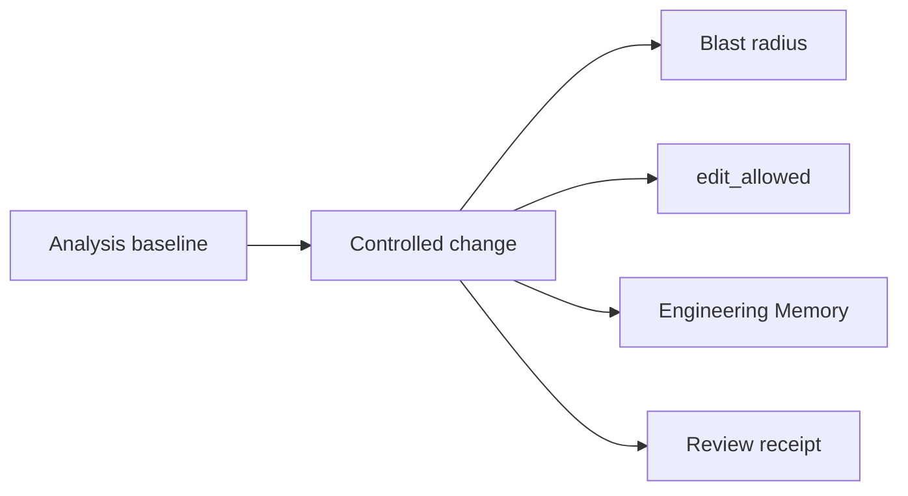

## What it is

Controlled change is CodeClone's pre-edit and post-edit verification workflow for repository modifications. It provides intent declaration, scope boundaries, structural risk assessment, and deterministic verification before and after code changes, producing a durable audit trail of what was known, what was declared, and what was verified.

## Why it exists

Unreviewed, unscoped edits are the normal failure mode for both human and AI-assisted development: a change silently grows beyond its intended files, nobody notices a new dependency cycle until it ships, and "I tested it" is not something a later reviewer can verify. Controlled change exists to make scope and verification explicit and checkable rather than a matter of trust — particularly important for AI agents, which have no persistent memory of their own actions across sessions unless the workflow records it for them.

## How it fits together

Controlled change is the umbrella workflow that several other concepts plug into:

| Concept | Role in the workflow |
|---------|------------------------|
| [Blast radius](blast-radius.md) | Computed at intent declaration; shows the structural risk of the declared scope |
| [Edit permission and edit_allowed](edit-allowed.md) | The single authorization signal the workflow produces before editing may begin |
| [Engineering Memory](engineering-memory.md) | Consulted mid-edit for prior decisions, incidents, and stale-context warnings |
| [Review receipts](review-receipts.md) | The durable, auditable record produced when the workflow finishes |

The workflow is lightweight for documentation-only changes and full-featured for structural Python or governance-config changes: a session holds exactly one trackable active intent at a time, and starting a new one before finishing the current one evicts it from tracking with no recovery except redeclaring the same scope.

## Related pages

- [Agent-safe change workflow](../guides/agent-safe-change.md) — the concrete commands and decision points
- [Blast radius](blast-radius.md)
- [Edit permission and edit_allowed](edit-allowed.md)
- [Engineering Memory](engineering-memory.md)
- [Review receipts](review-receipts.md)
