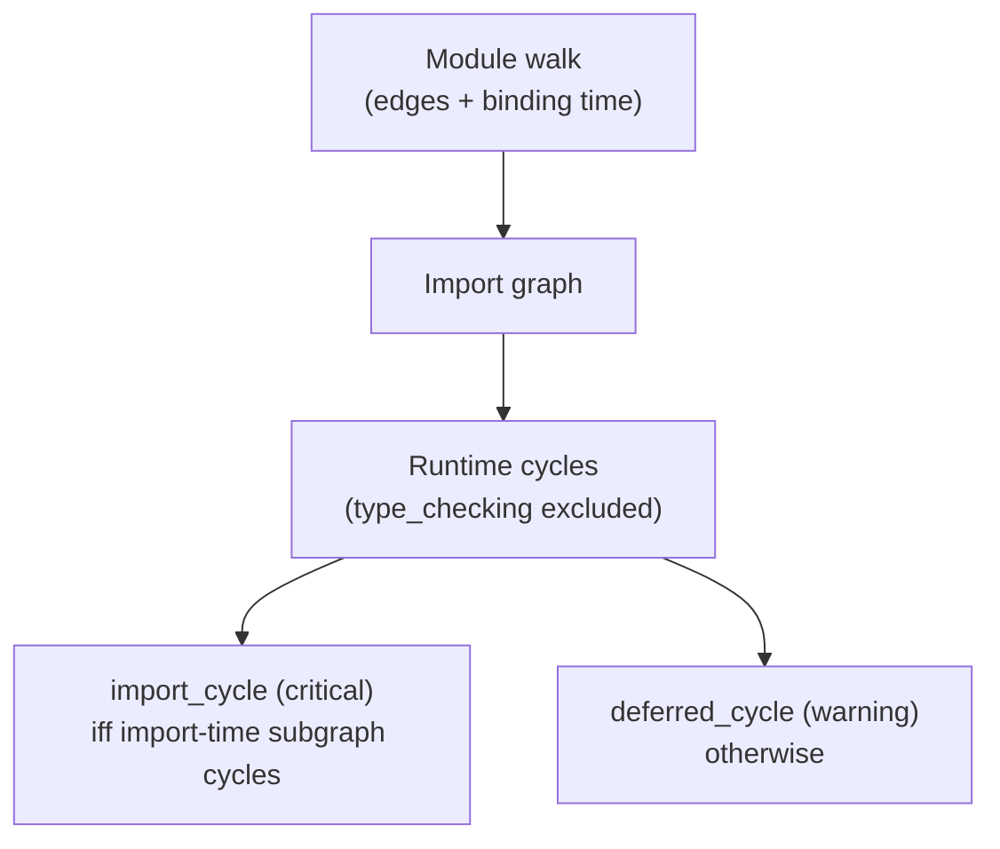

## What it is

A dependency cycle is a set of modules that import each other, directly or through intermediaries, so that no member can be loaded without the others. CodeClone detects cycles over the internal import graph and — unlike a plain cycle detector — classifies every edge by *when it binds*, statically derived from the AST:

| Edge binding | Meaning |
|--------------|---------|
| `import_time` | Executes while the module is being imported: top-level statements, class bodies, and module-scope dynamic loads |
| `deferred_function` | Binds only when an enclosing function or method is called |
| `deferred_getattr` | Binds on attribute miss through the module-level PEP 562 `__getattr__` hook |
| `type_checking` | Never executes at runtime — guarded by `TYPE_CHECKING` |
| `lazy_syntax` | The PEP 810 `lazy import` marker (Python 3.15) |

The classification is a closed decision table over AST position — no heuristics, no similarity, no runtime probing.

## Why it exists

"Circular dependency: critical" used to mean one thing to the report and another to the reader. A cycle whose every edge is a function-scope import cannot crash at import time — calling it critical alongside a genuine import-order crash risk buries the finding that can actually take production down. The reverse lie is just as bad: a cycle with even one surviving import-time back-edge *is* a crash risk, and no amount of lazy edges elsewhere softens it.

The cycle law is therefore by construction:

- A cycle is an **`import_cycle` (critical)** if and only if the subgraph restricted to `import_time` edges still contains a cycle.
- Otherwise it is a **`deferred_cycle` (warning)** — a real design cycle that binds no edge at import time.
- `type_checking` edges are excluded from runtime cycle detection entirely: a typing-only link is not a runtime fact. The edges themselves stay visible in the report's edge list with their kinds — no data is discarded.

Cycle findings also never invent file paths. A cycle member resolves to its real repository file through the module-identity inventory — a package module reports `pkg/__init__.py`, a module file reports `pkg.py`, and a member without a resolvable file reports its module identity with no path claim at all.

## How it fits together

Cycle detection runs on the same dependency lane the rest of the platform reads:

| Consumer | What it uses |
|----------|--------------|
| [Structural analysis](structural-analysis.md) | Collects every import edge with its binding during the module walk |
| [Health score](health-score.md) | Counts cycles in the dependencies dimension |
| [Reports and baselines](reports.md) | Carries edges, cycles, and their classification in the dependencies lane |
| [Blast radius](blast-radius.md) | Reads cycle membership when bounding structural risk before an edit |

The finding copy states what was measured — "cycle over import-time edges" versus "cycle only over deferred edges (function-scope, module `__getattr__`, or lazy imports)" — so a reviewer never has to reverse-engineer the severity.

## Related pages

- [Structural analysis](structural-analysis.md) — the base layer that collects dependency edges
- [Health score](health-score.md) — how cycles weigh into the dependencies dimension
- [Reports and baselines](reports.md) — where cycles and their classification are stored and compared
