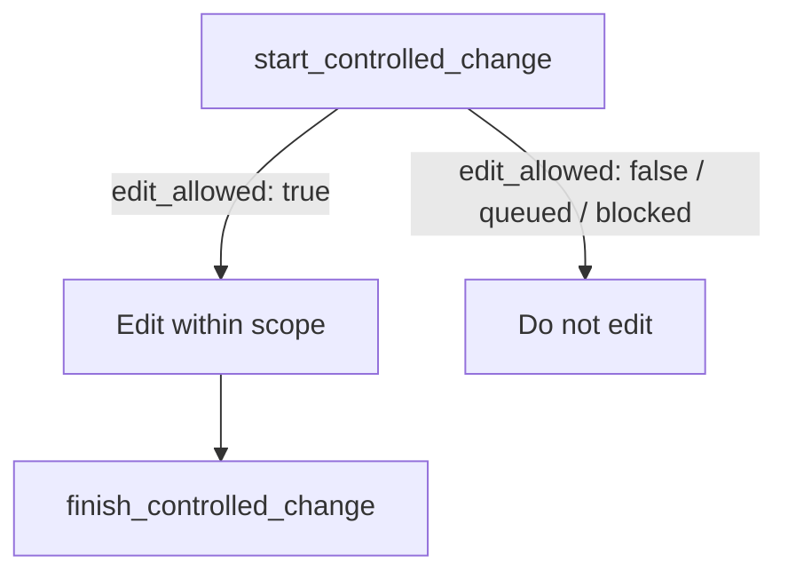

## What it is

`edit_allowed` is a deterministic permission flag returned by `start_controlled_change` that authorizes editing repository files within a declared scope. It is the single signal that gates an edit — not a suggestion, not one input among several, but the gate itself.

## Why it exists

Every other piece of context available before an edit — blast radius, engineering memory, how far along a task feels — is informative but not authoritative, and treating any of them as permission has caused real incidents (an agent editing because "the workflow is almost done" or because a blast-radius view looked safe). `edit_allowed` exists to remove that ambiguity: there is exactly one flag to check, and it is either `true` or it isn't.

## How it fits together

| Signal | Grants edit permission? |
|--------|--------------------------|
| `start_controlled_change` returns `status: "active"`, `edit_allowed: true` | Yes |
| `start_controlled_change` returns `edit_allowed: false` | No |
| `status: "queued"` (foreign intent holds scope) | No — wait for promotion |
| `status: "blocked"` (conflict or budget exhausted) | No — narrow or coordinate |
| Blast radius looks low-risk | No — blast radius is context, not authorization |
| Engineering Memory says a similar edit was safe before | No — memory does not authorize edits |
| `finish_controlled_change` returned `"accepted"` on a *previous* edit | No — authorization must exist *during* the edit, not after a prior one |

An MCP session holds exactly one trackable active intent. Calling `start_controlled_change` again before finishing the current one evicts it from session tracking with no recovery — the next `finish_controlled_change` call fails with "Unknown change intent id."

## Related pages

- [Controlled change](controlled-change.md) — the full workflow this flag belongs to
- [Blast radius](blast-radius.md) — context, not authorization
- [Agent-safe change workflow](../guides/agent-safe-change.md) — the concrete commands
