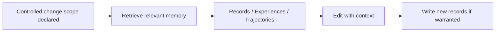

## What it is

Engineering Memory is CodeClone's durable knowledge store for repository insights and workflow decisions. It persists evidence-linked facts across analysis runs, AI agent sessions, and developer workflows in a local SQLite database, and survives process exits and restarts.

The store is **per repository, not per checkout**: all linked `git worktree` checkouts of one repository resolve the same store at the main checkout's `.codeclone/memory/`, discovered lexically from the git common directory. An agent working in a sandbox worktree reads the repository's shared approved knowledge, its draft writes land in the durable store the human Memory view opens, and removing the worktree loses nothing. Non-git roots and submodules keep a per-root store; an explicit `memory.db_path` always wins. MCP memory responses carry a `store_provenance` witness (`store_resolution`, `approved_records_total`) so a freshly bootstrapped hollow store is distinguishable from a knowledge-bearing one — `approved_records_total: 0` is a red flag, and an unresolvable git state adds an explicit `resolution_warning` instead of falling back silently.

It holds four kinds of evidence: **records** (architecture decisions, change rationales, contract notes, risk notes), **experiences** (episodic patterns distilled from past workflow trajectories), **trajectories** (timestamped audit trails of agent actions), and a **semantic index** over records and experiences for retrieval.

## Why it exists

An AI agent session is ephemeral — a new session, a context-window reset, or a new MCP process all start with no memory of what a previous session learned. Without a durable store, hard-won context (a non-obvious root cause, a workaround for a stale contract, a decision that was already litigated) is lost and gets rediscovered at cost, or worse, silently contradicted. Chat transcripts are not a substitute: they are ephemeral and not queryable by a future agent working on the same file. Engineering Memory exists to make that knowledge durable, evidence-linked, and scoped to the files it's actually relevant to.

## How it fits together

| Lane | What it captures | Authority |
|------|--------------------|-----------|
| Records | Asserted knowledge (decisions, rationale, risks) | Human-approved before treated as established |
| Experiences | Advisory patterns distilled from many past trajectories | Advisory, not a fact about the current code |
| Trajectories | Episodic evidence of what agents actually did | Evidence, not authorization |

Memory is retrieved mid-workflow, after [controlled change](controlled-change.md) has declared an edit scope, and is filtered to that scope rather than the whole repository. Writing new records happens through the same MCP surface, not by asserting things in chat. Draft records require human approval (via the CodeClone VS Code Memory view) before being treated as established facts — memory cannot authorize edits, expand scope, or override structural findings on its own.

Statements accept a safe Markdown subset (one leading `## ` title, code spans, bold/italic, depth-1 lists, compact tables, blockquotes, bare URLs) that degrades gracefully as plain text. Images, raw HTML, and `[text](url)` links are rejected at write time as render-surface security risks. Records authored under the subset carry `statement_format: "md-v1"`; legacy records have no marker and are treated as plain text, never markdown-rendered.

## Related pages

- [Engineering Memory workflow](../guides/engineering-memory-workflow.md) — the concrete retrieval and write commands
- [Controlled change](controlled-change.md) — where memory retrieval fits in the edit lifecycle
