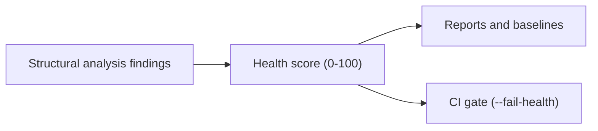

## What it is

Health score is a composite metric that measures Python code quality across multiple structural dimensions. It combines seven weighted factors into a single 0–100 score on a normalized scale where higher is better: clones, complexity, cohesion, coupling, coverage, dead code, and dependency cycles.

Health score is a summary, not a replacement for looking at findings. A score drop tells you *that* something regressed; the underlying structural analysis findings tell you *what* and *where*.

## Why it exists

Seven separate metrics are hard to reason about together, and harder still to gate a CI pipeline on. Health score exists to answer one question cheaply: "did this change make the codebase's structure better or worse, overall?" — without requiring every reviewer to understand the interaction between complexity thresholds, coupling limits, and dead-code detection individually.

It should not be treated as an absolute target, because the weighting reflects CodeClone's defaults, not a universal notion of correctness. High health also does not imply functional correctness or security — it measures structural properties only, and is meant to sit alongside tests and security review, not replace them.

## How it fits together

| Dimension | Weight | Fed by |
|-----------|--------|--------|
| Clones | 25% | Active function and block clone groups per analyzed file |
| Complexity | 20% | [Full-McCabe V(G)](complexity.md) per function |
| Cohesion | 15% | LCOM4 per class |
| Coupling | 10% | CBO per class |
| Coverage | 10% | Analyzed files over found files — analysis coverage, not test coverage |
| Dead code | 10% | Symbols with no production references — functions, classes, methods, imports |
| Dependencies | 10% | Dependency cycles and depth |

The weights above are the contract, not a suggestion. How each dimension spends
its points is in [Health explainability](health-explainability.md).

The dead-code dimension counts *symbols* with no production references —
unreferenced, or referenced only from tests.
[Unreachable statements](unreachable-statements.md) are reported and stored in
the dead-code lane, but they are not a health input and not a gate input today.

Health score is computed fresh on every run and stored as part of the [report](reports.md) for that run; comparing scores across runs only makes sense when both runs analyzed the same repository root.

## Related pages

- [Health explainability](health-explainability.md) — how each dimension spends its points
- [Run the first analysis](../guides/first-analysis.md) — where the score appears in the report
- [Structural analysis](structural-analysis.md) — the seven underlying dimensions
- [CI integration](../guides/ci-integration.md) — gating a pipeline on health score
