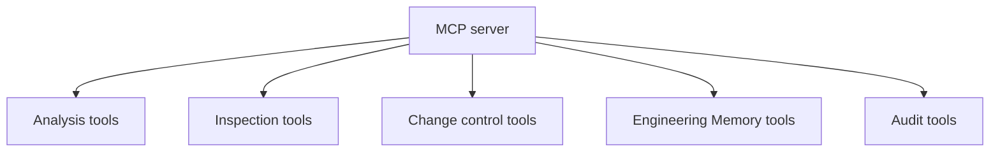

## What it is

The MCP interface is CodeClone's Model Context Protocol server: a deterministic, read-only repository-analysis and change-control surface intended for programmatic and agent-driven workflows, as opposed to a human typing commands at a terminal.

MCP tools operate on absolute repository roots, not relative paths, and are stateless between calls except for session-managed analysis runs and active change intents.

## Why it exists

A human-facing CLI and an agent-facing protocol have different needs: agents call tools programmatically, need structured (not human-formatted) responses, and benefit from narrower, purpose-built tools (a triage view, a single finding, a blast-radius query) rather than one large command with many flags. MCP exists to serve that audience directly, sharing the same deterministic analysis engine as the CLI rather than reimplementing it.

## How it fits together

MCP groups its tools by purpose:

| Group | Purpose |
|-------|---------|
| Analysis | Run analysis and register a session-local run |
| Inspection | Retrieve summaries, sections, and implementation context from a run |
| Change control | Declare intent, compute blast radius, verify, and clear |
| Triage | Production-first and hotspot-focused views for first-pass review |
| Engineering Memory | Retrieve and govern durable evidence |
| Audit | Fetch durably stored receipts, patch trails, and blast artifacts |

MCP is one of several client surfaces (see the [integrations](../integrations/claude.md)) that all talk to the same underlying analysis engine and change-control contracts described in [Controlled change](controlled-change.md).

## Related pages

- [MCP tools reference](../reference/mcp-tools.md) — the exhaustive tool list
- [Controlled change](controlled-change.md)
- [Claude integration](../integrations/claude.md)
