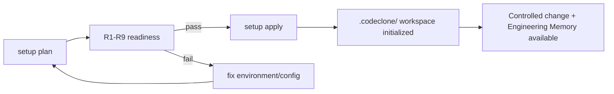

## What it is

Project setup is the process of preparing a repository for CodeClone governance. The `setup` command discovers project structure, evaluates readiness across nine dimensions (R1–R9), and plans a small set of filesystem mutations that initialize CodeClone's workspace and audit trail.

Setup is read-only until a plan is explicitly applied and confirmed — discovering and planning never write to disk on their own.

## Why it exists

Change control, Engineering Memory, and the audit trail all need some on-disk state to work: a workspace intent registry, an audit database, governance config in `pyproject.toml`. Creating that by hand is error-prone and easy to get subtly wrong (wrong gitignore entry, stale config key). Setup exists to make that bootstrap a single, safe, reviewable operation — plan first, then apply — rather than a set of manual file edits.

## How it fits together

Setup unlocks the rest of CodeClone's governance surface; nothing else requires it for read-only analysis:

| Capability | Requires setup? |
|------------|-------------------|
| Plain `codeclone .` analysis | No |
| [Controlled change](controlled-change.md) intent tracking | Yes — needs the workspace/audit state setup creates |
| [Engineering Memory](engineering-memory.md) | Yes — needs its backend initialized |
| CI gating on a baseline | No — a baseline can be created without running setup |

Applying a plan is a two-step contract by design: `--dry-run` previews the mutation with no writes, and `--plan-id` binds the actual apply to that exact previewed plan — if the repository changed in between, apply refuses with `status=stale_plan` rather than writing something that was never reviewed.

## Related pages

- [Set up a project](../guides/setup-project.md) — the concrete commands
- [Setup command reference](../reference/setup.md)
- [Controlled change](controlled-change.md) — what setup unlocks
