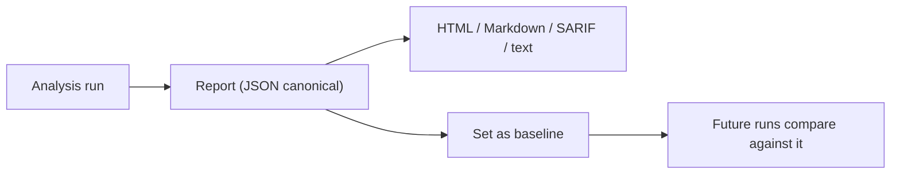

## What it is

A CodeClone **report** is the structural analysis of a repository produced by a single run: clones, design risks (cohesion, complexity, coupling), dead code, coverage, and the health score, in a deterministic form — the same repository state at the same commit always produces the same report.

A **baseline** is a stored snapshot of a report from a known-good state, typically a stable commit on the main branch. Once set, CodeClone compares new runs against it to mark findings as "novel" or "known" and to track health-score improvement or regression.

## Why it exists

A report alone only describes the present; it cannot say whether things got better or worse without something to compare against. Baselines exist to give every subsequent run a fixed point of reference, so that "500 findings" can mean either "500 pre-existing findings, none new" or "500 findings, 12 of them new regressions" — a distinction that matters enormously for CI gating and is invisible without a baseline.

## How it fits together

| Format | Purpose |
|--------|---------|
| JSON | Canonical, machine-readable; source for all other formats |
| HTML | Human-browsable report with drill-down |
| Markdown | Human-readable summary, e.g. for a PR description |
| SARIF | Static-analysis interchange format for CI code-scanning integrations |
| Text | Plain-text summary for terminals and logs |

A report is tied to its repository root; comparing reports generated from different roots is meaningless even if the content looks similar. Moving the baseline too often (on every commit) removes the ability to spot regressions — a baseline should move only after a deliberate review, not automatically.

## Related pages

- [Report reference](../reference/reports.md) — the exact schema and file formats
- [Health score](health-score.md) — the composite metric carried inside a report
- [Example report](../examples/report.md) — a live sample
