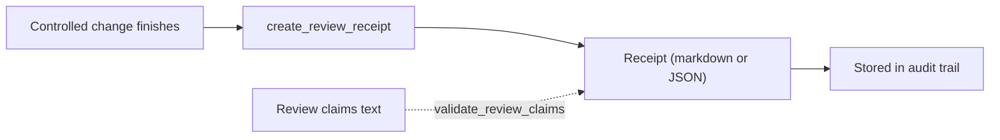

## What it is

A review receipt is a deterministic, auditable summary generated at the end of a controlled code change. It captures the scope of the edit, the structural risks identified, which findings were reviewed, and the patch-health decision — evidence that a change was examined and authorized, not a claim made from memory or chat.

A receipt is not a test result. It does not claim the code is defect-free; it is a boundary marker: "this is what we knew at the time of change, these are the findings we examined, this was the decision."

## Why it exists

"I reviewed it and it's fine" is not verifiable after the fact, and is exactly the kind of unfalsifiable claim that causes trouble when a later change uncovers a problem nobody can trace back to a decision. Review receipts exist to make that claim checkable: generated from the audit trail rather than typed by hand, referencing the exact analysis run, change intent, and blast radius that existed at the time — and immutable once created.

## How it fits together

A receipt is produced by `create_review_receipt` after [controlled change](controlled-change.md) finishes, referencing the intent id and the before/after analysis runs. Any review text supplied alongside it is checked by `validate_review_claims` against canonical report semantics, so a claim like "no regressions" cannot stand without before/after evidence to back it.

| A receipt captures | A receipt does not claim |
|----------------------|------------------------------|
| Declared scope and blast radius at intent time | The code is defect-free |
| Findings that existed and were reviewed | Functional correctness or security guarantees |
| Patch-health delta between before/after runs | Anything beyond what the audit trail evidences |
| The final scope/verification decision | A passing test result |

A session holds only one active intent at a time, so the `intent_id` from `start_controlled_change` must be kept until `finish_controlled_change` — losing it means the receipt for that edit cannot be generated for that intent.

## Related pages

- [Review a change](../guides/review-a-change.md) — the concrete commands for generating and reading a receipt
- [Controlled change](controlled-change.md) — the workflow a receipt is generated from
