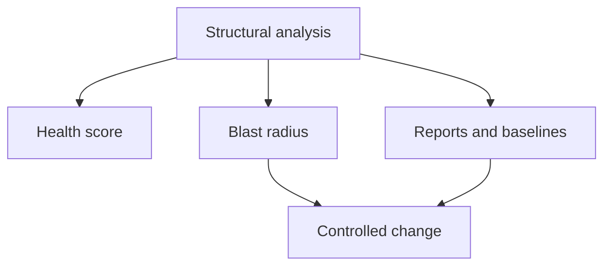

## What it is

Structural analysis is CodeClone's core examination of Python code for design metrics and patterns. It measures complexity, coupling, cohesion, dead code, and duplicate blocks across a repository, and produces a deterministic snapshot: the same repository state at the same commit always produces the same findings.

Structural analysis is not linting or style checking. It does not care about formatting, naming conventions, or import order — it measures the *shape* of the design: how large and tangled functions are, how tightly modules depend on each other, and whether code is reachable or duplicated.

## Why it exists

Design decay is gradual and easy to miss commit-by-commit. A function that grows by ten lines per PR, or a module that quietly picks up one more dependency each release, rarely triggers a code-review objection on its own — but the accumulated effect is a codebase that is expensive to change safely. Structural analysis makes that accumulation visible and comparable across time, instead of relying on individual reviewers to notice a slow drift.

It also gives AI coding agents a deterministic signal to reason about before and after an edit, which is what makes agent-safe change control possible at all: an agent cannot verify "no new regressions" without a structural baseline to compare against.

## How it fits together

Structural analysis is the base layer that several other CodeClone concepts build on:

| Consumer | What it uses from structural analysis |
|----------|----------------------------------------|
| [Health score](health-score.md) | Aggregates clone, complexity, cohesion, coupling, coverage, dead-code, and dependency metrics into one weighted 0–100 score |
| [Reports and baselines](reports.md) | Packages one analysis run's findings into a durable, comparable artifact |
| [Blast radius](blast-radius.md) | Uses the dependency and clone-cohort data from the same run to bound structural risk before an edit |
| [Controlled change](controlled-change.md) | Requires a fresh analysis run both before editing (baseline) and after (verification) |

Thresholds (what counts as "too complex" or "too coupled") are configurable per project in `pyproject.toml`, because acceptable complexity varies by domain — the analysis itself does not hard-code a universal definition of "good design."

## Related pages

- [Run the first analysis](../guides/first-analysis.md) — the concrete commands and workflow
- [Health score](health-score.md) — how these metrics become one number
- [Reports and baselines](reports.md) — how a run's findings are stored and compared over time
