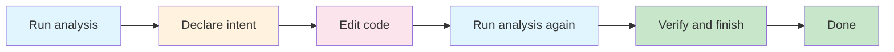

# Getting started

CodeClone is a deterministic structural change controller for Python. It analyzes your code before and after changes, detects structural regressions, and enforces quality gates to catch issues early.

## Install

CodeClone 2.1 is currently available as a prerelease. To install it:

**Using uv:**
```bash
uv tool install --prerelease allow codeclone
```

**Using pip:**
```bash
pip install --pre codeclone
```

Verify the installation:
```bash
codeclone --version
```

## Run the first analysis

Navigate to your Python project and run:

```bash
codeclone
```

CodeClone scans your project structure, detects code clones, complexity violations, and dependency issues. By default, it analyzes the current directory and generates reports in `.codeclone/`.

**Common first-run options:**

| Option | Purpose |
|--------|---------|
| `codeclone --help` | Show all available flags |
| `codeclone --processes 8` | Use parallel workers (default: 4) |
| `codeclone --min-loc 5` | Lower minimum lines for clone detection |
| `codeclone --no-progress` | Suppress progress output (useful in CI) |

For CI/CD integration, use CI mode:

```bash
codeclone --ci
```

This disables color, limits output, and applies fail-on-new clone detection.

## Read the first report

After analysis completes, open the HTML report:

```bash
codeclone --html
open .codeclone/report.html
```

Or generate other formats:

```bash
codeclone --json      # Canonical JSON report
codeclone --md        # Markdown summary
codeclone --sarif     # SARIF 2.1.0 format
```

The report shows:
- **Clone groups**: duplicate code segments and their locations
- **Complexity metrics**: cyclomatic complexity and coupling scores
- **Dead code**: unreachable functions
- **Health score**: overall code quality summary

## Start a controlled change

There are two distinct ways to guard edits, and it's worth keeping them separate:

- **CLI patch verification** (`--patch-verify`) — a one-shot check. It runs analysis, compares your working tree against the trusted baseline budget, reports baseline-relative regressions and gate status, then exits. It does **not** declare an intent or gate whether you may edit.
- **MCP controlled change** (`start_controlled_change` / `finish_controlled_change`) — the intent-first workflow used by agents and IDE integrations. It declares scope, gates edit permission, and verifies the patch at finish.

For a quick local check of the current working tree:

```bash
codeclone --patch-verify
```



The MCP controlled-change workflow ensures:
1. Your changes stay within declared scope
2. No structural regressions are introduced
3. Quality gates pass
4. All changes are audited

When using CodeClone's MCP service (for Claude Code, Cursor, or Codex integration), the workflow is:

1. `analyze_repository` — establish a baseline run
2. `start_controlled_change` — declare scope, get intent ID, gate edit permission
3. Edit your code within scope
4. `analyze_repository` again — after-run for structural verification
5. `finish_controlled_change` — verify, produce a receipt, and clear the intent

## Verify and finish

After editing, verify your changes don't introduce regressions:

```bash
codeclone --patch-verify --strictness ci
```

**Strictness levels:**
- `ci` — strict gating in CI environment (default)
- `strict` — all gates enabled
- `relaxed` — report warnings without failing

The verification checks:
- No new clone groups (unless baseline allows)
- No new complexity violations
- No uncovered hotspots
- No dead code regressions

If verification passes, your changes are safe to commit.

## Troubleshooting

**Q: Why did analysis report a baseline error?**
A baseline mismatch means your `codeclone.baseline.json` was created with a different version or is corrupted. Regenerate it:
```bash
codeclone --update-baseline
```

**Q: How do I ignore specific findings?**
Use baseline-aware gating. After reviewing a finding, update your baseline:
```bash
codeclone --update-baseline
```

Findings present in the baseline are not flagged as new.

**Q: Can I lower the minimum clone size?**
Yes, adjust the thresholds:
```bash
codeclone --min-loc 5 --min-stmt 3
```

Lower values catch more clones but may report trivial duplicates.

**Q: How do I see which files changed?**
Use `--changed-only` with a Git ref:
```bash
codeclone --changed-only --diff-against main
```

**Q: What exit codes mean?**
- `0` — success
- `2` — contract error (invalid baseline, incompatible version)
- `3` — gating failure (new clones, threshold violations)
- `5` — internal error

**Q: Can I integrate with CI?**
Yes. CodeClone supports multiple CI systems and output formats:
```bash
codeclone --ci --sarif report.sarif
```

See the CI documentation for integration guides.
