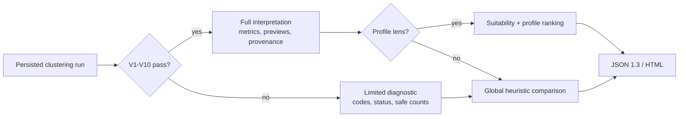

# Corpus Analytics

Use Corpus Analytics when you want **offline clustering of historical change-control
intents** — for example to compare agent workflow cohorts, inspect outliers, or
export HTML/JSON summaries for maintainer review.

## Prerequisites

1. A repository with audit enabled and historical `intent.declared` events.
2. Engineering Memory trajectory projection (optional but improves selection).
3. Install optional dependencies:

```bash
uv sync --extra analytics
```

## Quick start

Build snapshot, embeddings, and a recommended clustering run in one step:

```bash
codeclone analytics build --root . --sweep --use-recommended
```

`--use-recommended` requires `--sweep`. It renders the heuristic winner for
inspection; it does **not** set `selected_by_maintainer`.

Use a versioned profile lens when the review question is more specific:

```bash
codeclone analytics build \
  --root . \
  --profile intent-small-balanced-v1 \
  --use-recommended \
  --html-out /tmp/profile-report.html \
  --json-out /tmp/profile-report.json
```

`--profile` implies a finite sweep. `--profile auto` requires
`default_profile_id` in `pyproject.toml`; omitting `--profile` preserves the
ordinary single-run or sweep behavior.

Write a detailed single-run report to explicit paths:

```bash
codeclone analytics build \
  --root . \
  --representation description \
  --html-out /tmp/corpus-clusters.html \
  --json-out /tmp/corpus-clusters.json
```

Write a sweep comparison without choosing a primary detail view:

```bash
codeclone analytics build \
  --root . \
  --sweep \
  --html-out /tmp/corpus-sweep.html \
  --json-out /tmp/corpus-sweep.json
```

## Reading the reports

Corpus Analytics separates formal technical validity from human
interpretation:



A valid run can still be only a candidate. The banner distinguishes
maintainer-selected, profile-recommended, valid-but-profile-rejected,
heuristically recommended, candidate-only, and technically invalid runs; none
of those labels claims a semantic taxonomy.

Full reports show dominant-cluster ratios against both the whole corpus and
assigned non-noise items, bounded representative/boundary previews, numeric
summaries, categorical correlations, provenance completeness for small
clusters, and observable noise flags. Sweep comparison includes failed and
invalid runs as limited rows with `unavailable` metrics rather than silently
dropping them.

Normalized text previews are capped at 240 Unicode code points. JSON keeps raw
strings; HTML escapes them. The export `content_disclosure` block reports
whether previews were actually emitted and in which scopes. See
[Report Interpretability](../../book/27-corpus-analytics.md#report-interpretability-slice-11)
for the invariants and safe-output rules, and
[JSON export schema](../../book/appendix/b-schema-layouts.md#corpus-analytics-json-export-13)
for the wire shape.

## Step-by-step

```bash
# 1. Immutable snapshot from audit + trajectory (+ optional registry overlay)
codeclone analytics snapshot --root .

# 2. Analytics embeddings (separate LanceDB sidecar)
codeclone analytics embed --root . --snapshot-id SNAPSHOT_ID

# 3. Cluster (add --sweep or --profile for a finite parameter search)
codeclone analytics cluster \
  --root . \
  --snapshot-id SNAPSHOT_ID \
  --embedding-generation-id GENERATION_ID

# Optional profile registry and profile-scoped sweep
codeclone analytics profiles list --root .
codeclone analytics cluster \
  --root . \
  --snapshot-id SNAPSHOT_ID \
  --embedding-generation-id GENERATION_ID \
  --profile intent-small-discovery-v1

# 4. Inspect runs
codeclone analytics clusters --root . --snapshot-id SNAPSHOT_ID
codeclone analytics cluster-show \
  --root . --snapshot-id SNAPSHOT_ID --run-id RUN_ID

# 5. Record an explicit maintainer choice
codeclone analytics cluster --root . --select-run RUN_ID \
  --selected-by "$USER" \
  --selection-rationale "Chosen for maintainer review"
```

For a profile-scoped decision, add
`--selection-profile PROFILE_ID_OR_PROFILE_BATCH_ID`. Use `none` for global
scope.

## Configuration

Defaults live in `[tool.codeclone.analytics]` inside `pyproject.toml`. See
[Corpus Analytics contract](../../book/27-corpus-analytics.md) for the full table.
The historical audit source follows top-level `[tool.codeclone].audit_path`.

```toml
[tool.codeclone.analytics]
default_profile_id = "intent-small-balanced-v1"
profile_paths = ["analytics/profiles/team-review.json"]
sweep_pca_dimensions = [32, 64, 128]
sweep_min_cluster_sizes = [5, 8, 12, 15]
sweep_min_samples = [1, 3, 5]
sweep_selection_methods = ["eom", "leaf"]
```

Repository-local manifests use the same schema as bundled profiles. Paths must
resolve to files inside the repository. The default profile is consulted only
for explicit `--profile auto`.

## Reproducibility

Exports persist snapshot and embedding manifests, vector digests, requested and
effective parameters, fixed PCA/HDBSCAN settings, package versions, and the
random seed. Unless the model revision and artifact fingerprint are known,
CodeClone explicitly reports that full vector reproducibility is not guaranteed
from the model id alone.

Existing embedding generations created under an incompatible embedding contract
are rejected. Run `embed` again for the same snapshot to create a compatible
generation.

## Failure behavior

- Expected input, capability, schema, and artifact-integrity errors exit with
  code `2` and no traceback.
- A clustering run is persisted as `running`, then becomes `completed` or
  `failed`; failed runs contain no committed assignments or summaries.
- Resolved invalid or failed runs remain exportable in limited diagnostic mode;
  they never receive partition metrics, previews, score, or rank.
- A missing embedding-generation record is rendered explicitly as unavailable
  metadata rather than fabricated from the run.
- JSON and HTML outputs are written atomically.
- Snapshot, embed, cluster, and report spans are recorded only when
  `CODECLONE_OBSERVABILITY_ENABLED=1`.

## What this is not

- Not a second analyzer — it does not replace `codeclone` structural reports.
- Not Engineering Memory semantic search — vectors are stored separately.
- Not MCP-visible in Slice 1 — CLI only.

Contract reference: [27-corpus-analytics.md](../../book/27-corpus-analytics.md).
