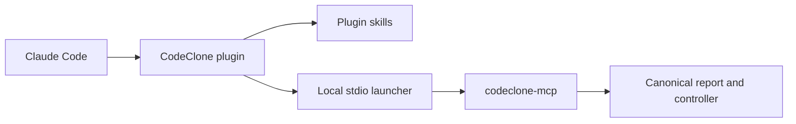

<!-- doc-scope: Claude Code plugin setup. class: guide max-lines: 170 -->
# Claude Code setup

CodeClone ships a native Claude Code plugin through the public
[orenlab/codeclone-claude-code](https://github.com/orenlab/codeclone-claude-code)
marketplace repository.

This is distinct from the
[Claude Desktop `.mcpb` bundle](../claude-desktop/setup.md). Claude Code loads
skills and the MCP definition; Claude Desktop installs an extension bundle.

## Prerequisites

- Claude Code with plugin support
- Python 3.10+
- a local `codeclone-mcp` installation

## Install from the marketplace

Add the marketplace and install the plugin:

```bash
claude plugin marketplace add orenlab/codeclone-claude-code
claude plugin install codeclone@orenlab-codeclone
```

The equivalent interactive commands are:

```text
/plugin marketplace add orenlab/codeclone-claude-code
/plugin install codeclone@orenlab-codeclone
```

Verify:

```bash
claude plugin marketplace list
claude plugin list
```

## Install the MCP launcher

Global tool installation:

```bash
uv tool install "codeclone[mcp]"
codeclone-mcp --help
```

Workspace-local installation:

```bash
uv venv
uv pip install --python .venv/bin/python "codeclone[mcp]"
.venv/bin/codeclone-mcp --help
```

The plugin launcher resolves a workspace `.venv`, then the current Poetry
environment, then `codeclone-mcp` from `PATH`.

## Runtime path



The plugin does not bundle Python or a second analyzer. It supplies guidance and
a local MCP definition over the same canonical CodeClone server.

## Skills

Claude Code namespaces installed plugin skills:

| Task | Invocation |
|---|---|
| Repository review | `/codeclone:codeclone-review` |
| Hotspot snapshot | `/codeclone:codeclone-hotspots` |
| Controlled edit | `/codeclone:codeclone-change-control` |
| Engineering Memory | `/codeclone:codeclone-engineering-memory` |

## Update or remove

```bash
claude plugin marketplace update orenlab-codeclone
claude plugin update codeclone@orenlab-codeclone
claude plugin uninstall codeclone@orenlab-codeclone
```

## Local development

Marketplace installation is the public path. For plugin development only:

```bash
claude --plugin-dir plugins/claude-code-codeclone
claude plugin validate plugins/claude-code-codeclone
```

Contract reference:
[Claude Code plugin](../../../book/integrations/claude-code-plugin.md).
