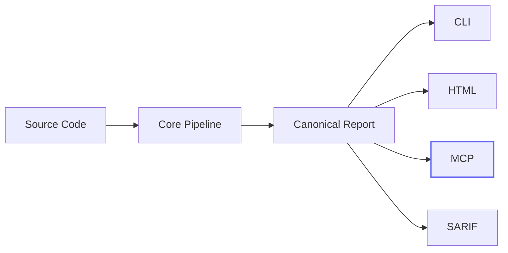
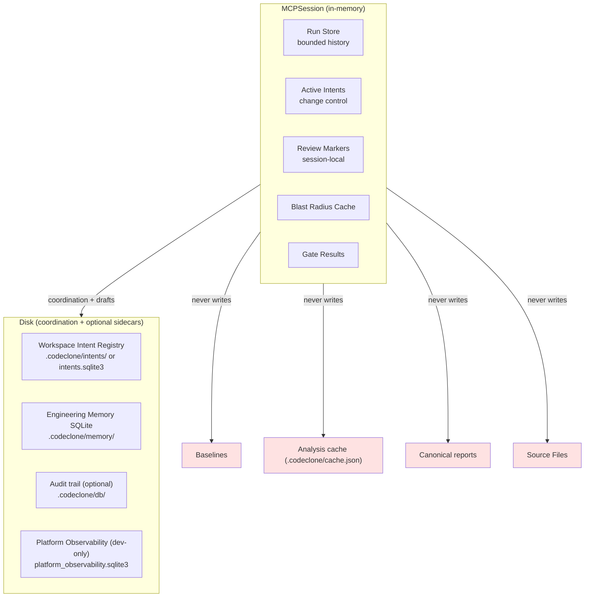
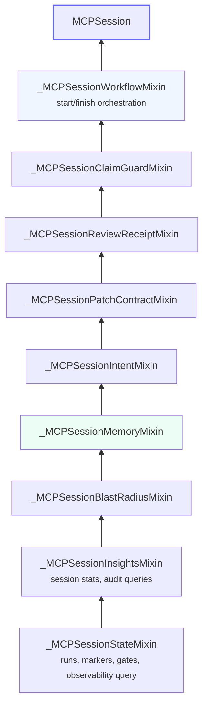

<!-- doc-scope: MCP session architecture. class: guide max-lines: 130 -->

# MCP architecture

## Where MCP fits

MCP is an **integration surface**, not a second analyzer. It composes over the
same canonical pipeline and report contracts as the CLI and HTML report.

## Session architecture

Every `codeclone-mcp` process owns an isolated session. Session state lives
entirely in process memory and does not survive restart.

**Read-only contract (analysis truth):** MCP never mutates source files,
baselines, analysis cache, or canonical report artifacts. It **may** write
ephemeral workspace intent records, Engineering Memory **drafts** (human approve
required for promotion), optional audit evidence, and opt-in development
telemetry when enabled. Platform Observability remains separate from repository
findings, reports, gates, baselines, and memory facts.

## Mixin chain

`MCPSession` is composed from focused mixins (`codeclone/surfaces/mcp/session.py`).
In Python MRO, the **first** listed mixin wins method resolution — workflow tools
sit outermost.

New capabilities extend the chain by adding a mixin **before** `MCPSession` in
the class definition — not by editing lower layers.

---
