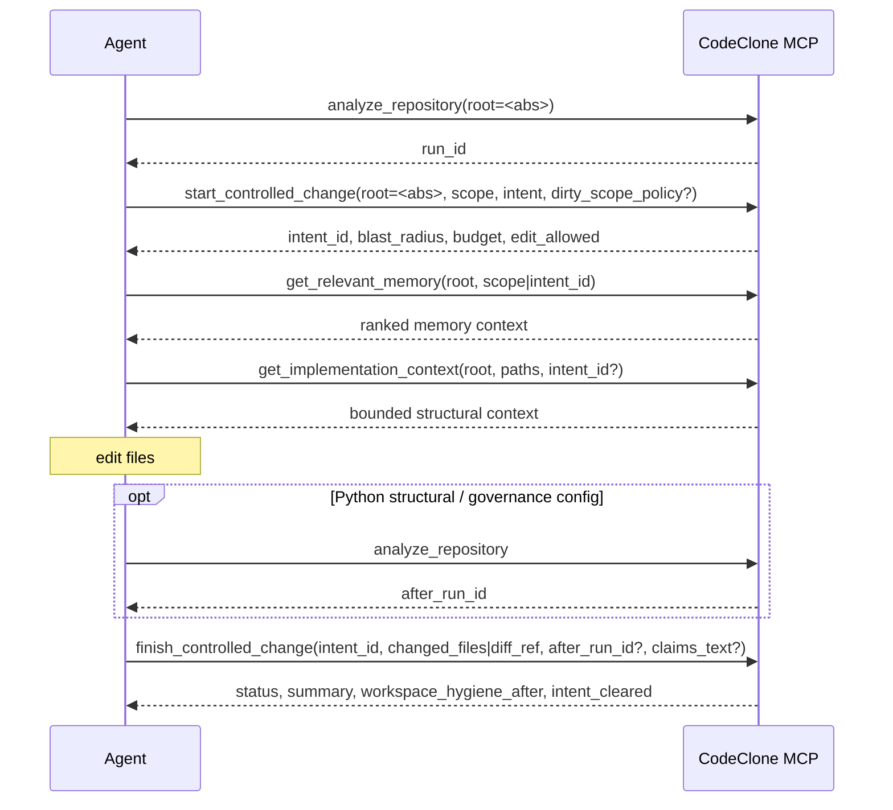

<!-- doc-scope: MCP change control workflow. class: guide max-lines: 120 -->

# Change control workflow

Primary MCP edit cycle (sole sequence diagram for change control in the guide):

When start or finish responses are compacted by response governance, do not ask
the model to restate omitted evidence. Follow the exact drill-down pointer in
`context_governance.omitted` or `_continuation`:

| Omitted evidence             | Exact drill-down                                                          |
|------------------------------|---------------------------------------------------------------------------|
| Start blast graph/detail     | `get_blast_artifact(root, run_id, blast_artifact_id)`                     |
| Structured finish receipt    | `get_review_receipt(root, run_id, receipt_digest, format="structured")`   |
| Receipt markdown             | `get_review_receipt(root, run_id, receipt_digest, format="markdown")`     |
| Full Patch Trail             | `get_patch_trail(root, patch_trail_digest)`                               |
| Memory lane tail             | `get_memory_projection_page(root, cursor)`                                |
| Implementation-context facet | `get_implementation_context_page(root, context_projection_digest, facet)` |

## Tool tiers

| Tier           | Tools                                                 | When                |
|----------------|-------------------------------------------------------|---------------------|
| Normal         | `start_controlled_change`, `finish_controlled_change` | Every edit cycle    |
| Queue/recovery | `manage_change_intent` (promote, recover, …)          | Multi-agent / crash |
| Advanced       | `get_blast_radius`, `check_patch_contract`, …         | Debugging only      |

Normative tool params: [MCP workflow tools](../../../book/25-mcp-interface/tools/workflow.md).
Finish pipeline and
hygiene: [finish_controlled_change](../../../book/12-structural-change-controller/finish-controlled-change.md),
[Finish hygiene](../../../book/12-structural-change-controller/finish-hygiene.md).

## Related recipes

- [Agent edit cycle](../../change-control/agent-cycle.md)
- [Queue & recovery](../../change-control/queue-and-recovery.md)
- [Atomic debug path](../../change-control/atomic-debug.md)
- [Engineering Memory recipes](memory-recipes.md)
