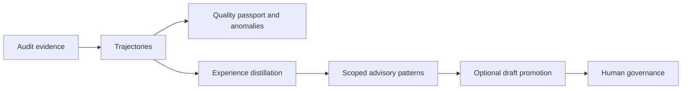

# Work with Trajectories and Experiences

<!-- doc-scope: guide -->

Engineering Memory exposes two evidence layers beyond curated records:

- trajectories reconstruct what happened during agent work;
- Experiences distill recurring patterns across those trajectories.

Neither layer grants permission to edit. Use them to prepare and review work,
then use change control for authorization.



## Inspect trajectory health

```bash
codeclone memory trajectory status --root .
codeclone memory trajectory dashboard --root .
codeclone memory trajectory anomalies --root .
codeclone memory trajectory agents --root .
```

Routine run projections are hidden by default. Add `--include-routine` when
you are diagnosing those workflows too.

Search and inspect one trajectory:

```bash
codeclone memory trajectory search "verification" --root .
codeclone memory trajectory show TRAJECTORY_ID --root .
```

The detail view explains the quality score, complexity band, incidents,
anomalies, evidence, and patch-trail verification.

## Rebuild projections

```bash
codeclone memory trajectory rebuild --root .
codeclone memory jobs run-once --root .
```

The background projection job refreshes trajectory, semantic, and Experience
projections in that execution order. See
[Projection jobs](../../book/13-engineering-memory/projection-jobs.md).

## Retrieve Experiences

Experiences are returned automatically by scoped memory retrieval when their
directory family matches the requested scope. They are kept separate from
memory records and trajectory precedents so callers cannot confuse advisory
patterns with governed facts.

Through MCP, call `get_relevant_memory` with `scope` or an active `intent_id`.
The response may include:

- `records`: governed memory records;
- `trajectories`: relevant precedents;
- `experiences`: recurring project patterns.

To inspect a known Experience in full, use the Engineering Memory query
surface. To turn it into a reviewable draft, use
`manage_engineering_memory(action="promote_experience", experience_id="...")`.
Promotion is idempotent and does not approve the draft.

The normative contracts
are [Trajectory quality and passport](../../book/13-engineering-memory/trajectory-quality-and-passport.md)
and [Experience layer](../../book/13-engineering-memory/experience-layer.md).
