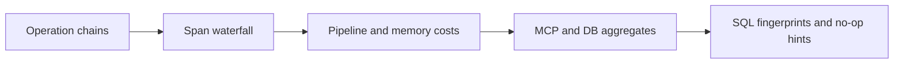

# Diagnose CodeClone with Platform Observability

<!-- doc-scope: guide -->

Platform Observability is for diagnosing CodeClone itself: slow MCP calls,
projection work, database query cost, redundant work, and correlated
CLI/MCP/worker activity. It is not a repository quality report.

The normative contract is
[Platform Observability](../../book/26-platform-observability.md).

## Enable it locally

```bash
export CODECLONE_OBSERVABILITY_ENABLED=1
```

Run the CodeClone workflow you want to inspect, then query the local store:

```bash
codeclone observability trace --root .
```

For optional process metrics:

```bash
uv pip install "codeclone[perf]"
export CODECLONE_OBSERVABILITY_PROFILE=1
```

In CI, observation remains off unless it is explicitly enabled:

```bash
export CODECLONE_OBSERVABILITY_ENABLED=1
```

`CODECLONE_OBSERVABILITY_FORCE=1` is an explicit CI-gate override but never
enables collection by itself.

## Render the cockpit

```bash
codeclone observability trace \
  --root . \
  --last 50 \
  --html /tmp/codeclone-observer.html
```

The self-contained page visualizes:



Use `--operation` to isolate one operation or `--correlation` to follow a
workflow across process boundaries. Use `--json` for a machine-readable export.

## Query through MCP

Start broad:

```json
{
  "root": "/absolute/repository",
  "section": "summary",
  "window": "latest",
  "detail_level": "compact"
}
```

Then select one bounded section such as `slow_operations`, `db_cost`,
`memory_pipeline_cost`, `mcp_tool_matrix`, or `correlated_chains`.

Do not infer repository quality from these numbers. High database activity
means CodeClone executed database work; it does not mean the analyzed project
has a database problem. See
[MCP observability tool](../../book/25-mcp-interface/tools/platform-observability.md).

## Local data lifecycle

The store is `.codeclone/db/platform_observability.sqlite3`. CodeClone does not
send it to a remote telemetry service. Automatic pruning is not currently
enforced, so remove the file when you no longer need the diagnostics.

Raw prompts, payload bodies, and SQL literals are not stored.
