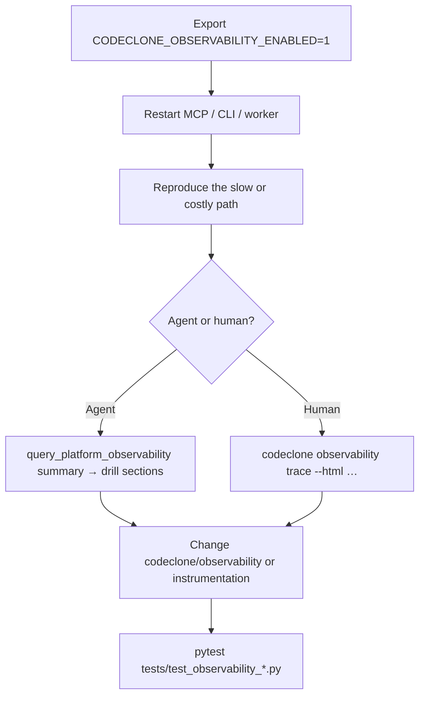

# Developing CodeClone with Platform Observability

<!-- doc-scope: guide -->

Platform Observability is **maintainer tooling only**. It helps people who
**build and debug CodeClone itself** — not users who run CodeClone against their
own Python projects.

If you want structural review, clones, health score, or CI gates for **your**
repository, use the normal CLI/MCP workflow ([MCP guide](../mcp/README.md),
[Production triage](../mcp/workflows/analyze-and-triage.md)). Observer data will
not answer those questions and must never be treated as repository quality
evidence.

Normative contract: [Platform Observability](../../book/26-platform-observability.md).

## Audience boundary

| You are…                                                     | Use observer?                                   |
|--------------------------------------------------------------|-------------------------------------------------|
| CodeClone contributor debugging MCP/CLI/memory/observer code | **Yes** (after explicit enable)                 |
| Application team using CodeClone on their repo               | **No**                                          |
| Agent reviewing user Python for clones/metrics               | **No** — use review / hotspots / change control |

Anti-inference: high `db_cost` means CodeClone executed SQL during its work, not
that the analyzed project has a database defect. High MCP payload sizes reflect
CodeClone's tool traffic, not low code quality in the target repo.

## Explicit enable (required)

Observation is **off by default**. No pyproject toggle — environment variables
only.

```bash
export CODECLONE_OBSERVABILITY_ENABLED=1
```

Every process that should emit telemetry must start **with this variable set**:

- terminal `codeclone …` runs;
- `codeclone-mcp` (restart the MCP server after exporting);
- background projection workers spawned during memory rebuild.

Optional:

| Variable                            | Effect                                           |
|-------------------------------------|--------------------------------------------------|
| `CODECLONE_OBSERVABILITY_PROFILE=1` | Process metrics (`codeclone[perf]`)              |
| `CODECLONE_OBSERVABILITY_PERSIST=0` | Instrument without writing completed ops         |
| `CODECLONE_OBSERVABILITY_FORCE=1`   | CI override only — **does not** enable by itself |

Until a reproducer runs under `CODECLONE_OBSERVABILITY_ENABLED=1`, there is no
store. MCP `query_platform_observability` returns `status=disabled` or
`status=no_store` — inert, not an error.

Store path: `.codeclone/db/platform_observability.sqlite3`

## Maintainer workflow



### 1. Reproduce under observation

Example — exercise MCP after enabling observer on the server process:

```bash
export CODECLONE_OBSERVABILITY_ENABLED=1
codeclone-mcp --transport stdio   # or your IDE launcher with env inherited
```

Then run the MCP workflow you are debugging (analysis, memory rebuild, finish,
etc.).

### 2. Agent path (bounded MCP)

See [MCP observability recipes](../mcp/workflows/observability-recipes.md).

Skill: `/codeclone-platform-observability` (bundled in CodeClone plugins).

### 3. Human path (full cockpit)

```bash
codeclone observability trace --root . --last 50 --html /tmp/codeclone-observer.html
```

Self-contained HTML: operation chains, span waterfall, MCP matrix, DB
fingerprints, memory pipeline costs. No external assets.

### 4. Verify instrumentation changes

```bash
uv run pytest -q tests/test_observability_*.py
```

Also run MCP registrar tests when touching server wiring:
`tests/test_observability_mcp_registrar.py`.

## What observer never does

- Does not affect reports, gates, baselines, cache, or finding identity
- Does not authorize edits or expand change-control scope
- Does not store raw MCP/prompt bodies or SQL literals
- Does not send data to a remote telemetry service

## Related

- [Diagnostics quick start](diagnostics.md)
- [MCP observability recipes](../mcp/workflows/observability-recipes.md)
- [MCP tool contract](../../book/25-mcp-interface/tools/platform-observability.md)
- [CONTRIBUTING.md — Platform Observability](https://github.com/orenlab/codeclone/blob/main/CONTRIBUTING.md)
