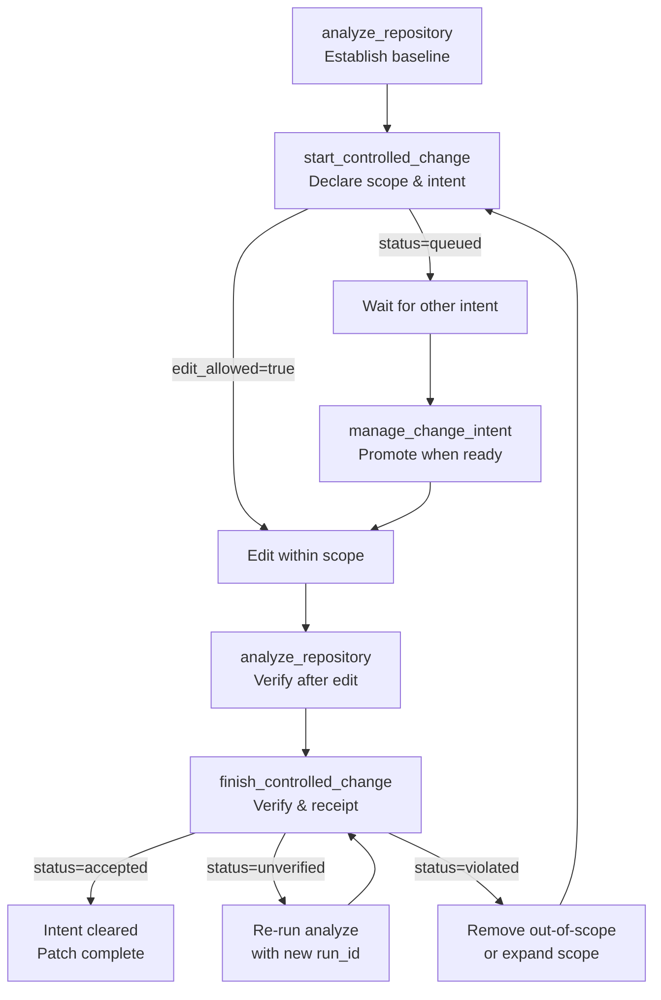

# Agent-safe change workflow

## What it is

The agent-safe change workflow is CodeClone's MCP-based protocol for making edits to a Python repository while maintaining deterministic control, blast radius bounds, and auditable evidence trails. It combines pre-edit intent declaration, scope enforcement, structural verification, and post-edit receipt generation into a single coordinated cycle.

When an agent needs to modify code, CodeClone:
1. Captures workspace state before editing
2. Declares scope and intent upfront
3. Computes blast radius and patch budget
4. Verifies scope adherence after editing
5. Generates an auditable receipt

## When to use it

Use the agent-safe workflow whenever:

- An agent edits Python source files (`*.py` or `*.pyi`)
- Configuration files change (governance, CI, `pyproject.toml`)
- Scope must be bounded to prevent unintended side effects
- An auditable trail of what changed and why is needed
- Multiple agents coordinate changes to the same repository

The workflow is **required** for any tracked file edit in CodeClone-managed repositories, regardless of patch type or task classification.

## Basic workflow

## Key commands

| Command | Purpose | When used |
|---------|---------|-----------|
| `analyze_repository` | Run CodeClone analysis; establishes baseline | Before `start`, after editing (Python only) |
| `start_controlled_change` | Declare scope, compute blast radius | Before any file edit |
| `get_relevant_memory` | Retrieve prior decisions & incidents | After `start` returns `edit_allowed=true` |
| `finish_controlled_change` | Verify scope, generate receipt, clear intent | After editing; pass `after_run_id` for Python changes |
| `manage_change_intent` | Queue/promote/recover intents | When another agent's intent blocks yours |

## Common mistakes

**Starting without analysis**
`start_controlled_change` requires an existing analysis run. Call `analyze_repository` first.

**Expanding scope silently**
If your fix requires files outside the declared scope, stop. Call `start_controlled_change` again with expanded scope before editing new files.

**Abandoning an active intent**
Leaving an intent active blocks the next agent. Always call `finish_controlled_change` before exiting, even if the edit failed.

**Ignoring stale memory**
`get_relevant_memory` returns prior decisions and known incidents. Do not skip this step or treat cached decisions as obsolete without reading the contradiction notes.

**Mixing concurrent intents**
One active intent per MCP session. Calling `start_controlled_change` again evicts the prior intent with no recovery—`finish` will fail with "Unknown change intent id."

## Next steps

- Read the change control reference for detailed tool semantics and response shapes
- Review engineering memory governance to understand decision tracking and stale-note handling
- For multi-agent coordination, consult the queue/promote workflow in intent-registry documentation
- Use `help(topic="change_control")` within the MCP client for immediate workflow guidance
