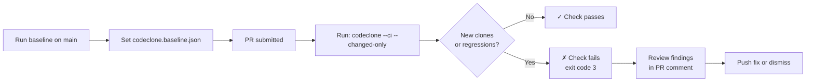

# CI integration

## What it is

CodeClone provides a CI mode for deterministic code quality gating in pull requests and continuous integration workflows. The `--ci` preset configures CodeClone to detect code clones, structural regressions, and quality violations, then exit with status code 3 if checks fail, allowing you to block merges until issues are resolved.

## When to use it

Use CodeClone in CI when you want to:

- Prevent new code clones from entering your codebase
- Detect cyclic dependencies, high complexity, or poor cohesion in changed code
- Track metrics regressions (typing coverage, docstrings, dead code) against a baseline
- Gate merges on quality thresholds before human review

CI mode is designed for pull request pipelines and automated merge gates. Run a baseline first on your main branch, then compare each PR against that baseline.

## Basic workflow

## Key commands

| Task | Command | Notes |
|------|---------|-------|
| Set baseline | `codeclone --update-baseline` | Run on main branch once to establish truth |
| Check PR | `codeclone --ci --changed-only` | Compares changed files against baseline |
| Check all files | `codeclone --ci` | Full analysis; slower but comprehensive |
| Show failures | `codeclone --ci --verbose` | Lists clone IDs and file locations |
| Skip dead code | `codeclone --ci --skip-dead-code` | Omits high-confidence dead-code checks |

Clone findings and metrics share one baseline container, so `--update-baseline`
refreshes both. There is no separate metrics-baseline flag.

## Common mistakes

**Running without a baseline:** CodeClone needs a baseline file to measure regressions. Commit `codeclone.baseline.json` to your repository after running `--update-baseline` on main.

**Not using `--changed-only`:** Analyzing the entire repo on every PR is slow. Use `--paths-from-git-diff main` (shorthand for `--changed-only --diff-against main`) to limit scope to changed files.

**Ignoring metrics baselines:** Complexity and typing metrics drift over time. Refresh the baseline on main with `--update-baseline`, then use `--fail-on-new-metrics` to catch regressions.

**Omitting `baseline_scope_id`:** baseline update and baseline-relative gating both require a stable canonical UUID under `[tool.codeclone]`, unique to the project — it is what keeps one project's baseline from being read as another's. Without it CodeClone exits 2 before any gate runs, printing a generated UUID and the exact line and file to add it to; `codeclone setup` writes the same key. Never copy a scope id out of the documentation or another repository.

**Misconfiguring gates:** Default thresholds are conservative. Tune `--fail-complexity`, `--fail-coupling`, and `--fail-health` to match your team standards, but document the choices so other developers understand the intent.

**Using `--ci` without gating:** The preset disables colors and progress output for log parsers. Pair it with explicit exit-code checks in your CI provider (e.g., `if [ $? -eq 3 ] then fail`).

## Next steps

- Read [Upgrading from 2.1.0a1 to 2.1.0a2](migration-a1-a2.md) if your pipeline already runs an older CodeClone
- Run `codeclone --help` to see all options for quality gates and reporting formats
- Set up a GitHub Actions or GitLab CI workflow to run CodeClone on every PR
- Store baseline files in version control so all team members use the same reference
- Use HTML reports (`--html`) for reviewers to inspect findings inline
